# Move Data to the Cloud using the Bluemix Lift CLI

## Obtain the Lift CLI activation token
1. In your web browser, **navigate** to: https://lift.mybluemix.net/

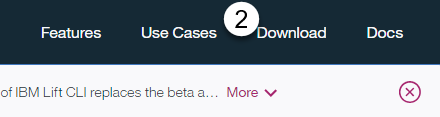

2. **Click** on the Download button at the top-right of your screen

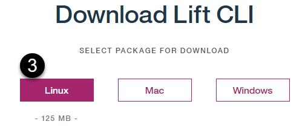

3. **Click** on the Linux button

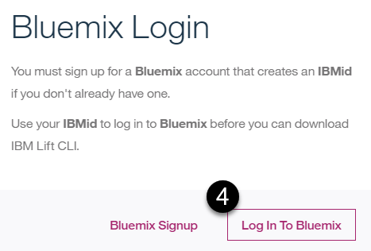

4. Follow the on-screen prompts to login to Bluemix, and accept the Terms of Use.  

5. **Cancel** the resulting download pop-up, because the software is already pre-installed in the VM

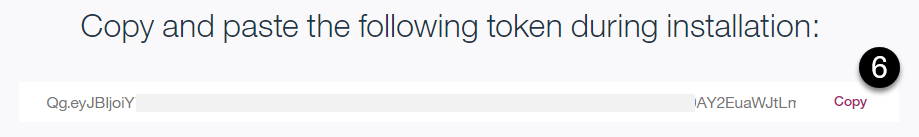

6. Notice that back on the web page, near the bottom of the screen, there is now an activation token.  **Click** Copy and save this into a temporary location, such as Notepad.  

## Install Lift CLI using your activation token

**Go Back** to the VM Image.  

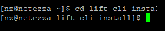

1. **Enter** the command **cd lift-cli-install**

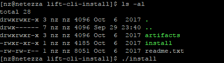

2. **Enter** the command **ls -al** to confirm that the install command exists.  Then, **enter** the command **./install**

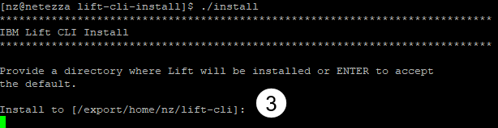

3. You are prompted to install to the default directory.  Confirm the default by hitting the **Enter** key

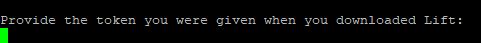

4. You are prompted for your activation token.  If the token that you copied is no longer in your clipboard, go back to your browser or temporary location where you saved it, and re-copy it.  **Paste** the token into the installer.  

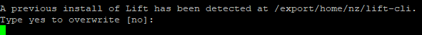

5. You are prompted to overwrite the existing installation.  **Enter yes** 

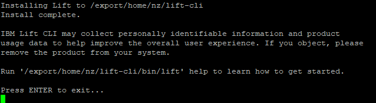

6. You should now see that installation has completed.  

## Use the Lift CLI application 

1. **Enter** the command **cd $DATA**. This is where the script is that contains all of the Lift CLI command that you will execute to move the data from on-premises to your dashDB database in the cloud.

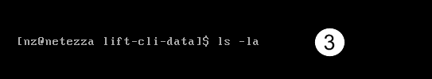

2. **Enter** the command **ls -la**.

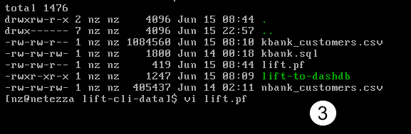

3. **Enter** the command **vi lift.pf** to edit the Lift properties file.

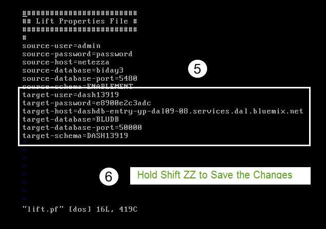

> **Note -** 
>
> The content in the **lift.pf** properties file is case sensitive. Make sure that when you change values noted below that you keep the values in lowercase or Uppercase. For instance, the **target-user** is in lowercase but the **target-schema** is in Uppercase. Keep them in the same case when doing changes.
>

4. **Change** the **target-user**, **target-password** , **target-host** and **target-schema** to your dashDB user, password, host and schema (your schema is the same as your user but in Uppercase...) using the credentials from your dashDB for Analytics service Credentials section you obtained in a previous section.

> **Note -** 
>
> While in the vi editor you can use the arrow keys to move to the character that you want to change and press R to overwrite the character at the cursor location, continue typing with your edits and hit ESC when done to return to command mode.
>

5. **When finished**, hit ESC, hold `SHIFT` and type `ZZ` to save and close the file.

<a name="secgwid" /> 

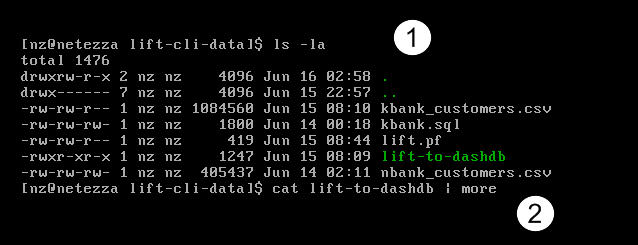

1. **Enter** the command **ls -la** to list the directory contents.
2. **Enter** the command **cat lift-to-dashdb | more** to view the Lift script contents.

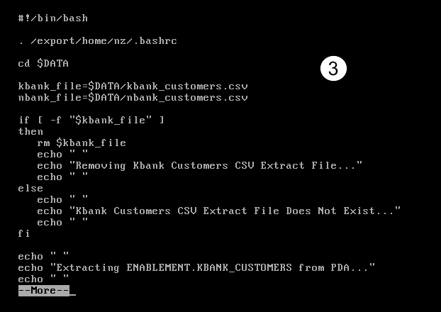

**Scroll** through the script by hitting the space bar on the keyboard until you have viewed the entire script. **Notice** the **lift extrac**, **lift put**, **lift ls** and **lift load** commands and the syntax used to execute them. The Lift commands were put into a script for your convenience so you can execute them all at once instead of individually.

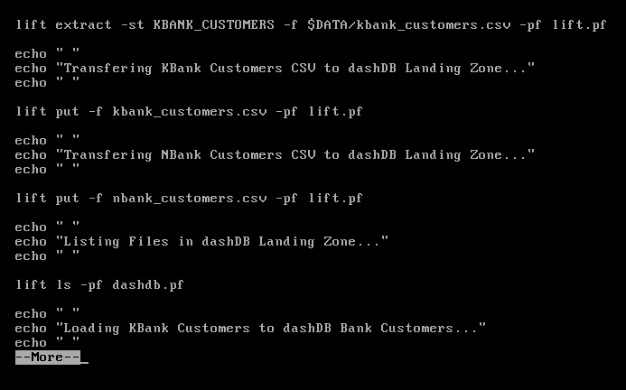

3. **Enter** the command **lift-to-dashdb | more** to execute the Lift script and begin moving the data to the cloud.

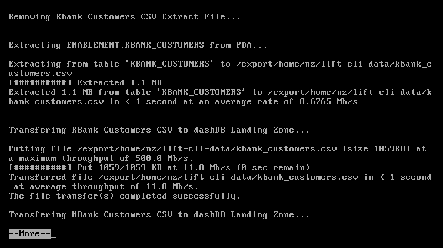

**Scroll** through the output by hitting the space bar on the keyboard until the script is complete.

**Notice** the Load record counts. You should have loaded a total of 11,022 rows to the BANK_CUSTOMERS table in dashDB. 3,000 N Bank Customers and 8,022 K Bank Customers.
