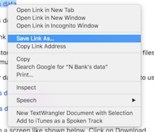
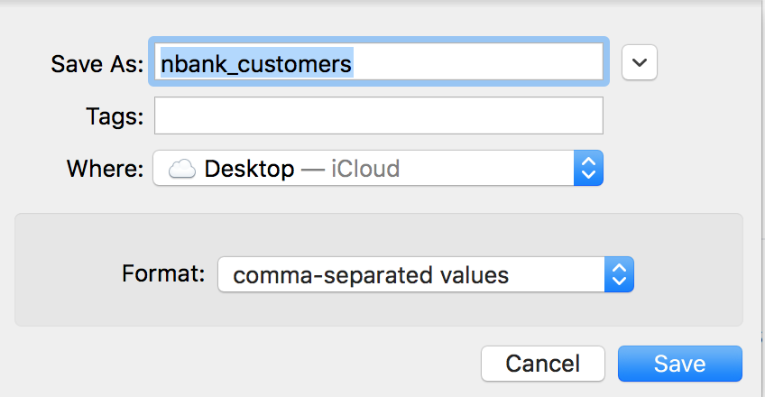
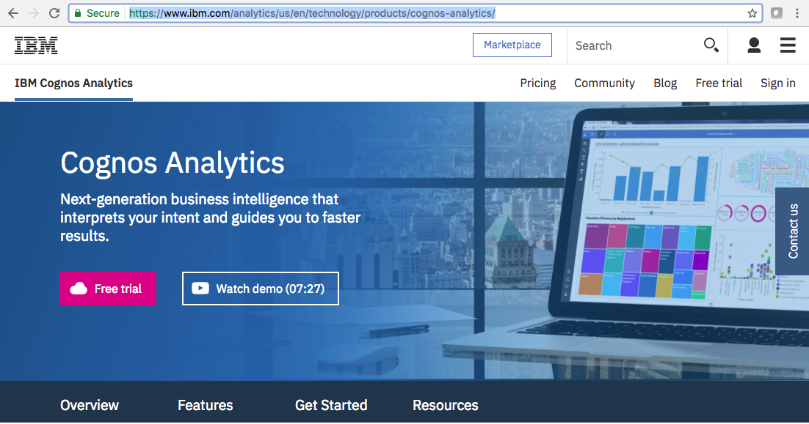
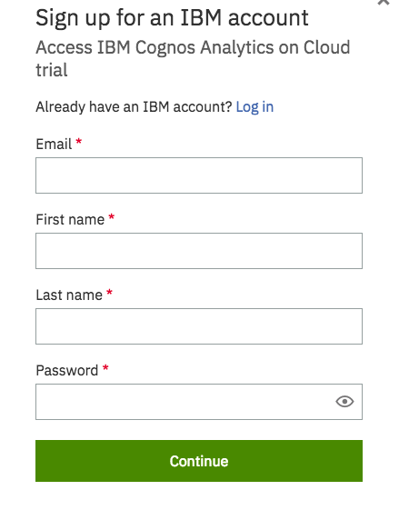
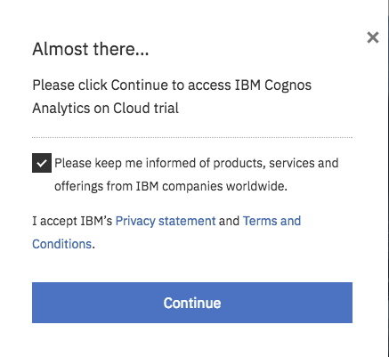
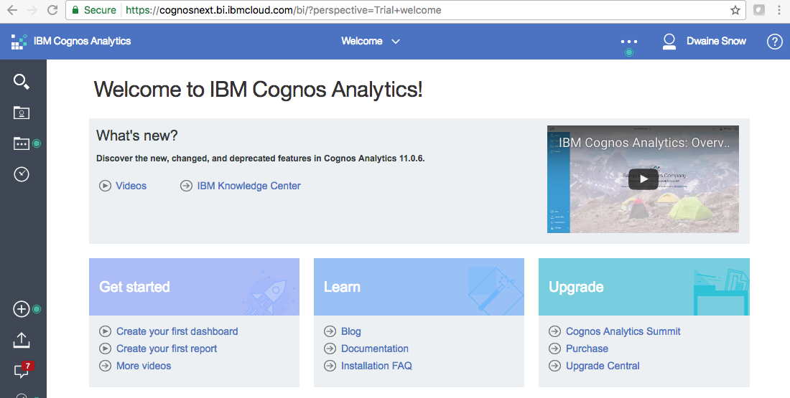

## Prerequisite Step By Step Directions

> **Note - If you already have any of the services, skip that step below**

   - **[PREWORK: Environment Setup](#prework-environment-setup)**
      - [Overview](#overview)  
      - [Step A: Download the lab files](#step-a-download-the-lab-files)  
      - [Step B: Create a Bluemix account](#step-b-create-a-bluemix-account)
      - [Step C: Create a Cognos Analytics account](#step-c-create-a-cognos-analytics-account)
      - [Step D: Create a GitHub account](#step-d-create-a-github-account)

## Environment Setup   

The Cloud Data Analytics lab is conducted using many components on the IBM cloud. It utilizes dashDB for Analytics (to be renamed **Db2 Warehouse on Cloud** as of ~July 18th) to persist data and Data Connect (and Lift CLI) to ingest data. These services are available and deployed from Bluemix, IBM’s cloud platform. This lab also leverages Cognos Analytics, IBM’s smart data reporting, analytics and visualization service on the cloud.

This lab uses a Virtual Machine. You will need to have VMware Workstation or VMware Workstation Player on Windows or Vmware Fusion Pro on Mac/OSX. If you do not already have this, download the appropriate tool from 

   [Windows](https://www.vmware.com/products/player/playerpro-evaluation.html)

   [Mac OSX](https://www.vmware.com/products/fusion/fusion-evaluation.html)
   
   Download the lab [VMware Image](https://ibm.box.com/s/50uj4kfg87qe3rd3icjfvlx94xaygdmr) 
   
   Download the VMware image to your hard drive or an external USB drive. 
   **NOTE: The faster the drive, the better the performance will be.**

## Overview

On the following pages are a series of steps you need to complete before you do any of the labs. Each step outlines an easy to follow set of instructions that walks you through preparing your IBM cloud environment so you can do any of the labs you choose. It is a serial process so it’s important that you follow each step in sequence and do not deviate from the workflow or skip any steps in the process.

Step | Description
------------ | -------------
A | Download the lab files
B | Create a Bluemix account
C | Create the Cloud-Data-Analytics lab services
E | Create a Cognos Analytics account
F | Create a GitHub account

## Step A: Download the lab files

   **Download** the Customer data CSV files to your workstation. These files are used if you do not want to (or cannot) use the VM image to emulate the on-premises databases. Be sure to use the default names and the .csv file extension.
    
   Right click on this link and select Save Link As... [K Bank's data](https://github.com/ibm-cloud-architecture/refarch-cloud-data-analytics/raw/master/kbank_customers.csv)
    
   Right click on this link and select Save Link As... [N Bank's data](https://github.com/ibm-cloud-architecture/refarch-cloud-data-analytics/raw/master/nbank_customers.csv)
   
        
  
   Make sure you do not change the name of the file, and that the comma-separated values Format is selected. 
   Click on Save.
   
    

## Step B: Create a Bluemix account

You will need a Bluemix account. Follow the instructions in one of the sections below depending on whether or not you have a Bluemix account.

## If you have a Bluemix account...

### Log Into Bluemix 

### [Click Here to Login to Bluemix](https://console.ng.bluemix.net/)

> **Note** - The URL for Bluemix is https://console.ng.bluemix.net

1. **Select** the "Log In" button. When prompted, enter your Bluemix ID and password.

### Create a Bluemix space

> **Note -**
> 
> You may be prompted automatically to create a space if you do not have one defined. If not, follow the steps below.
>

  

1. **Select** the account information area in the top right corner of your Bluemix home page.
2. **Select** the "Create a Space" link next to “Manage Organizations” below the space drop down list box.

  

3. **Enter** “Cloud-Data-Analytics” (without quotes) for the space name.  
4. **Select** the “Create” button.  

> The space will be created and you will be brought into it. You should now see, in the top right corner, that you are in the “Cloud-Data-Analytics” space in your Bluemix organization. You will use this space to house the Cloud-Data-Analytics lab services. 

**Proceed to Step C: Create the Cloud Data Analytics Lab Services**

## If you don't have a Bluemix account...

### [Click Here to Register for a Bluemix Account](https://console.ng.bluemix.net/registration/)

**Enter** the required information *(required fields are marked with an asterick)* on the right side panel.

1. **Select** the "I'm not a bot" check box.

> **Note** - You may be asked to verify multiple images. Select the Skip or Next button as instructed until you get to a screen (as shown above) with a Verify button.

2. **Select** the images you are instructed to select. For instance, Select all squares with street signs. 
3. **Select** the "Verify" button.

4. **Review** and check or uncheck the options to be kept informed of products, services and offerings from IBM.
5. **Select** the "Create Account" button when it is enabled for selection.

A page will appear notifying you to check your email to complete your registraion. Check the inbox of the email address that you supplied to register for your Bluemix account and open the email.

6. **Select** the “Confirm your account” link.

You will be brought to a web page confirming that you sucessfully signed up for Bluemix and that it is now activated.

7. **Click** on the "Log in" link to log into your Bluemix account.

8. **Select** the checkbox to agree to the terms and conditions.
9. **Select** the “Continue” button.

> **Note** - I have redacted my email address on some screen shots to protect my identity, yours will be visible.

10. **Click** on the email address suggestion for an organization name. It will be automatically filled in for you as your organization name.
11. **Select** the “Create” button.

12. **Enter** “Cloud-Data-Analytics" (without quotes) as your Bluemix space name.
13. **Select** the "Create" button.

14. **Select** the "I'm Ready" button.

## Step C: Create a Cognos Analytics account

You will need a Cognos Analytics account. If you **don't** have an account:

[Click Here to Register for a Cognos Analytics account](https://www.ibm.com/analytics/us/en/technology/products/cognos-analytics/)

1. **Select** the “Free Trial” button.

> Cognos Analytics is IBM account aware, but not Bluemix aware. 

If you have an IBM ID select login, otherwise enter your email and name, and set a password.

You will then see this screen, click on Continue

You now have a Cognos Analytics Account, and will see a screen like

## Step D: Create a GitHub account

You will need a GitHub account. If you **don't** have an account:

### [Click Here to Register for a GitHub account](https://github.com/)

1. **Enter** a Username.
2. **Enter** an Email. I recommend using the same Email Address you used for your Bluemix account.
3. **Enter** a Password. Again, I recommend using the same password you used for your Bluemix account.
4. **Select** the "Sign up for GitHub" button.

5. **Choose** the "Unlimited repositories for free" plan (It should be selected by default).
6. **Select** the "Continue" button.

7. **Review** the "Tailor your experience" choices. Optionally select those you wish to supply or none of them.
8. **Select** the "Submit" button.

9. **Select** the "Start a project" button.

10. **Go to** the Email account you supplied during signup. Open the verification email sent to you by GitHub.

11. **Click On** the "Verify email address" link.

> You will be brought to a web page notifying you that your email was verified. 

12. **Select** the "X" in the top right corner to close the verification message.

> You have completed the pre-requisite steps. You can now begin completing the lab/demo.
