# Moving data and workloads from on premises to the cloud for more agile analytics

## Table of Contents
- **[Introduction](#introduction)**
- **[Narrative](#narrative)**
- **[Solution Overview](#solution-overview)**
- **[Prerequisites](#prerequisites)**
- **[Project Components](#project-components)**
- **[Setup the reference solution in IBM Cloud](#Setup-the-reference-solution-in-ibm-cloud)**
    - **[Step 1: Bluemix Environment Setup](#step-1-bluemix-environment-setup)**
    
    - **[Step 2: Provision a Kubernetes cluster on IBM Bluemix Container service](#step-2-provision-a-kubernetes-cluster-on-ibm-bluemix-container-service)**
        - [Lite Cluster](#lite-cluster)
        - [Paid Cluster](#paid-cluster)
    - **[Step 3: Deploy reference implementation to Kubernetes Cluster](#step-3-deploy-reference-implementation-to-kubernetes-cluster)**
        - [Deploy Bluecompute Community Edition to Lite Cluster](#deploy-bluecompute-community-edition-to-lite-cluster)
            - [Delete Bluecompute Community Edition from Lite Cluster](#delete-bluecompute-community-edition-from-lite-cluster)
        - [Deploy Bluecompute Community Edition to Local Minikube Cluster](#deploy-bluecompute-community-edition-to-local-minikube-cluster)
            - [Delete Bluecompute Community Edition from Local Minikube Cluster](#delete-bluecompute-community-edition-from-local-minikube-cluster)
        - [Deploy Bluecompute to Paid Cluster](#deploy-bluecompute-to-paid-cluster)
            - [Delete Bluecompute from Paid Cluster](#delete-bluecompute-from-paid-cluster)


## Introduction

This project provides a reference implementation for moving data from on premises relational databases running in two different organizations into a Cloud Managed Database Service (dashDB) so that the data can be analyzed quickly, easily, and without the need to setup any new hardware or request resources from the IT department.   

In this case, one organization is using our PureData System for Analytics (Netezza) and the other DB2 for their datawarehouses. The data from these systems will be pshed or pulled into dashDB in the cloud so that it can be combined and analyzed as a single entity.  

**We will provide two mechanisms for moving the data from on premises to the cloud, Bluemix Data Connect and Lift CLI, so that you can choose the method based on who you demoing to.** Data Connect is a cleaner, easier solution for one time moves, and best used when demoing to Business Users (LOB managers and executives). Lift CLI is how we would productionalize this process if we were doing this over and over to keep the data in synch, and best used when demoing to IT.

### Loading data using IBM Data Connect


### Loading data using IBM Bluemix Lift CLI


## Narrative 

Consider the following scenario. You are talking to the CMO at K Bank. 

Hi Ms. Smith, I know that K Bank just bought N Bank, and I just came from a meeting on how you plan to integrate the two companies’ systems, and it is going to take a while. I would think that many people, and you in particular, can’t wait for a year or more for the integrated data to start reaching out to your customers.

I know that K Bank has been doing churn analytics for some time, but the team at N Bank has not. It would be interesting to see how your models could be used to identify N Bank customers at risk of leaving as well. 

IBM can help you combine this data now so that you can get access to this combined data within days, without putting any load on your IT staff who is already over loaded with the consolidation.  We can use our fully managed cloud services to copy data from your current on-premises systems in each bank into a data warehouse and match customer names automatically to give you a single view of your customers across both banks.
 
Once you have that data at your fingertips, you can start asking even more probing questions, like –

   Why are customers at risk of leaving? Which customers would be a loss and which would not? 

   This will help you identify your most important customers, so you can work to keep them as long term customers. 

What do you think?

## Solution Overview

The solution is a set of Business Inteligence (BI) tools that allow Business Users to get quick, but important, insght from the data. In order to gain this insight the data from the two bank systems need to be moved from their data centers into a common repository. Because IT cannot support creating a new system and moving the data, that new/common repository needs to be hosted in the cloud. The BI tools will then be connected to this new repository and the existing analytical reports will be run. 

## Prerequisites

You must have the following
 - A Bluemix account
 - VMware
      - VMware Player or VMware Workstation for Windows
      - VMware Fusion (Full or 30 day trial) for OSX
 - Download the [VMware Image](https://ibm.box.com/s/50uj4kfg87qe3rd3icjfvlx94xaygdmr) 
 - A provisioned Data Connect Starter service in Bluemix
 - A provisioned dashDB for Analytics (**Db2 Warehouse on Cloud** *as of ~July 18*) service in Bluemix
 - Sign up for Signup for free a [Cognos Anlaytics Trial](https://ca-trial.mybluemix.net/) 

## Project Components

There are a few components of this solution.  

- The Virtual Machine (VM) that contains the on premises databases. Due to licensing restricions on some of the software in the VM this is only available to IBMers and Business Partners. 

    [Download VM Image from here](https://ibm.box.com/s/50uj4kfg87qe3rd3icjfvlx94xaygdmr)

- So that anyone can use the data and run the lab/demo we have also included the raw data (CSV) files from the two banks. You can download this to your computer and load them into dashDB using the steps provided later. 
    
    [K Bank's data](https://github.com/ibm-cloud-architecture/refarch-cloud-data-analytics/blob/master/kbank_customers.csv)
    
    [N Bank's data](https://github.com/ibm-cloud-architecture/refarch-cloud-data-analytics/blob/master/nbank_customers.csv)
    
- So that the reports/graphics/dashboards we will have to create run correctly, we need everyone to use the same table definition for the combined data. The file below contains the CREATE TABLE command
    
    [Table DDL](https://github.com/ibm-cloud-architecture/refarch-cloud-data-analytics/blob/master/bank_customers.ddl)    


XXXXXX


 - [refarch-cloud-data-analytics-data](https://github.com/ibm-cloud-architecture/refarch-cloudnative-bluecompute-mobile/tree/kube-int) - The raw data that is preloaded in the databases in the VM
 

## Setup the reference solution in IBM Cloud

To run the solution demo you will need to download and start the VM, configure your Bluemix environment, run the data movement service and then run the BI tools...  
runtimes.  


### Step 1: Bluemix Environment Setup   

The Cloud Data Analytics lab is conducted using many components on the IBM cloud. It utilizes dashDB for Analytics to be renamed **Db2 Warehouse on Cloud** as of ~July 18th to persist data and Data Connect (and Lift CLI) to ingest data. These services are available and deployed from Bluemix, IBM’s cloud platform. This lab also leverages Cognos Analytics, IBM’s smart data reporting, analytics and visualization service on the cloud. 


On the following pages are a series of steps you need to complete before you do any of the labs. Each step outlines an easy to follow set of instructions that walks you through preparing your IBM cloud environment so you can do any of the labs you choose. It is a serial process so it’s important that you follow each step in sequence and do not deviate from the workflow or skip any steps in the process.

Step | Description
------------ | -------------
1 | Download the lab files
2 | Create a Bluemix account
3 | Create the Cloud-Data-Analytics lab services
4 | Create the Cloud-Data-Analytics lab application
5 | Create a Cognos Analytics account
6 | Create a GitHub account

## Step 1: Download the lab files


   Download the [VMware Image](https://ibm.box.com/s/50uj4kfg87qe3rd3icjfvlx94xaygdmr) 

**Download** the Customer data CSV files to your workstation. These files are used if you do not want to (or cannot) use the VM image to emulate the on premises databases.

Save the customer data for both banks to your computer. Be sure to use the .csv file extention.
    
   Download [K Bank's data](https://github.com/ibm-cloud-architecture/refarch-cloud-data-analytics/blob/master/kbank_customers.csv)
    
   Download [N Bank's data](https://github.com/ibm-cloud-architecture/refarch-cloud-data-analytics/blob/master/nbank_customers.csv)

## Step 2: Create a Bluemix account

You will need a Bluemix account. Follow the instructions in one of the sections below depending on whether or not you have a Bluemix account.

## If you have a Bluemix account...

### Log Into Bluemix 

### [Click Here to Login to Bluemix](https://console.ng.bluemix.net/)

> **Note** - The URL for Bluemix is https://console.ng.bluemix.net

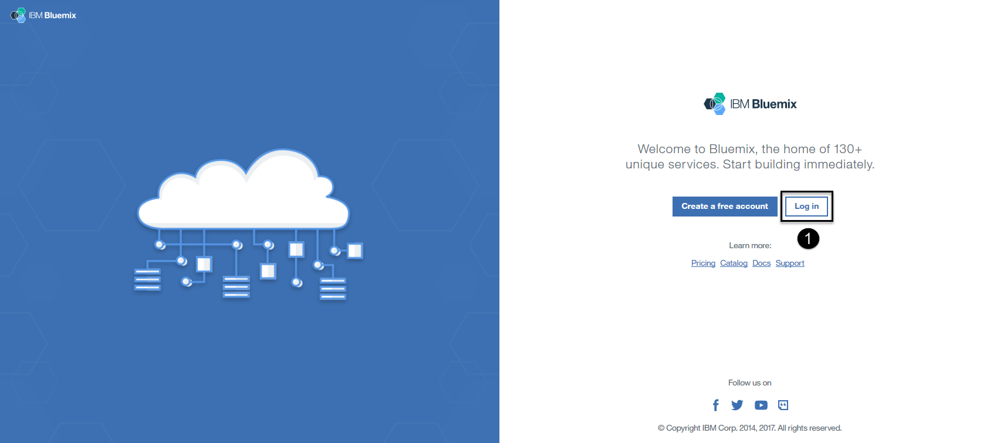

1. **Select** the "Log In" button. When prompted, enter your Bluemix ID and password.

### Create a Bluemix space

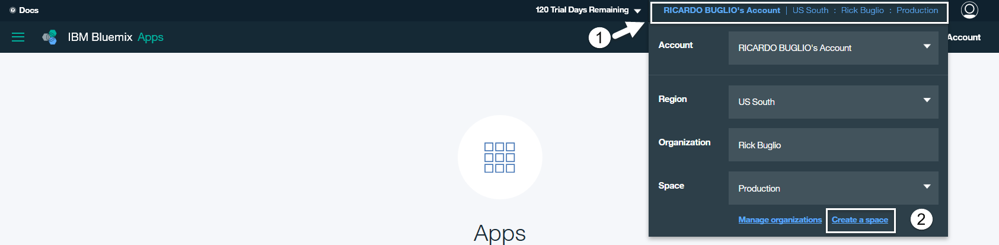  

1. **Select** the account information area in the top right corner of your Bluemix home page.
2. **Select** the "Create a Space" link next to “Manage Organizations” below the space drop down list box.

  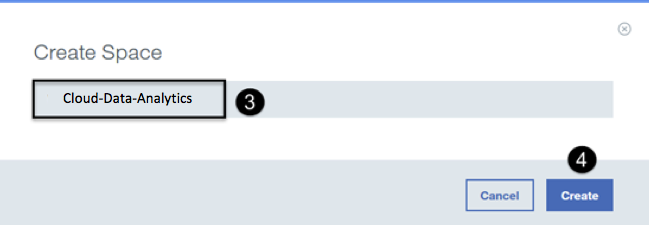

3. **Enter** “Cloud-Data-Analytics” (without quotes) for the space name.  
4. **Select** the “Create” button.  

> The space will be created and you will be brought into it. You should now see, in the top right corner, that you are in the “Cloud-Data-Analytics” space in your Bluemix organization. You will use this space to house the Watson Data Platform lab services and application.

**Proceed to Step 3: Create the Watson Data Platform lab services**

## If you don't have a Bluemix account...

### [Click Here to Register for a Bluemix Account](https://console.ng.bluemix.net/registration/)

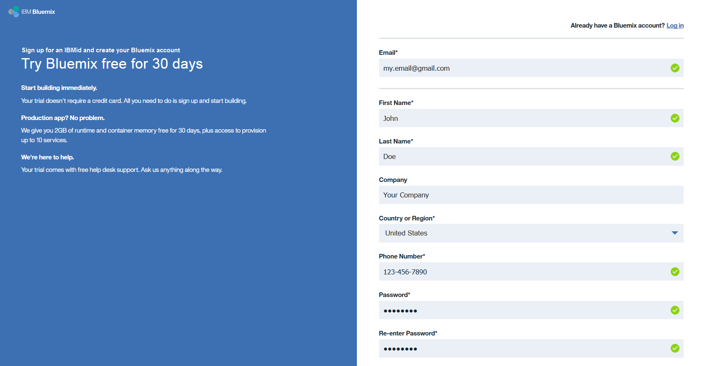

**Enter** the required information *(required fields are marked with an asterick)* on the right side panel.

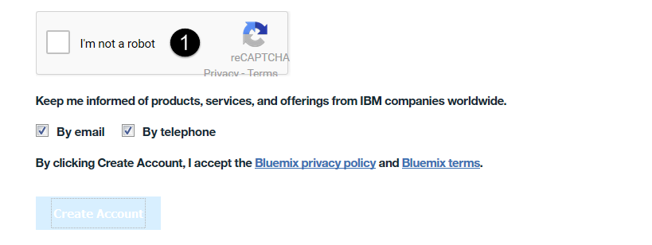

1. **Seletct** the "I'm not a bot" check box.

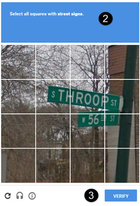

> **Note** - You may be asked to verify multiple images. Select the Skip or Next button as instructed until you get to a screen (as shown above) with a Verify button.

2. **Select** the images you are instructed to select. For instance, Select all squares with street signs. 
3. **Select** the "Verify" button.

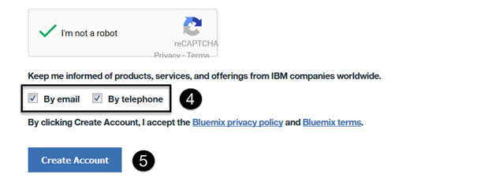

4. **Review** and check or uncheck the options to be kept informed of products, services and offerings from IBM.
5. **Select** the "Create Account" button when it is enabled for selection.

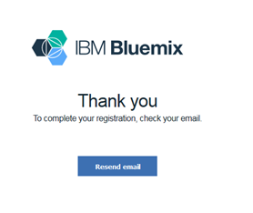

A page will appear notifying you to check your email to complete your registraion. Check the inbox of the email address that you supplied to register for your Bluemix account and open the email.

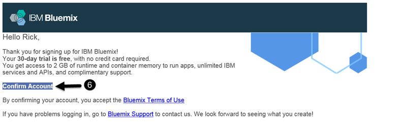

6. **Select** the “Confirm your account” link.

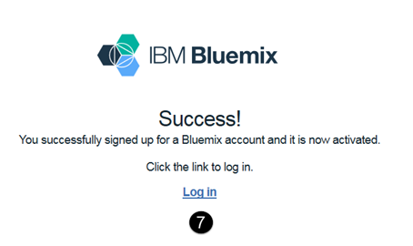

You will be brought to a web page confirming that you sucessfully signed up for Bluemix and that it is now activated.

7. **Click** on the "Log in" link to log into your Bluemix account.


8. **Select** the checkbox to agree to the terms and conditions.
9. **Select** the “Continue” button.

> **Note** - I have redacted my email address on some screen shots to protect my identity, yours will be visible.

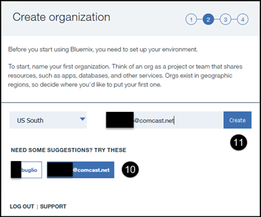

10. **Click** on the email address suggestion for an organization name. It will be automatically filled in for you as your organization name.
11. **Select** the “Create” button.

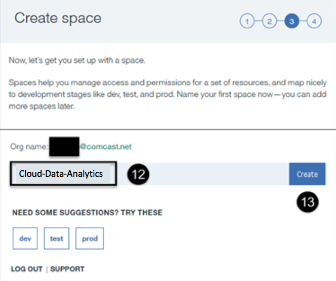

12. **Enter** “Watson Data Platform" (without quotes) as your Bluemix space name.
13. **Select** the "Create" button.

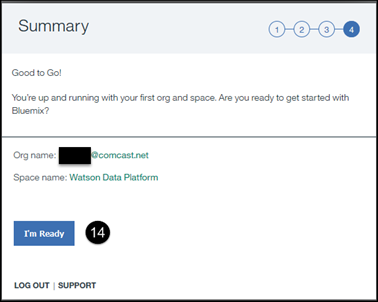

14. **Select** the "I'm Ready" button.

## Step 3: Create the Cloud Data Analytics lab services


1. **Select** the "Catalog" menu at the top of the Bluemix home page.


2. **Enter** "data connect" (without quotes) in the catalog search area.  
3. **Click on** the “Data Connect” service.  


4. **Enter** "CDA Data Connect” (without quotes) for the Service name.  (Use CDA as the acronym for Cloud Data Analytics).
5. **Enter** “CDA Data Connect” (without quotes) for the Credential name.  
6. **Select** the the "Create" button. The service will be created and the launch page is displayed.


1. **Select** the "Catalog" menu at the top of the Bluemix home page.


2. **Enter** "dashdb" (without quotes) in the catalog search area.  
3. **Click on** the “dashDB for Analytics” service.  


4. **Enter** "CDA dashDB” (without quotes) for the Service name.   
5. **Select** the the "Create" button. The service will be created and the launch page is displayed.


6. **Click On** the "CDA dashDB" service you just created from the list of services.


7. **Select** the "Service credentials” section of the "CDA dashDB" service launch page.   
8. **Select** the the "New credential +" button.


9. **Enter** "CDA dashDB” (without quotes) for the credential name.   
10. **Select** the the "Add" button. The service credential will be created.


11. **Select** the "View credentials v" down arrow to view the newly created credentials.

> **Note** - These are the "CDA dashDB" service credentials you will need to access the dashDB service in the Data Engineering and Data Science labs. Remember how to get back to this area of the service to access the credentials. I have redacted my password, to protect my identity, yours will be visible.


## Step 5: Create a Watson Analytics account

You will need a Watson Analytics account. If you **don't** have an account:

### [Click Here to Register for a Watson Analytics account](https://watson.analytics.ibmcloud.com/product)

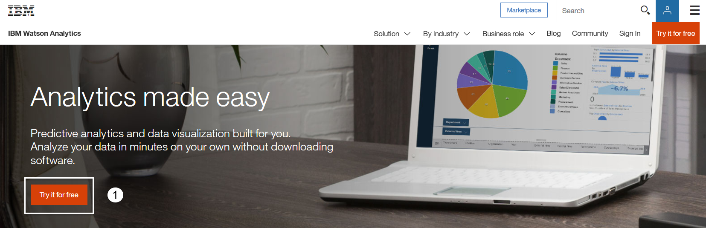

1. **Select** the “Try it for free” button.

> Watson Analytics is IBM account aware. It is also Bluemix aware and knows if you are logged into Bluemix from within the same browser session. This can be very beneficial and is one of the reasons these instructions had you create a Bluemix account prior to creating a Watson Analytics account using the same browser session. Creating a Bluemix account creates an IBM account. Therefore, depending on whether or not you are logged into Bluemix in the same browser session you are requesting to create a Watson Analytics account, you will see one of the two scenarios below to register for a Watson Analytics account:

## If you are logged into Bluemix in the same browser session...

### You will see this registration page: 

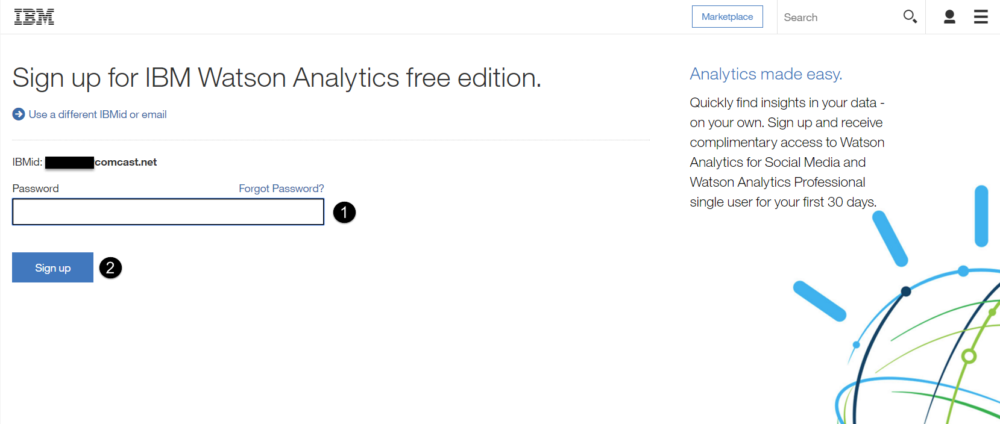
   
1. **Enter** the password for the IBM account displayed. My account is redacted to protect my identity.
2. **Select** the "Sign Up" button.

## If you are not logged into Bluemix in the same browser session...

### You will see this registration page:

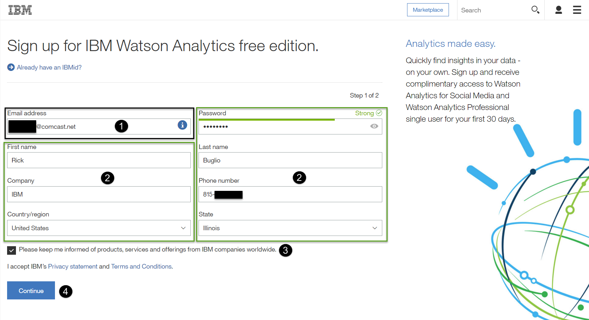

1. **Enter** an email address. 

> If the email address you enter does not exist as an IBM account, Watson Analytics will keep you on this page. If so, complete steps 2-4 below.

2. **Enter** all the required fields; Password, First and Last Name, Company, Phone Number, Country/region and State.
3. **Check** or **Uncheck** the box to keep informed of products and services and offerings from IBM worldwide.
4. **Select** the "Continue" button.

> If the email address already exists as an IBM account, Watson Analytics will switch to the page you see below with your email already designated. If so, complete steps 1-2 below.


1. **Enter** the password for the IBM account displayed. My IBMid is redacted to protect my identity.
2. **Select** the "Sign Up" button.

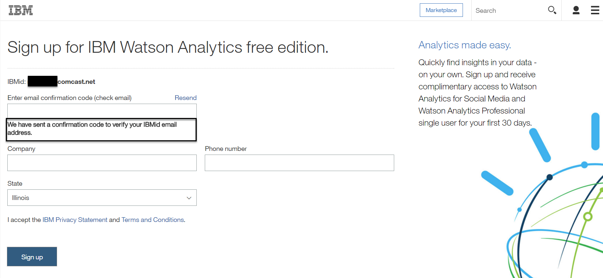

> You will be brought to the Sign Up page informing you “We have sent a confirmation code to verify your IBMId email address." You will be sent an email by ibmacct@us.ibm.com with a “Confirmation code” (7 digit number), to verify your email address.

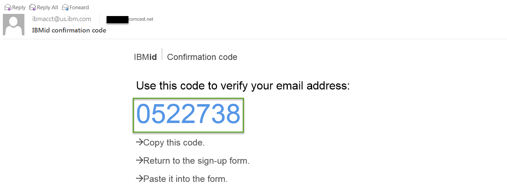

To activate your account, **Go to** your email inbox that you used to register your Watson Analytics account to retrieve the confirmation code.

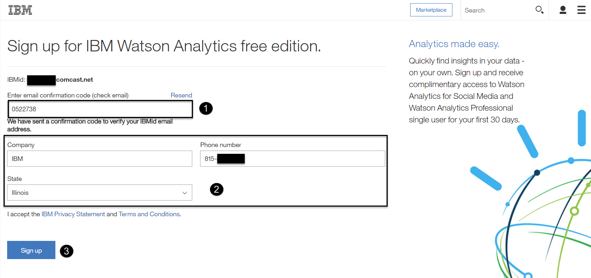

1. **Enter** the confirmation code you received in the email by typing it in or copy and pasting it from the email.
2. **Enter** your Company and Phone Number and select your State.
3. **Select** the "Sign Up" button.

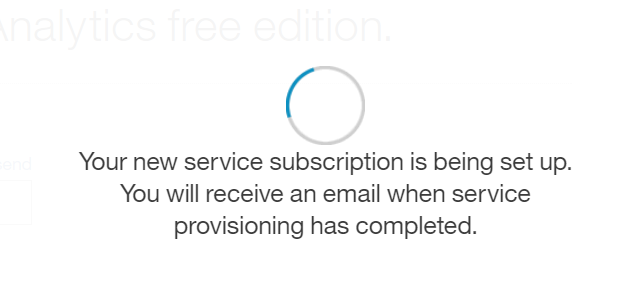

> At this point, you will see a screen informing you that “Your new service subscription is being setup. You will receive an email when service provisioning has been completed”.


> In a few seconds you will be brought into a Welcome page that plays a video introducing you to Watson Analytics with a status of "Setting up your account" at the bottom of the page. 


1. When you are able, **Select** the "Continue to Watson Analytics" link.

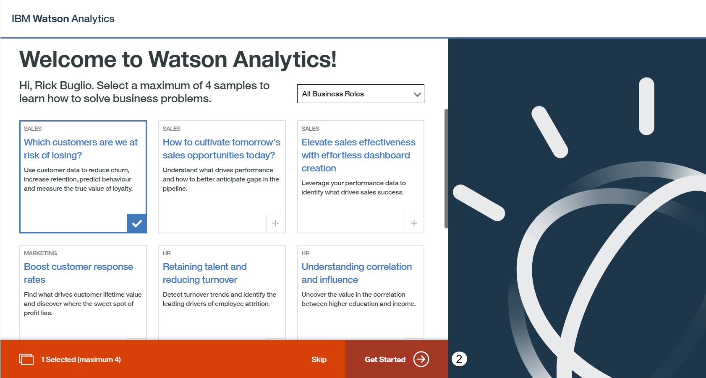

2. **Select** the "Get Started ->" button.

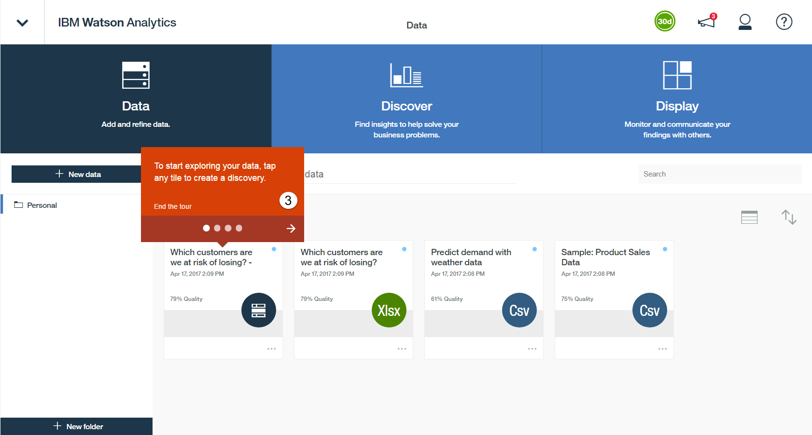

3. **Click through** the exploration tour.

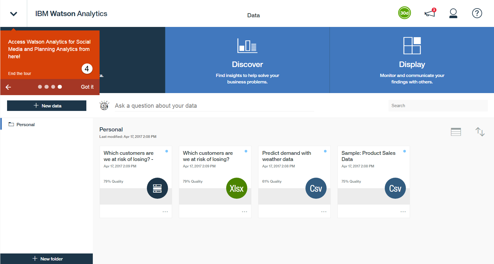

4. **Select** "Got it" when you get to the end of the exploration tour.

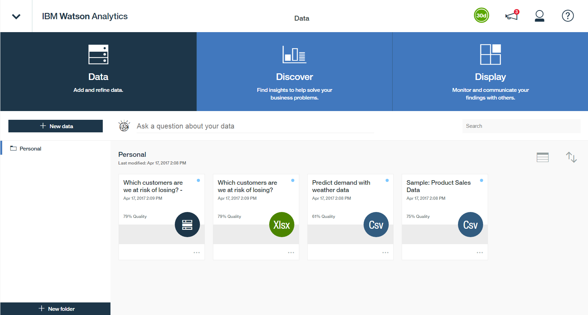

> Your Watson Analytics account is now ready for use. You have completed all of the Getting Started prerequisites and are ready to begin the Watson Data Platform labs. You can do the labs in any order you like but we strongly suggest you start by doing the Data Engineering lab first followd by Business Analysis, Data Science and then Application Development.

## Step 5: Create a GitHub account

You will need a GitHub account. If you **don't** have an account:

### [Click Here to Register for a GitHub account](https://github.com/)

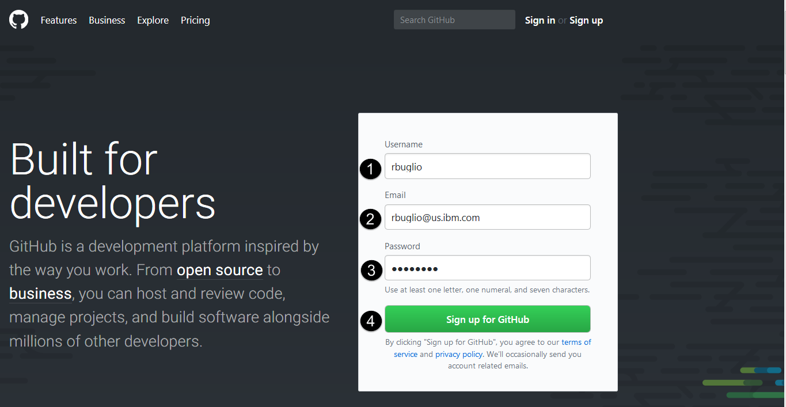

1. **Enter** a Username.
2. **Enter** an Email. I recommend using the same Email Address you used for your Bluemix account.
3. **Enter** a Password. Again, I recommend using the same password you used for your Bluemix account.
4. **Select** the "Sign up for GitHub" button.

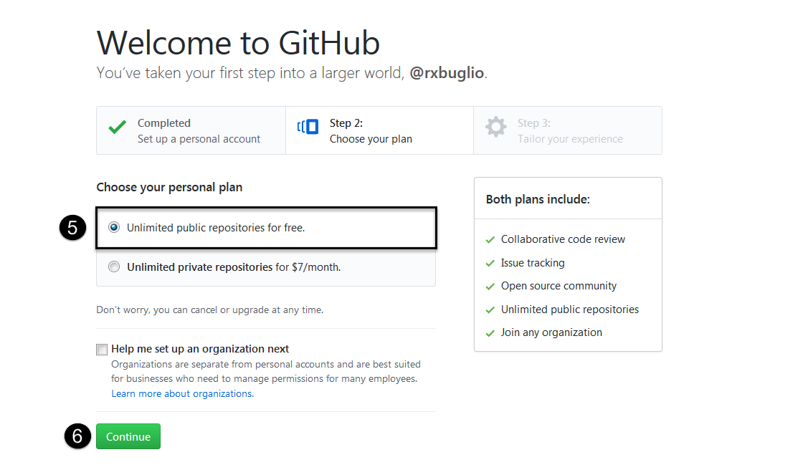

5. **Choose** the "Unlimited repositories for free" plan (It should be selected by default).
6. **Select** the "Continue" button.


7. **Review** the "Tailor your experience" choices. Optionally select those you wish to supply or none of them.
8. **Select** the "Submit" button.

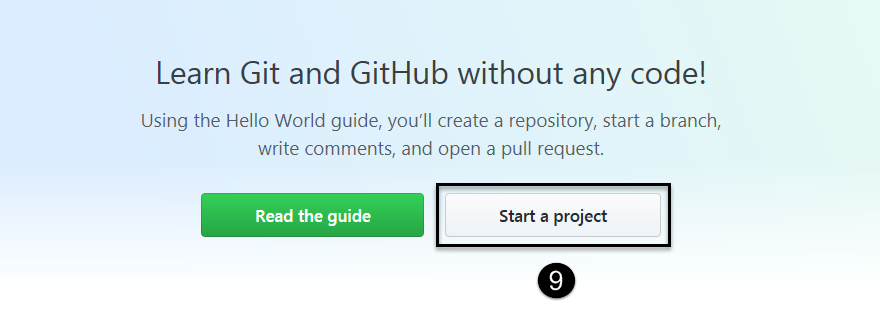

9. **Select** the "Start a project" button.

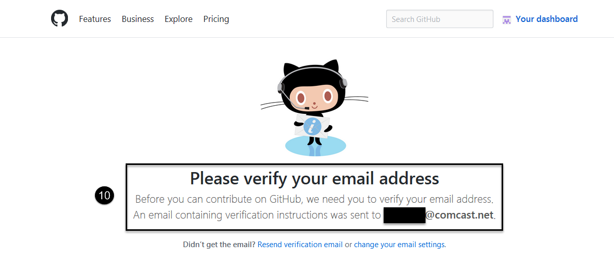

10. **Go to** the Email account you supplied during signup. Open the verification email sent to you by GitHub.

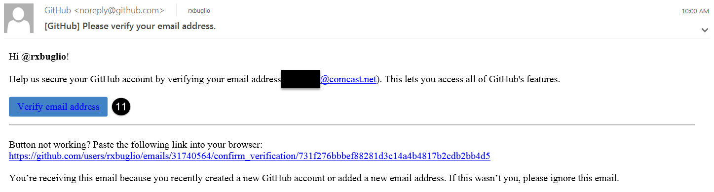

11. **Click On** the "Verify email address" link.


> You will be brought to a web page notifying you that your email was verified. 

12. **Select** the "X" in the top right corner to close the verification message.

> Your have completed the pre-requisite steps. You can now begin completing the labs. Please proceed to the Data Enginner lab first to begin preparing your data.


    
### Start the Virtual Machine

- Clone the base repository:  
    **`$ git clone https://github.com/ibm-cloud-architecture/refarch-cloudnative-kubernetes`**

- Clone the peer repositories:  
    **`$ cd refarch-cloudnative-kubernetes && sh clonePeers.sh`**

#### Install IBM Bluemix CLI and Container Service Plugin, Kubernetes CLI and Helm

To install and test BlueCompute stack in IBM Bluemix, you need the following tools:
- [Cloud Foundry CLI](https://github.com/cloudfoundry/cli/releases)
- [Bluemix CLI](http://clis.ng.bluemix.net/ui/home.html)
- [Bluemix Container Service plugin](https://console.ng.bluemix.net/docs/containers/container_cli_cfic.html)
- [Kubernetes cli](https://kubernetes.io/docs/tasks/kubectl/install/) (`kubectl`)
- [Helm](https://github.com/kubernetes/helm) (Helm is Kubernetes package manager)

We have developed a wrapper script to install all above tools on your Mac or Linux machine. In your root directory, execute the following command:

```
$ ./install_cli.sh
```
This script will install the CLIs for Bluemix, Container Service, Kubernetes, Helm, and jq for configuration parsing.
It will ignore what's already installed.

#### Create a New Space in Bluemix

1. Click on the Bluemix account in the top right corner of the web interface.
2. Click Create a new space.
3. Enter "cloudnative-dev" for the space name and complete the wizard.

#### Create a Bluemix API Key

1. Click on the Bluemix account in the top right corner of the web interface.
2. Click Create a new space.
3. Enter "cloudnative-dev" for the space name and complete the wizard.

```
$ bx login
$ bx iam api-key-create <api-key-name>
```

Please keep this API key as it WILL BE NEEDED in future steps.

### Step 2: Provision a Kubernetes cluster on IBM Bluemix Container service

Once you created Bluemix account and space, you will be able to provision/create a Kubernetes cluster with following instructions:

```
$ bx login
$ bx cs init
```

#### Lite Cluster

The Lite tier of Bluemix Container Service is free of charge and allows users to provision a cluster with one worker node of type `u1c.2x4` (2 core, 4GB memory, 100GB storage, 100Mbps network).  This should be sufficient to run the entire BlueCompute stack.

```
$ bx cs cluster-create --name <cluster-name>
```

#### Paid Cluster

The Paid tier of Bluemix Container Service allows users to provision a cluster in a user-selected datacenter, with configurable number of worker nodes and configurable number of worker node sizes.  The cluster is provisioned in the linked IBM Bluemix Infrastructure Account.  With a paid cluster, the Ingress Controller and Load Balancer are enabled.

First, retrieve the list of valid locations:

```
$ bx cs locations
```

Choose a location to discover the available worker node sizes:

```
$ bx cs machine-types <location>
```

(Optional) If you already have devices in Bluemix Infrastructure, you may select a specific public/private VLAN pair to place the worker nodes on.

```
$ bx cs vlans <location>
```

Make note of the `Router` of each VLAN; you must select a *private* and a *public* VLAN behind the same physical *router* in Bluemix Infrastructure.  These look like `fcr01a.dal10` for a public VLAN, and `bcr01a.dal10` for a private VLAN; ensure that the number in the router's name (e.g. `01`) matches for the public and private VLAN.

The final command looks like:

```
$ bx cs cluster-create \
    --name <cluster-name> \
    --location <location> \
    --machine-type <machine-type> \
    --private-vlan <private-vlan-id> \
    --public-vlan <public-vlan-id> \
    --workers <number-of-workers>
```

For example:

```
$ bx cs cluster-create \
    --name my-kube \
    --location dal10 \
    --machine-type b1c.16x64 \
    --private-vlan 1221455 \
    --public-vlan 1325142 \
    --workers 3
```

The entire process may take a few minutes, as the automation creates a master node in the IBM managed Bluemix Infrastructure account , then worker node(s) in your Bluemix Infrastructure account.  Monitor the cluster creation using:

```
$ bx cs clusters
$ bx cs cluster-get <cluster-name>
```

and the individual cluster node statuses:

```
$ bx cs workers <cluster-name>
```

### Step 3: Deploy reference implementation to Kubernetes Cluster

We packaged all the application components as Kubernetes [Charts](https://github.com/kubernetes/charts). To deploy the Bluecompute solution, please follow the instructions in the following sections.

#### Deploy BlueCompute Community Edition to Lite Cluster

We created a couple of handy scripts to deploy the Bluecompute Stack for you in the Lite Cluster. If you haven't done so, please [Create a New Bluemix Space](#create-a-new-space-in-bluemix) and [Create a Bluemix API Key](#create-a-bluemix-api-key). Then, run the following command:

```
# Supported Regions:
# ng
#  - (US South) - Default
# eu-de
#  - (Germany)

$ ./install_bluecompute_ce.sh <cluster-name> <bluemix-space-name> <bluemix-api-key> <Optional:region>
```

Once the actual install of Bluecompute takes place, it takes about 5-10 minutes to be fully deployed. So it might look like it's stuck, but it's not. Once you start to see output, look for the `Bluecompute was successfully installed!` text in green, which indicates that the deploy was successful and cleanup of jobs and installation pods will now take place. Please wait a minute or two to access the web app since some of the Microservices Pods are still initializing.

At the very end you will get a **URL** (i.e. http://169.48.138.137:31469) to access the Bluecompute Web App.    

  
You can reference [this link](https://github.com/ibm-cloud-architecture/refarch-cloudnative-bluecompute-web/tree/kube-int#validate-the-deployment) to validate the sample web application.  

Login Credentials: Once you are on the Bluecompute Web App, use the following test credentials to login:
- **Username:** user
- **Password:** passw0rd

That's it! **Bluecompute is now installed** in your Kubernetes Cluster. To see the Kubernetes dashboard, run the following command:

`$ kubectl proxy`

Then open a browser and paste the following URL to see the **Services** created by Bluecompute charts:

  http://127.0.0.1:8001/api/v1/proxy/namespaces/kube-system/services/kubernetes-dashboard/#/service?namespace=default

If you like to see **installation progress** as it occurs, open a browser window and paste the following URL to see the Installation Jobs. About 17 jobs will be created in sequence:

  http://127.0.0.1:8001/api/v1/proxy/namespaces/kube-system/services/kubernetes-dashboard/#/job?namespace=default

Be mindful that jobs come and go as new charts are getting installed.

**Notes:**

The *install_bluecompute_ce.sh* script will do the following:
1. Ask you login to Bluemix.
2. Initialize Container Plugin (bx cs init).
3. Unless already provided, it will create a Bluemix API Key
    * Not needed to deploy the reference application stack but will be needed for [DevOps and CI/CD](#devops-automation-resiliency-and-cloud-management-and-monitoring)
4. Get cluster configuration and set your terminal context to the cluster.
5. Initialize Helm.
6. Install the entire *Reference Application* Stack by installing the individual Helm charts. i.e.
    * `cd docs/charts`
    * `$ helm install chart_name --name release_name`
    * It will create all the necessary configurations before deploying any pods.
7. Cleanup Jobs and Pods used to deploy dependencies.

##### Delete Bluecompute Community Edition from Lite Cluster
To delete the Bluecompute Stack from your cluster, run the following script:

```
# Supported Regions:
# ng
#  - (US South) - Default
# eu-de
#  - (Germany)

$ ./delete_bluecompute_ce.sh <cluster-name> <bluemix-space-name> <bluemix-api-key> <Optional:region>
```

#### Deploy BlueCompute Community Edition to Local Minikube Cluster

We created a couple of handy scripts to deploy the Bluecompute Stack for you in your [Local Minikube Cluster](https://kubernetes.io/docs/tasks/tools/install-minikube/). Please run the following command.

```
$ ./install_bluecompute_ce.sh minikube
```

Once the actual install of Bluecompute takes place, it takes about 5-10 minutes to be fully deployed. So it might look like it's stuck, but it's not. Once you start to see output, look for the `Bluecompute was successfully installed!` text in green, which indicates that the deploy was successful and cleanup of jobs and installation pods will now take place. Please wait a minute or two to access the web app since some of the Microservices Pods are still initializing.

At the very end you will get a **URL** (i.e. http://192.168.99.100:31469) to access the Bluecompute Web App.    

  
You can reference [this link](https://github.com/ibm-cloud-architecture/refarch-cloudnative-bluecompute-web/tree/kube-int#validate-the-deployment) to validate the sample web application.  

Login Credentials: Once you are on the Bluecompute Web App, use the following test credentials to login:
- **Username:** user
- **Password:** passw0rd

That's it! **Bluecompute is now installed** in your Kubernetes Cluster. To see the Kubernetes dashboard, run the following command which will open a new browser window:

`$ minikube dashboard`

Then navigate to the **Services and discovery** section to see all the **Services** created by Bluecompute charts.

If you like to see **installation progress** as it occurs, use the `minikube dashboard` command to open a new browser window, then navigate to the `Jobs` section to see Installation jobs.

Be mindful that jobs come and go as new charts are getting installed.

**Notes:**

The *install_bluecompute_ce.sh* script will do the following:
1. Ask you login to Bluemix.
2. Initialize Container Plugin (bx cs init).
3. Unless already provided, it will create a Bluemix API Key
    * Not needed to deploy the reference application stack but will be needed for [DevOps and CI/CD](#devops-automation-resiliency-and-cloud-management-and-monitoring)
4. Get cluster configuration and set your terminal context to the cluster.
5. Initialize Helm.
6. Install the entire *Reference Application* Stack by installing the individual Helm charts. i.e.
    * `cd docs/charts`
    * `$ helm install chart_name --name release_name`
    * It will create all the necessary configurations before deploying any pods.
7. Cleanup Jobs and Pods used to deploy dependencies.

##### Delete Bluecompute Community Edition from Local Minikube Cluster
To delete the Bluecompute Stack from your Local Minikube Cluster, run the following script:

```
$ ./delete_bluecompute_ce.sh minikube
```

#### Deploy Bluecompute to Paid Cluster

Just like in the [Deploy Bluecompute to Lite Cluster](#deploy-bluecompute-to-lite-cluster) section, we created a couple of handy scripts to deploy the Bluecompute Stack for you. If you haven't done so, please [Create a New Bluemix Space](#create-a-new-space-in-bluemix) and [Create a Bluemix API Key](#create-a-bluemix-api-key). Then, run the following command:

```
# Supported Regions:
# ng
#  - (US South) - Default
# eu-de
#  - (Germany)

$ ./install_bluecompute.sh <cluster-name> <bluemix-space-name> <bluemix-api-key> <Optional:region>
```

Once the actual install of Bluecompute takes place, it takes about 10~15 minutes to be fully deployed. So it might look like it's stuck, but it's not. Once you start to see output, look for the `Bluecompute was successfully installed!` text in green, which indicates that the deploy was successful and cleanup of jobs and installation pods will now take place.

At the very end you will get a **URL** to access the Bluecompute Web App.
That's it! **Bluecompute is now installed** in your Kubernetes Cluster. To see the Kubernetes dashboard, run the following command:

`$ kubectl proxy`

Then open a browser and paste the following URL to see the **Services** created by Bluecompute charts:

  http://127.0.0.1:8001/api/v1/proxy/namespaces/kube-system/services/kubernetes-dashboard/#/service?namespace=default

If you like to see **installation progress** as it occurs, open a browser window and paste the following URL to see the Installation Jobs:

  http://127.0.0.1:8001/api/v1/proxy/namespaces/kube-system/services/kubernetes-dashboard/#/job?namespace=default

Be mindful that jobs come and go as new charts are getting installed.

**Login Credentials:** Once you are on the Bluecompute Web App, use the following test credentials to login:
- **Username:** user
- **Password:** passw0rd


##### Delete Bluecompute from Paid Cluster

To delete the Bluecompute Stack from your cluster, run the following script:

```
# Supported Regions:
# ng
#  - (US South) - Default
# eu-de
#  - (Germany)

$ ./delete_bluecompute.sh <cluster-name> <bluemix-space-name> <bluemix-api-key> <Optional:region>
```

