# Moving data and workloads from on-premises to the Cloud for more agile analytics

- **[Introduction](#introduction)**
- **[Narrative](#narrative)**
- **[Solution Overview](#solution-overview)**
- **[Solution Components & Services](#solution-components-and-services)**
- **[Prerequisites](#prerequisites)**

**The main part of the lab starts here**

- **[Move the Data to the Cloud](#move-the-data-to-the-cloud)**
    - [Step 1: Create the Cloud Data Analytics lab services](#step-1-create-the-cloud-data-analytics-lab-services)
    - [Step 2: Create the dashDB Credentials](#step-2-create-the-dashdb-credentials)
    - [Step 3: Work with the VM](#step-3-work-with-the-vm)
    - [Step 3a: Set the Keyboard](#step-3a-set-the-keyboard)
    - [Step 4: Update the Lift Properties](#step-4-update-the-lift-properties)
    - [Step 5: Update the Secure Gateway ID](#step-5-update-the-secure-gateway-id)
    - [Step 6: Move Data to the Cloud using Data Connect](#step-5-move-data-to-the-cloud-using-data-connect)

- **[Analyze the Data](#analyze-the-data)**
    - [Step 1: Setup Cognos](#step-1-setup-cognos) 
    - [Step 2: Getting Insight](#step-2-getting-insight) 

# Introduction

This project provides a reference implementation for moving data from on-premises relational database(s) into a Cloud Managed Database Service (dashDB) so that the data can be analyzed quickly, easily, and without the need to setup any new hardware or request resources from the IT department. In this example, the on-premises databases are in two different RDBMS'es to emulate two different organizations. However, you could use a similar pattern and set of steps to copy from a single database into the cloud as well. 

In this case, one organization is using IBM's PureData System for Analytics (Netezza) and the other Db2 on Linux for their data warehouses. The data from these systems will be pushed into dashDB in the cloud so that it can be combined and analyzed as a single entity.  

**We will provide two mechanisms for moving the data from on-premises to the cloud, Bluemix Data Connect and Lift CLI, so that you can choose the method based on who you demoing to.** Data Connect is a cleaner, easier solution for one time moves, and best used when demoing to Business Users (LOB managers and executives). Lift CLI is how we would productionalize the initial and delta data load process, and best used when demoing to IT.

### Loading data using IBM Data Connect

### Loading data using IBM Bluemix Lift CLI

# Narrative 

Consider the following scenario: You are talking to the Chief Marketing Officer (CMO) at "K Bank". 

Hi Ms. Smith, I know that "K Bank" just bought "N Bank", and I just came from a meeting on how you plan to integrate the two companies’ systems, and it is going to take quite a while. I would think that many people, and you in particular, can’t wait for a year or more for the integrated data to start reaching out to your customers.

I know that "K Bank" has been doing churn analytics for some time, but the team at "N Bank" has not. "K Bank" has found that customer loss (churn) is directly related to the customer's satisfaction level. This is kind of obvious, so it would be interesting to see how these churn prediction models could be used to look at "N Bank" customers and identify who might be at risk of leaving. Since "K Bank" just spent a lot of money to acquire "N Bank", you do not want to lose any customers if you can help it.  

IBM can help you combine the data from both banks now, so that you can get access to this combined data within days, without putting any load on your IT staff who is already overloaded with the consolidation.  We can use IBM's fully managed cloud services to copy data from your current on-premises systems in each bank into a cloud data warehouse and give you a single view of your customers across both banks.
 
Once you have that data at your fingertips, you can explore the data and discover how satisfied your customers are, within each Bank and across both Banks. You can also identify which customers are leaving the bank and which ones you should strive to retain.

We can quickly show you how to create a dashboard to showcase your findings, use it to tell a story of what you discovered and the actions you might want to take base on this analysis.

# Solution Overview

The solution is a set of Business Inteligence (BI) tools that allow Business Users to get quick but important insights from the data. In order to gain this insight the data from both bank systems need to be moved from their data centers into a common repository. Because IT cannot support creating and managing a new system and moving the data, the new, common repository needs to be hosted as a managed cloud service. The BI tools will then be connected to this new repository and the existing analytical reports will be run. 

# Solution Components and Services

There are a few components of this solution. We used a VM to emulate the on-premises systems, PureData System for Analytics (Netezza) and Db2. Both of these systems are commonly used by financial firms due to the performance and security they provide - not only for data at rest, but also data as it is being queried.   

We chose dashDB for Analytics (to be renamed **Db2 Warehouse on Cloud** as of ~July 18th) as the combined repository since it is a fully managed service in the cloud that can be expanded easily, needs no administration, and has built in encryption and security. ** Note -** dashDB is ISO 27001, SOC 2, SOC 3 and HIPAA certified.

Data Connect uses the Secure Gateway to encrypt the data on the wire and Lift uses Aspera to transfer the data using very high levels of compression as well as automatic encryption.   

Cognos Analytics is modern, self-service Business Intelligence Platform that provides a sleek and intuitive user experience. Cognos Analytics provides the ability to empower everyone in the organization to find insight from their data to positively impact their decision making.

# Prerequisites

You will need the following:

 - VMware
      - VMware Player or VMware Workstation for Windows
      - VMware Fusion (Full or 30 day trial) for OSX
 - The Virtual Machine (VM) for the lab
      - Download the [VMware Image](https://ibm.box.com/s/50uj4kfg87qe3rd3icjfvlx94xaygdmr) 
        > **Note** - The image download is 11 GB -- make sure you have a reliable high speed network to download this file! When unzipped the VMware image will consume 20GB of local disk (and up to 20GB temp space), and 3GB RAM. Users with limited RAM (8GB) will want to shut down as many applications as possible prior to launching VMware.
 - A Bluemix account
 - A provisioned Data Connect Starter service in Bluemix
 - A provisioned dashDB for Analytics (**Db2 Warehouse on Cloud** *as of ~July 18*) Entry service in Bluemix
 - dashDB access credentials
 - A Cognos Anlaytics Trial

> **Note**  
If you need help with any of the prerequisites, go to the [Prerequisite Step by Step Directions](https://github.com/ibm-cloud-architecture/refarch-cloud-data-analytics/blob/master/PreWork.md) page

# Move the Data to the Cloud

## Step 1: Create the Cloud Data Analytics Lab Services

1. **Select** the **Catalog** menu at the top of the Bluemix home page.

2. **Enter** "data connect" (without quotes) in the catalog search area to find the service faster than scrolling.  

3. **Click** on the “Data Connect” service.  

4. **Enter** "CDA Data Connect” (without quotes) for the Service name.  (We are using CDA as the short form for Cloud-Data-Analytics).

5. **Enter** “CDA Data Connect” (without quotes) for the Credential name.  

6. **Click** on the the "Create" button. The service will be created and the launch page is displayed.

7. **Select** the **Manage** menu of the CDA Data Connect service on the left.

8. **Select** the **LAUNCH** button to launch the Data Connect service.

9. **Select** the **X** in the top right corner of the Welcome dialog to close it.

10. **Select** the **Secure Gateway** menu from the Data Connect main menu on the left hand side.

11. **Select** the **Add Gateway** button next to the moving arrow to add a gateway.

12. **Enter** a gateway name of **Cloud-Data-Analytics**.

13. **Uncheck** the "Require security token to connect clients" check box.

14. **Uncheck** the "Token Expiration" check box.

15. **Select** the **Add Gateway** button.

16. **Select** the **Settings** buton (the gear icon) at the top of the page to view the Gateway settings.

17. **Select** the **Copy** button next to the Gateway ID to copy the Gateway ID to the clipboard. 
> **Note -** 
>
> This is a **very important** step because you are going to need this Gateway ID further on in the Prework to supply to the Secure Gateway client configuration file thta is installed on the VM image. Remember this ID or save it off so you can easily get back to it when its needed.

18. **Select** the **X** in the top right corner of the settings dialog to close the dialog.

19. **Close** down the Data Connect service browser tab by selecting the **X** on the browser tab.

**Go Back** to your Bluemix Account for the next steps. 

1. **Select** the "Catalog" menu at the top of the Bluemix home page. 

2. **Enter** "dashdb" (without quotes) in the catalog search area.  

3. **Click on** the “dashDB for Analytics” service.  

4. **Enter** "CDA dashDB” (without quotes) for the Service name.   

5. **Select** the the "Create" button. The service will be created and the launch page is displayed.

6. **Click On** the "CDA dashDB" service you just created from the list of services.

## Step 2: Create the dashDB Credentials

7. **Select** the "Service credentials” section of the "CDA dashDB" service launch page.   

8. **Select** the the "New credential +" button.

9. **Enter** "CDA dashDB” (without quotes) for the credential name.   

10. **Select** the the "Add" button. The service credential will be created.

11. **Select** the "View credentials v" down arrow to view the newly created credentials.

> **Note** - These are the "CDA dashDB" service credentials you will need to access the dashDB service later when moving the data to the cloud. Copy this into with the Data Connect Server info you saved earlier. I have redacted my password, to protect my identity, yours will be visible.

1. **Select** the **Manage** menu of the CDA dashDB service on the left.
2. **Select** the **OPEN** button on the top right or under the "Where to Start" section at the bottom of the page to open the dashDB console.

3. **Select** the **Run SQL** menu from the left hand side of the console.

4. **Select** all the sample SQL in the SQL scratch pad area and delete it.

5. **Copy and Pate** the dashDB target table DDL from the [Bank Customers DDL File](https://github.com/ibm-cloud-architecture/refarch-cloud-data-analytics/blob/master/bank_customers.ddl).

6. **Select** the Run All button on the toolbar.

7. **Review** the results. It should complete successfully.

8. **Select** the **Tables** menu from the left hand side of the console.

9. **Select** the **BANK_CUSTOMERS** table from the tables drop down list box.

You will see the schema for the new table. The table is empty. You will be moving data from on-premises to this table in the move data to cloud excercies later on in this lab using Data Connect and optionally the Bluxemix Lift CLI.

# Work on the "On-Premises" systems

> **NOTE -** 
>
> We use a VM with a running Db2 and PureData System for Analytics (Netezza) solution in it.  In reality these would likely be 2 separate systems, in different data centers, but this still represents that environment in a realistic manner.
>  

## Step 3: Work with the VM

## Steps
1. [Unzip the VM Image](#unzip)

1. [Power On the Virtual Machine](#power)

1. [Login to the Virtual Machine](#login)

1. [Update the Lift Properties File](#liftpf)

1. [Update the Secure Gateway ID](#secgwid)

<a name="unzip" />

## Unzip the VM Image

### On Windows

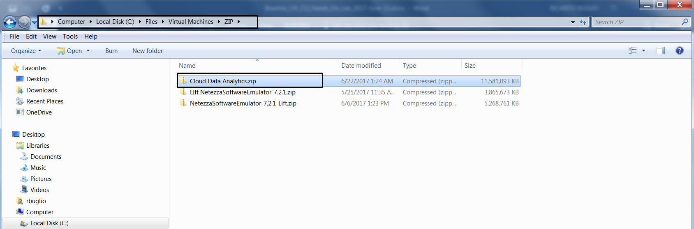

**Locate** the **Cloud Data Analytics.zip** VMWare Image zip file that you downloaded to your system in the Prework section.

**Unzip** the **Cloud Data Analytics.zip** file using your favorite program of choice; 7 Zip,  WinZip etc.  It will create a **Cloud Data Analytics** folder in the location you choose to put it.

### On Mac OSX

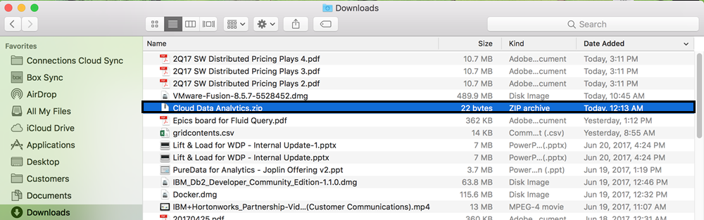

**Locate** the **Cloud Data Analytics.zip** VMWare Image zip file that you downloaded to your system in the Prework section.

**Unzip** the **Cloud Data Analytics.zip** file by simply **Double Clicking** the file or by selecting it, right mouse clicking and choosing to open it or open it using the Archive Utility. It will create a **Cloud Data Analytics** folder in the same location where the zip file resides and extract all the files into that folder.

<a name="power" />

## Power on the Virtual Machine

### On Windows

**VMWare Workstation**

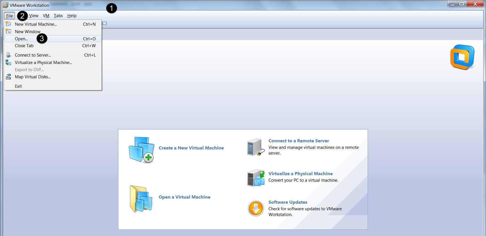

**Open** the VMWare Workstation or VMWare Workstation Player application (you can use either or to open the VM).

1. **Select** the **File** menu from the toolbar.

2. **Select** the **Open** menu item.

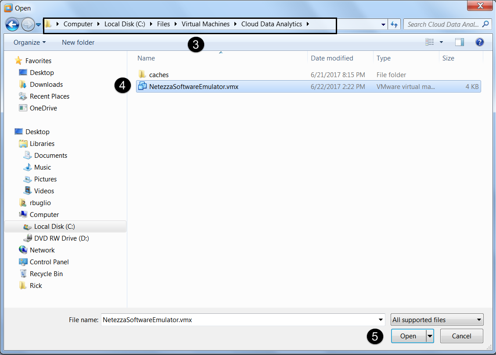

3. **Go to** the location on your file system where you unzipped the VM Image.

4. **Select** the **NetezzaSoftwareEmulator.vmx** file.

5. **Select** the **Open** button.

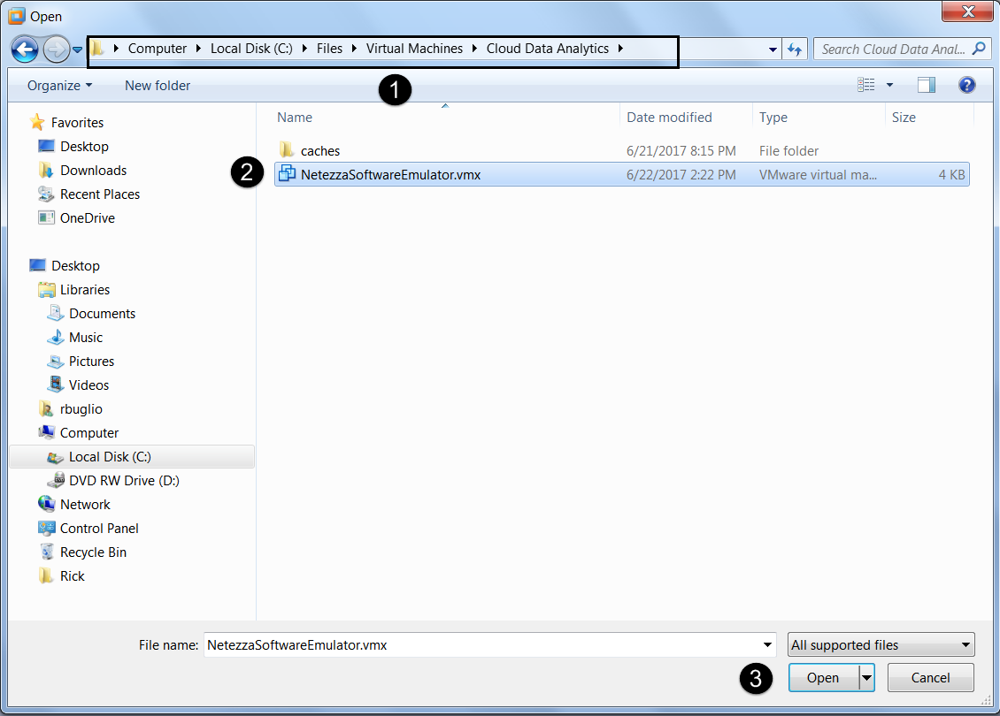

6. **Select** the "Power on this virtual machine" button to Power on the Virtual Machine.

**VMWare Player**

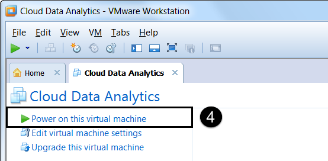

1. **Select** the **Player** menu on the toolbar.

2. **Select** the **File** menu item.

3. **Select** the **Open** menu item.

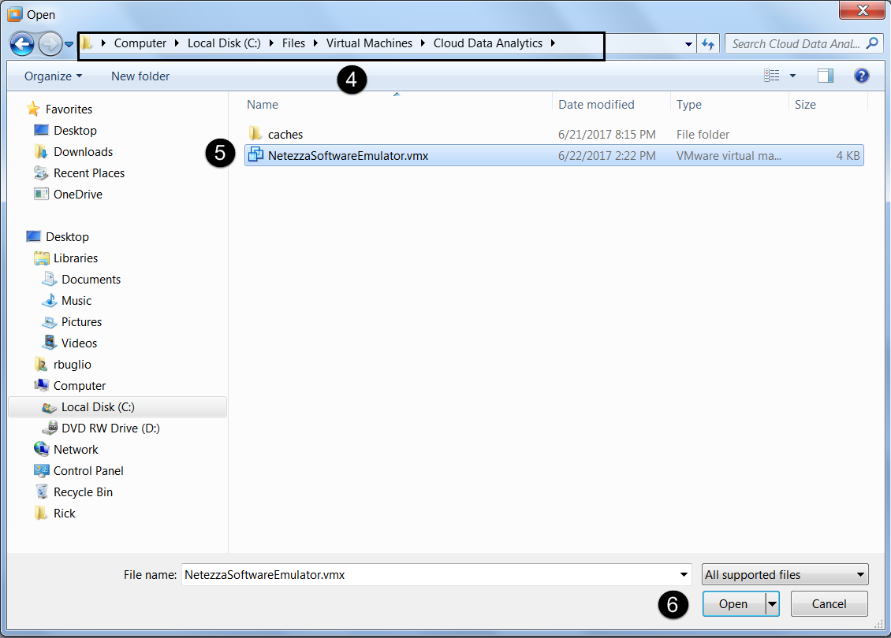

4. **Go to** the location on your file system where you unzipped the VM Image.

5. **Select** the **NetezzaSoftwareEmulator.vmx** file.

6. **Select** the **Open** button.

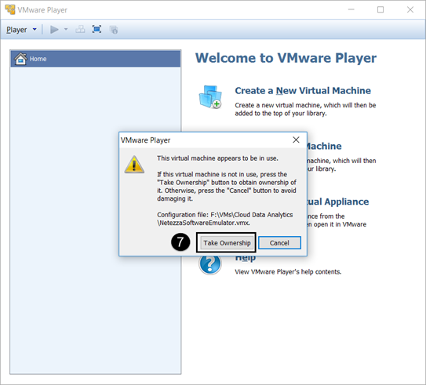

7. **Select** the **Take Ownership** button when prompted.

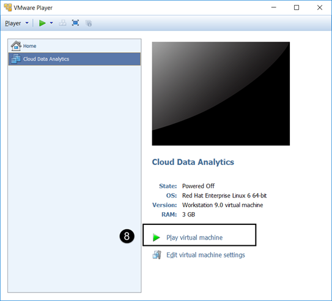

8. **Select** the "Play Virtual Machine" button to Power on the virtual machine.

### On Mac OSX

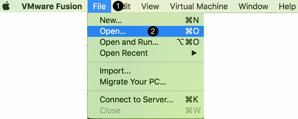

**Open** the VMWare Fusion application (VMWare Player is not available for Mac OSX).

1. **Select** the **File** menu from the toolbar.

2. **Select** the **Open** menu item.

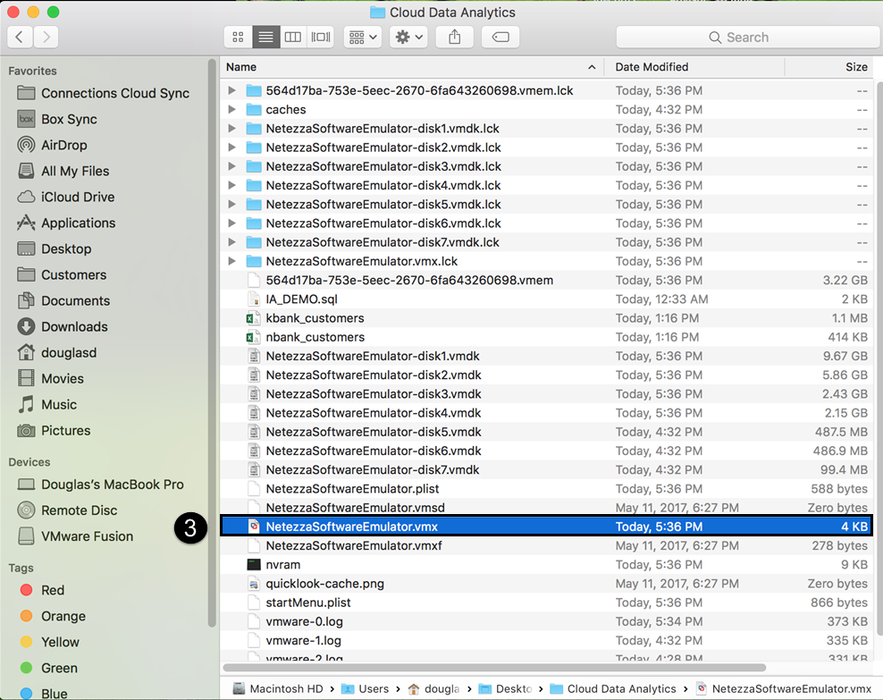

3. **Select** the **NetezzaSoftwareEmulator.vmx** file from within the **Cloud Data Analyitcs** VM Image folder.

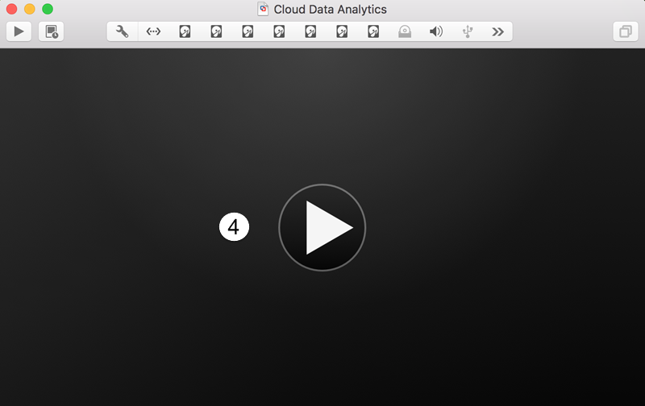

4. **Select** the **Play** button to Power on the virtual machine.

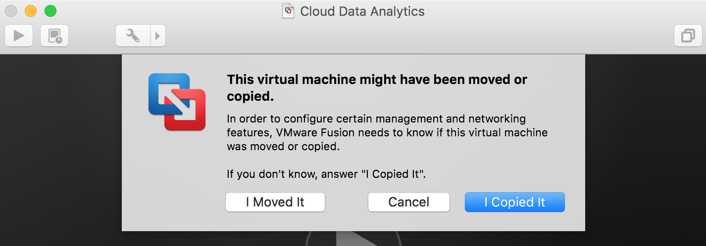

5. **Select** the **I Moved It** button so that the system maintains the configuration as we defined it.

<a name="login" />

### Note

>
> When you start working in the VM, your keyboard and mouse will be connected to the VM. You cannot just move the mouse outside the VM window to work on other applications. To **release** the mouse and keyboard from the VM, 
>
> On Windows hit CTL+ALT
>
> On Mac OSX hit control+command
>

## Virtual Machine Credentials

The credentials (userid / password) for this Virtual Machine (VM) are as follows:

- Root = root / netezza

- Netezza User = nz / nz – You will use these credentials to log into the VM

- Netezza Admin = admin / password – You will use these credentials for your Lift data migration

## Step 3a: Set the Keyboard

**OPTIONAL**  For a non "US English keyboard" you way want to switch to a local keyboard to make the work easier.

For France for example - where the keyboard is AZERTY.
1. If logged in, then logout

1. login as root: root/netezza

1. run: **loadkeys fr**

1. logout

## Login to the Virtual Machine

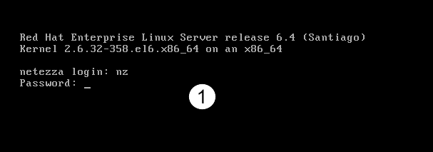

1. **Enter** a lowercase login id of **nz** and a password of **nz**. The Virtual Machine’s IP Address is displayed.

<a name="liftpf" />

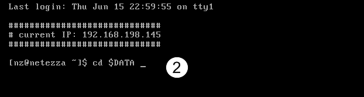

## Step 4: Update the Lift Properties

1. **Enter** the command **cd $DATA**.

2. **Enter** the command **ls -la**.

3. **Enter** the command **vi lift.pf** to edit the Lift properties file.

> **Note -** 
>
> The content in the **lift.pf** properties file is case sensitive. Make sure that when you change values noted below that you keep the values in lowercase or Uppercase. For instance, the **target-user** is in lowercase but the **target-schema** is in Uppercase. Keep them in the same case when doing changes.
>

4. **Change** the **target-user**, **target-password** , **target-host** and **target-schema** to your dashDB user, password, host and schema (your schema is the same as your user but in Uppercase...) using the credentials from your dashDB for Analytics service Credentials section you obtained in a previous section.

> **Note -** 
>
> While in the vi editor you can use the arrow keys to move to the character that you want to change and press R to overwrite the character at the cursor location, continue typing with your edits and hit ESC when done to return to command mode.
>

5. **When finished**, hit ESC, hold `SHIFT` and type `ZZ` to save and close the file.

<a name="secgwid" />

## Step 5: Update the Secure Gateway ID

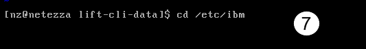

1. **Enter** a command of **cd /etc/ibm**.

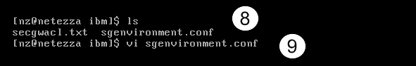

2. **Enter** a command of **ls**.

3. **Enter** a command of **vi sgenvironment.conf**.

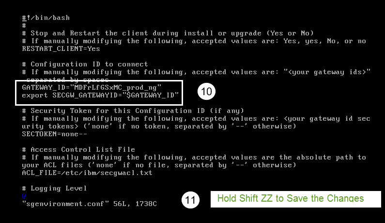

**Note -** The GATEWAY_ID you will be changing is case sensitve so make sure you type it in exactly as it appears.

4. **Change** the **GATEWAY_ID**, to **GATEWAY_ID="<your_gateway_id>"**. This is your Data Connect service Secure Gateway ID that you were instructed to copy to the clipboard and save off.

5.	**When finished**, hold `SHIFT` and type `ZZ` to save and close the file.

6. **Enter** the command **reboot** to recycle the VM image. This will esnsure that the Secure Gateway Client restarts and that it picks up your Gateway ID to communicate with your Data Connect service in the cloud.

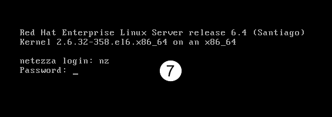

7. **Enter** a lowercase login id of **nz** and a password of **nz** to log back into the VM image.

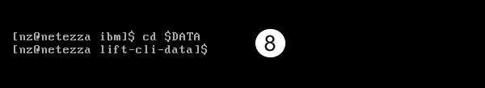

8. **Enter** the command **cd $DATA** to position yourself in the Lift CLI data directory.

## Step 5: Move Data to the Cloud using Data Connect

### Steps 
1. [Launch the Data Connect service](#launch)
1. [Validate the Secure Gateway Client is Connected](#secgw)
1. [Create the Source and Target Connections](#createconn)
1. [Create the Data Movement Activity](#createact)
1. [Run the Data Movement Activity](#runact)
1. [Validate the Data Movement Results](#validact)

Open a browser and go to Bluemix.net. You will see the Welcome screen that looks like 

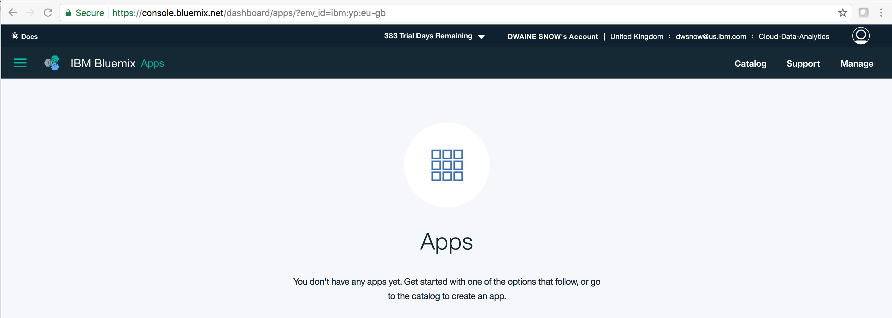

Scroll down the screen until you see the list of all of your services, like shown below. 

<a name="launch" /> 

## Launch the Data Connect Service

1. **Click on** the **CDA Data Connect** service from your Bluemix Account services area.

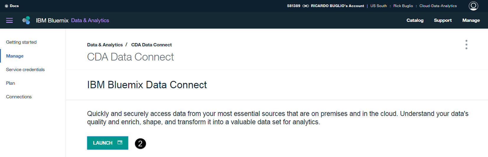

2. **Select** the **LAUNCH** button to launch the Data Connect service. It will open up in a new tab in your browser.

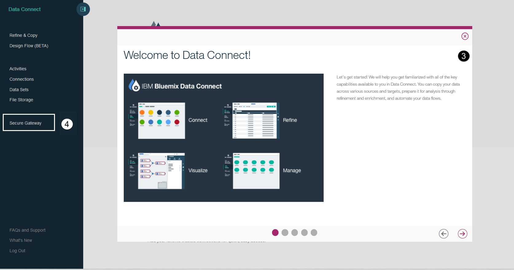

3. If you get the Welcome screen, **Select** the **X** in the top right corner of the Data Connect Welcome dialog to close the dialog.

4. **Select** the **Secure Gateway** menu from the Data Connect main menu on the left hand side.

<a name="secgw" />

## Validate the Secure Gateway Client is Connected

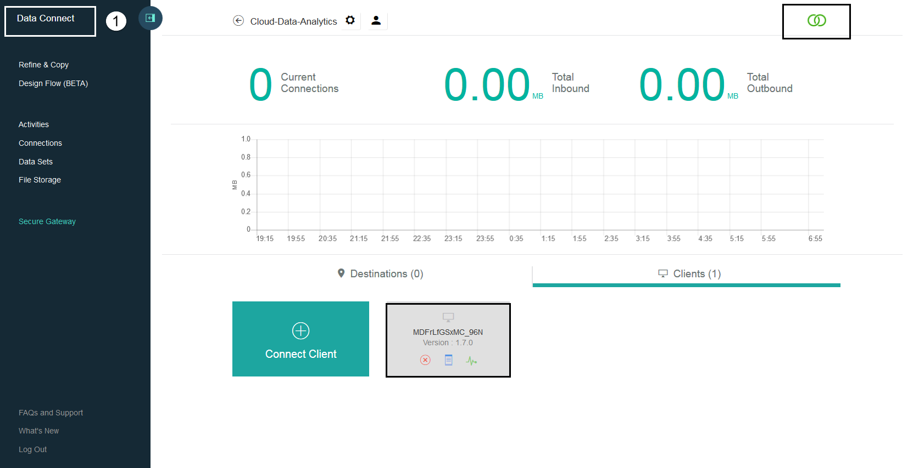

You should see that your Secure Gateway client is connected in the Secure Gateway client section as depicted above. There should also be a green client connection icon in the top right hand corner signifying that client(s) are connected and ready for work. 

> **BE CAREFUL**
> 
> If your Secure Gateway section **does not** look like the screen shot above - then your Secure Gateway client in the VM Image may not have the correct Gateway ID to communicate with your Data Connnect Secure Gateway. If that is the case, go back to the [Create the Cloud Data Analytics lab services](#step-1-create-the-cloud-data-analytics-lab-services) section of this lab where you were instructed to configure the Secure Gateway client and make sure the Gateway ID is equal to the Gateway ID of your Secure Gateway. 
> 

When everything is green, and you see that your Secure Gateway client is connected, proceed.

1. **Select** the **Data Connect** title in the top left corner of the service to go to the home page.

<a name="createconn" />

## Create the Source and Target Connections

In this step, you will create three Data Connect connections:

1. dashDB for Analytics - This is your target data souce where you will move the Db2 and PDA on-premises data to

1. PureData for Analytics - This is the on-premises PDA database in the VM that contains K Bank's Customer data

1. Db2 - This is the on-premises Db2 database in the VM that contains N Banks"s Customer data

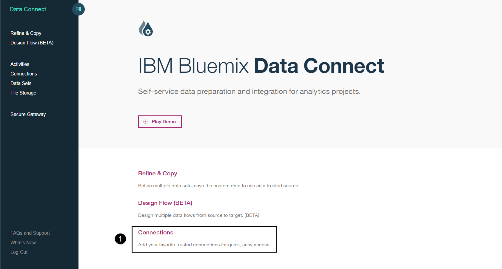

1. **Select** the **Connections** link in the middle of the Data Connect home page to begin creating connections.

### Create the dashDB for Analytics Connection  

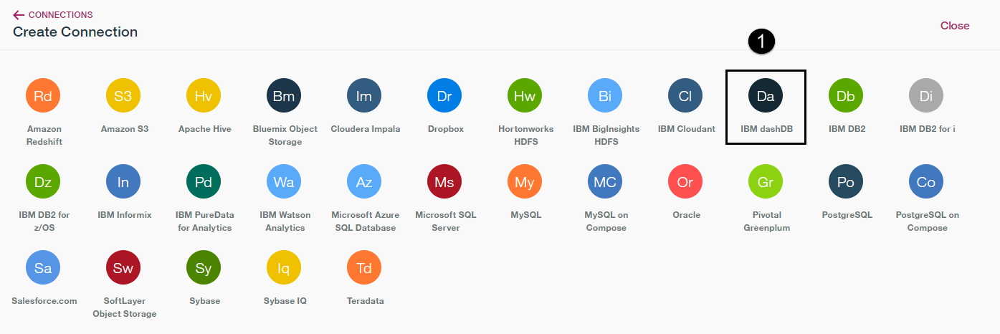

1. **Select** the **IBM dashDB** connector from the list of connection types.

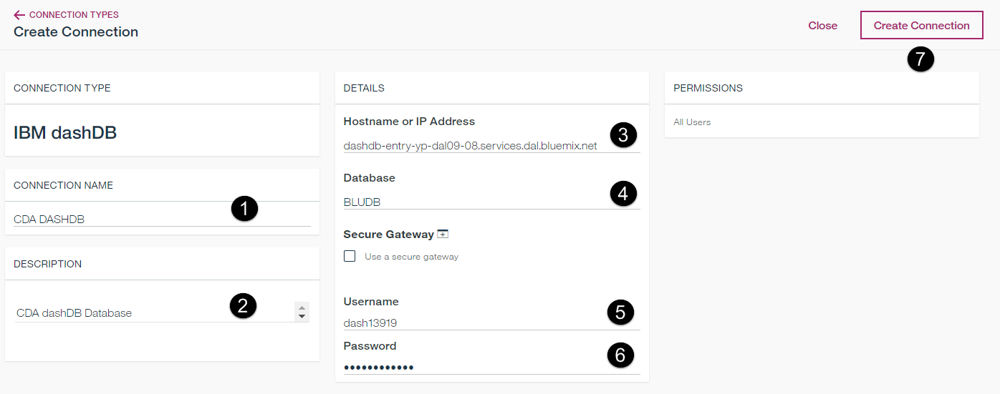

1. **Enter** a connect name of **CDA DASHDB**.

1. **Enter** a description of **CDA dashDB Database**.

1. **Enter** the host name from your dashDB service credentials.

1. **Enter** a Database name of **BLUDB** - All dashDB plans use a database name of BLUDB.

1. **Enter** the username from your dashDB service credentials.

1. **Enter** the password from your dashDB service credentials.

1. **Select** the **Create Connection** button.

### Create the Db2 Connection

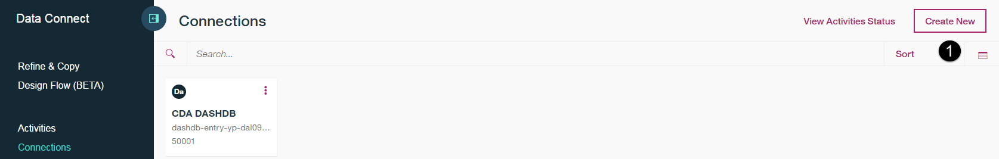

1. **Select** the **Create New** button in the top right corner.

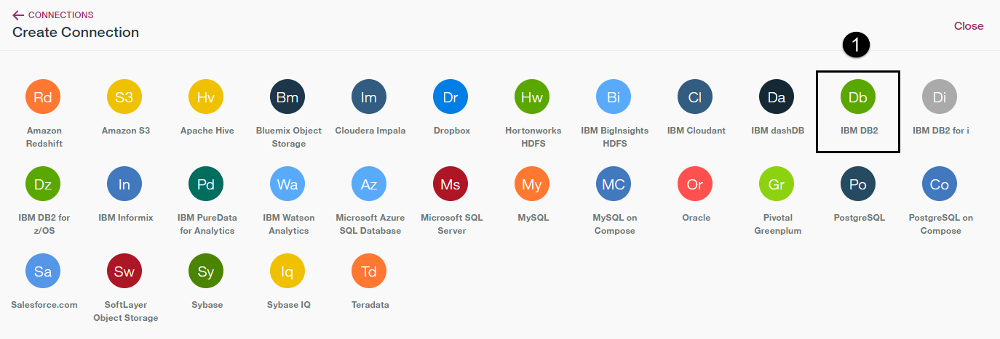

1. **Select** the **IBM DB2** connection from the list of connection types.

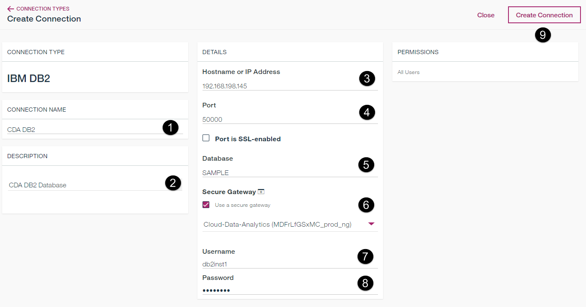

1. **Enter** a connect name of **CDA DB2**.

1. **Enter** a description of **CDA DB2 Database**.

1. **Enter** the **IP Address** of your VM Image as the host name.

1. **Enter** a port of **50000**.

1. **Enter** a Database of **SAMPLE**.

1. **Select** the Cloud-Data-Analytics secure gateway from the list. There should only be one.

1. **Enter** a username of **db2inst1**.

1. **Enter** a password of **db2inst1**.

1. **Select** the **Create Connection** button.

### Create the PureData for Analytics Connection

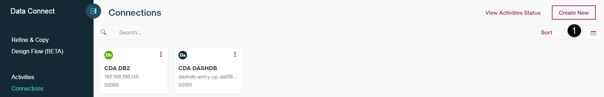

1. **Select** the **Create New** button in the top right corner.

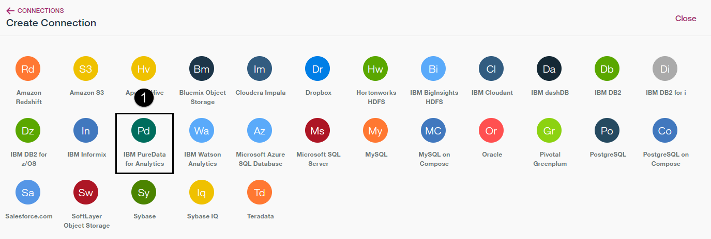

1. **Select** the **IBM PureData for Analytics** connecter from the list of connection types.

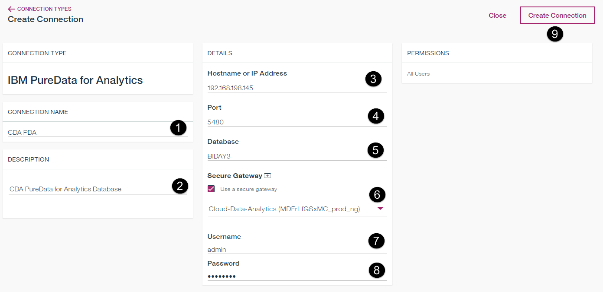

1. **Enter** a connect name of **CDA PDA**.

1. **Enter** a description of **CDA PureData for Analytics Database**.

1. **Enter** the **IP Address** of your VM Image as the host name.

1. **Enter** a port of **5480**.

1. **Enter** a Database of **BIDAY3**.

1. **Select** your Cloud-Data-Analytics secure gateway from the list. There should only be one.

1. **Enter** a username of **admin**.

1. **Enter** a password of **password**.

1. **Select** the **Create Connection** button.

<a name="createact" />

## Create the Data Movement Activity

Now that you have all the connections created, you will create a Data Connect Activity which will read the K Bank Customers from PDA on-premises and the N Bank Customers from Db2 on-premises, combine the customers from both banks using a union, sort the data by Customer and then move the data to dashDB on the cloud.

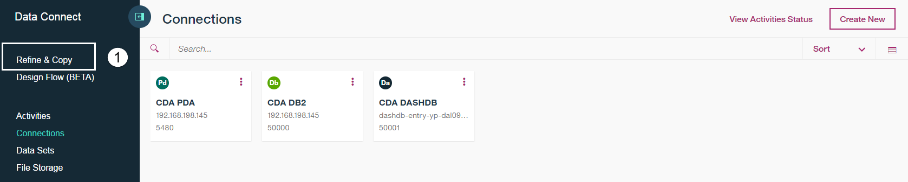

1. **Select** the **Refine and Copy** menu item from the Data Connect main menu on the left.

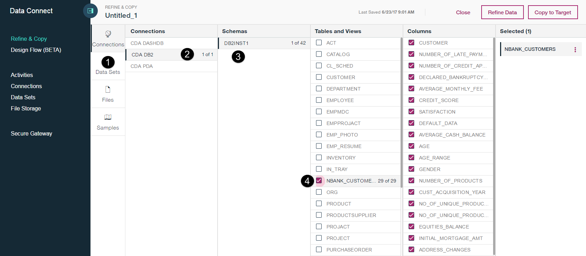

1. **Select** the **Connections** category.

1. **Select** the **CDA DB2** connection from the list of connections.

1. **Select** the **DB2INST1** schema from the list of schemas.

1. **Select** the **NBANK_CUSTOMERS** table from the list of tables.

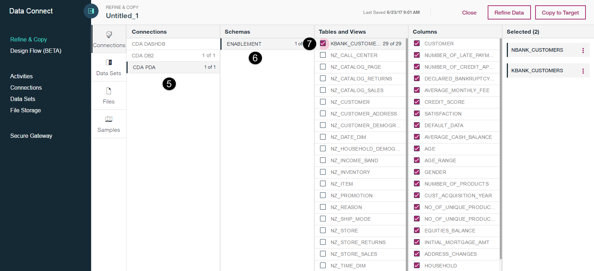

5. **Select** the **CDA PDA** connection from the list of connections.

6. **Select** the **ENABLEMENT** schema from the list of schemas.

7. **Select** the **KBANK_CUSTOMERS** table from the list of tables.

8. **Select** the edit icon (the pencil) next to the default "Untitled 1" activity name.

9. **Enter** an activty name of **CDA Move to Cloud**.

10. **Select** the **Save** button next to the name.

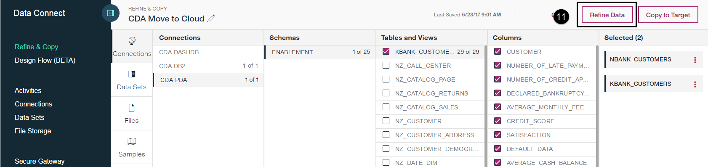

11. **Select** the **Refine Data** button to go into the Data Connect shaper.

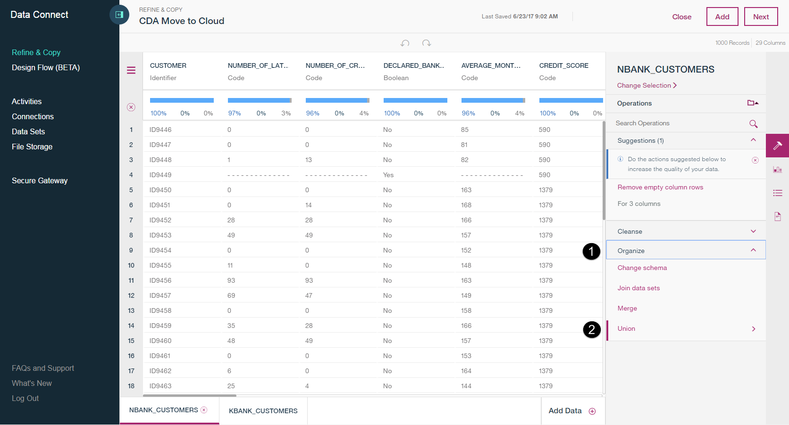

1. **Select** the **Organize** category from the Operations side bar section on the right hand side.

1. **Select** the **Union** operation.

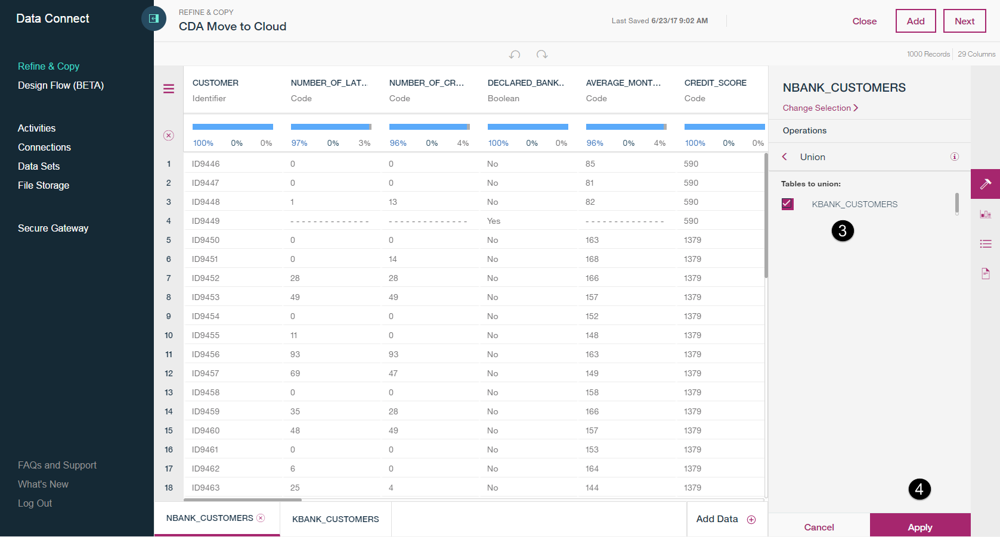

3. **Select** the **check box** next to the **KBANK_CUSTOMERS** table as the table to union.

4. **Select** the **Apply** button**.

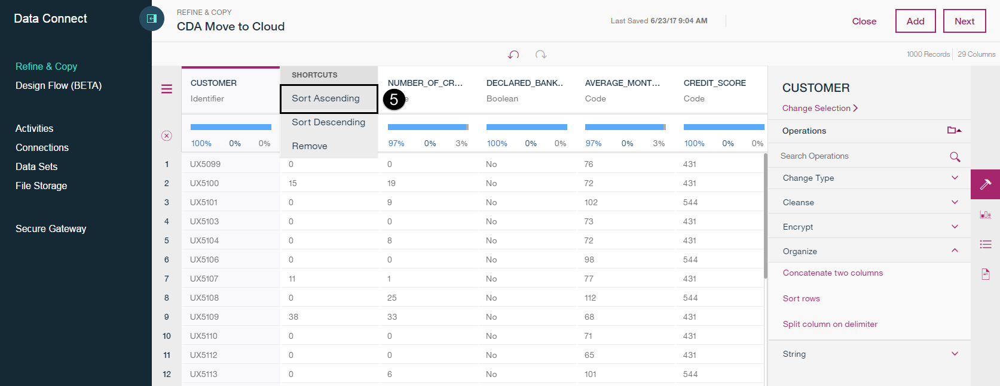

5. Hover over the customer column and then **Select** the three dots the right corner of the **Customer** column and then **Select** the **Sort Ascending** menu item.

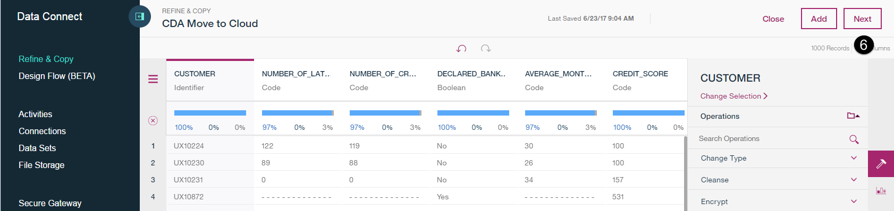

6. **Select** the **Next** button in the top right corner.

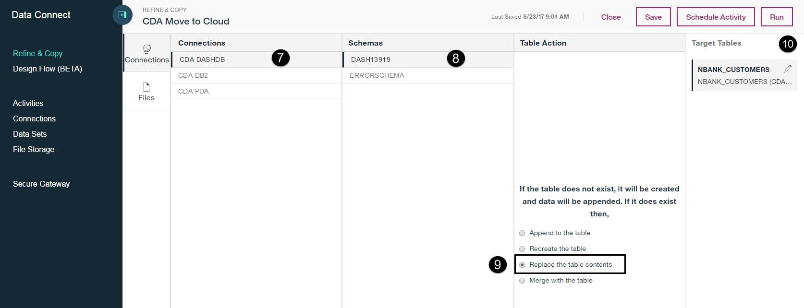

7. **Select** the **CDA DASHDB** connection from the list of connetions.

8. **Select** the **DASH####** schema (your dashDB schema) from the list of schemas.

9. **Select** the **Replace the table contents** radio button from the list of table actions. 

> **Note -** 
> 
> This is an important step so make sure you select the correct table action. You want to replace the entire table contents.

10. **Select** the edit icon next to the **NBANK_CUSTOMERS** target table name to change the target table name.

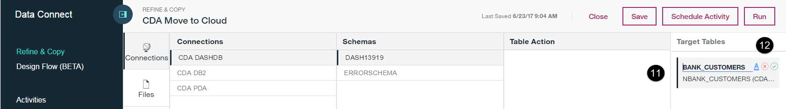

11. **Enter** a target table name of **BANK_CUSTOMERS** for the target table name.

12. **Select** the green check mark next to the new target table name to save the name change. Your new target table name should now be **BANK_CUSTOMERS**.

<a name="runact" />

## Run the Data Movement Activity

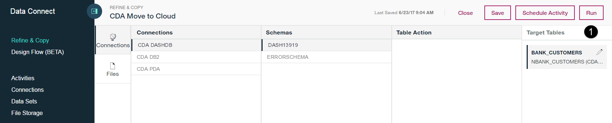

1. **Select** the **Run** button in the top right corner of the shaper.

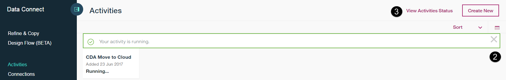

2. **Select** the **X** on the "Your activity is running" message to close the message.

3. **Select** the **View Activities Status** link to bring up the activity monitor.

<a name="validact" />

## Validate the Data Movement Results

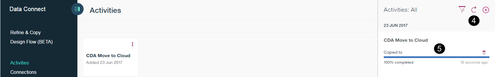

1. **Select** the **Refresh** button on the activity status monitor to update the status.

> Keep hitting the **Refresh** button until you see a status of **Copied to** and **100% completed**.

2. **Select** the **Copied to** link in the status monitor for the activity to view the activity log.

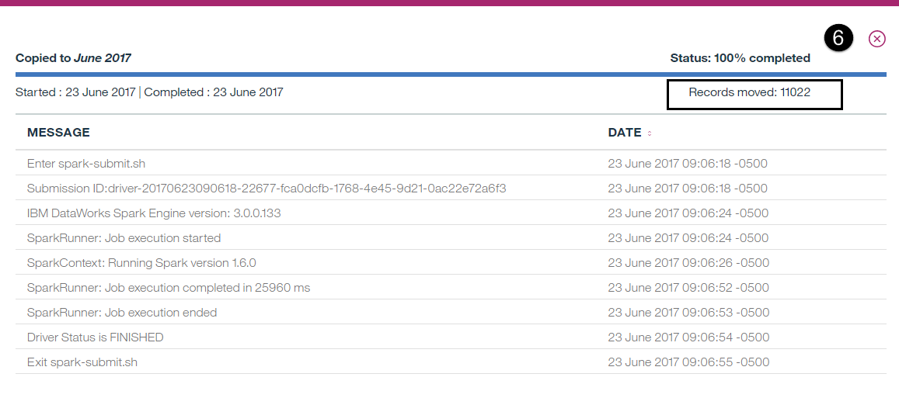

> You should see that the number of **Records Moved** is equal to 11,022 rows.

3. **Select** the **X** in the top right corner of the activity log dialog to close the activity log dialog.

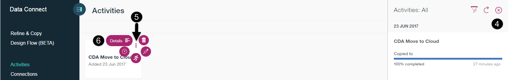

4. **Select** the **X** in the top right cornder of the activity status monitor to close the monitor.

5. **Select** the three dots on the top right of the **CDA Move to Cloud** activity.

6. **Select** the **Details** option to view the activity details.

7. **Select** the **View data** link in the **OUTPUTS** section of the activity detail.

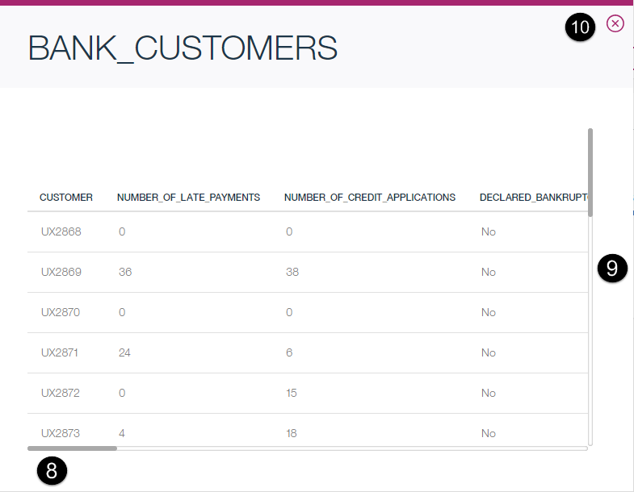

8. **Scroll** to the right to view all the columns.

9. **Scroll** down to view the 100 row sample set provided.

10. **Select** the **X** in the top right corner of the View data dialog to close the dialog.

Congratulations! You have successfully move data to the cloud using Data Connect.

> ____________________________________________________________________________________ 
>
>
> **Note:**
>    
>  
> If you want to try to move the data again using the Lift CLI, go to [Lift4Move.md](https://github.com/ibm-cloud-architecture/refarch-cloud-data-analytics/blob/master/Lift4Move.md)
>  
>  
> ____________________________________________________________________________________ 

# Analyze the Data

"K Bank" has found that customer loss (churn) is directly related to the customer's satisfaction level. This is kind of obvious, so it would be interesting to see how these churn prediction models could be used to looks at "N Bank" customers and identify who might be at risk of leaving. Since "K Bank" just spent a lot of money to acquire "N Bank", you do not want to lose any customers if you can help it.

Now that we have the data in one place, we can explore the data and discover how satisfied your customers are, within each Bank and across both Banks. You can also identify which customers are leaving the bank and which ones you should work to retain going forward. You can also create a dashboard to showcase your findings and use it to tell a story of what you discovered and any actions you might want to take base on this analysis for use in your next board meeting.

## Step 1: Setup Cognos

Launch [Cognos Free Trial](https://www.ibm.com/analytics/us/en/technology/products/cognos-analytics/)
and SIGN IN to bring up the login page.

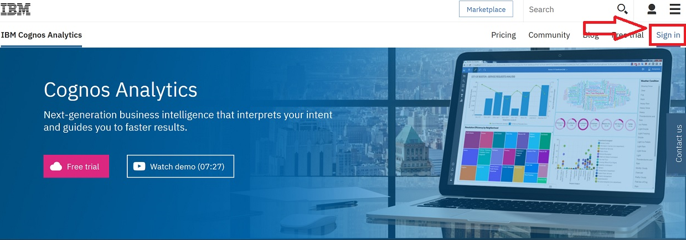

You will be taken to the Welcome page.

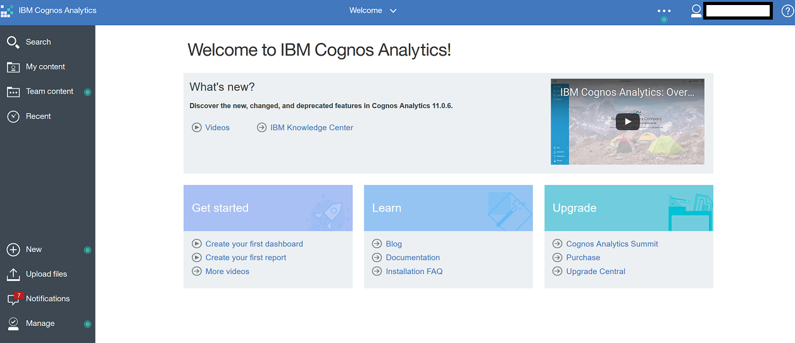

### Create a Data server connection

1. On the Welcome screen, select Manage on the bottom left side. 

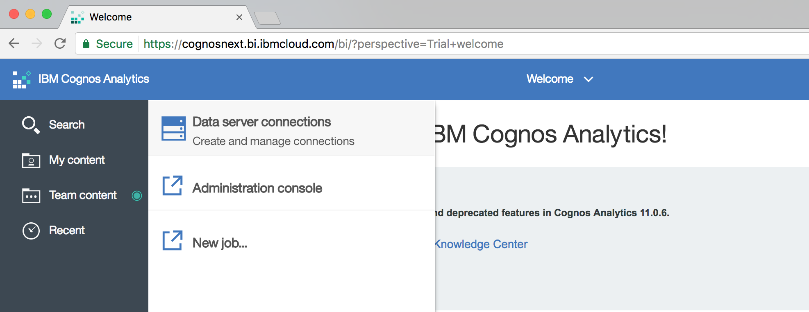

1. Select Data server connections to create a new data server.

1. Create a new data server connection by selecting the ‘+’

Select dashDB as the typeIA

1. Rename the connection name from New data server connection to IA_Bank Customers

1. Enter your dashDB JDBC URL from your dashDB service credentials you created and obtained earlier during the dashDB service setup. Copy the "jdbcurl" (NOT the "ssljdbcurl") and paste into Cognos Analytics. Your JDBC URL might look something like this (do not paste the quotes):  **"jdbc:db2://dashdb-entry-yp-dal09-08.services.dal.bluemix.net:50000/BLUDB"**

1. You need to specify the sign in credentials for the dashDB user to use each time you connect to this database. Select the Use the following signon check mark  

1. Select the  ‘+’ icon 

1. Enter the your dashDB User ID

1. Enter your password and confirm your password

1. Click on the Test Button to verify your new connection.  If it tests successfully, then

1. Click Save

If the test fails, check the userID, password, etc. and re-test.

Now we need to select the database schema (table owner) that we will use in this exercise. 

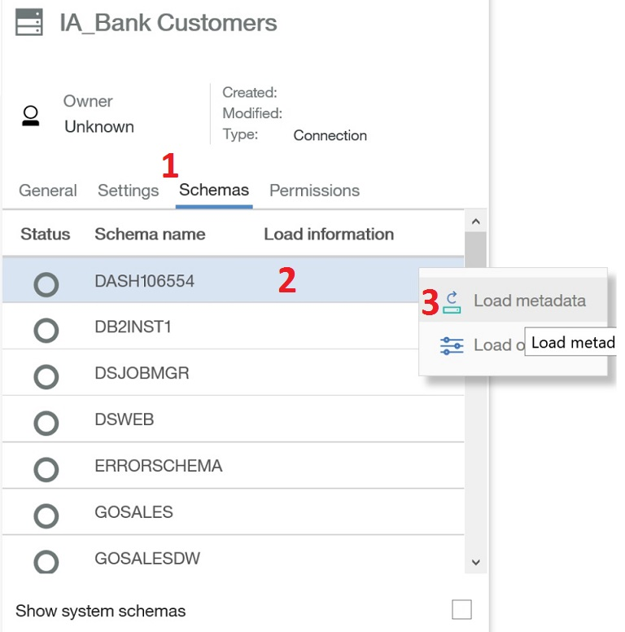

1. Select the Schema tab for the IA_Bank Customers data server connection

1. Select the schema associated to your userid and select

1. Select Load metadata. 

 When the schema is successfully loaded, the status button next to the schema will turn green

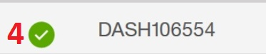

### Create a Data Module

With Cognos Analytics, users are not restricted to only using existing enterprise data sources. Users can blend perosnal data or external data with enterprise data to gain deeper insight. Users can connect to enterprise data directly, or they can import other data sets from from files or other data sources into Cognos Analytics. These data sources can be blended, cleansed and joined together to create a reusable **data module** for use in dashboards and reports, and/or shared with other users in the organization. Although this lab has only one data source, we will still create a data module.

To create a new data module, select New from Navigation Bar on the left side of the Cognos Analytics screen and then select Data module

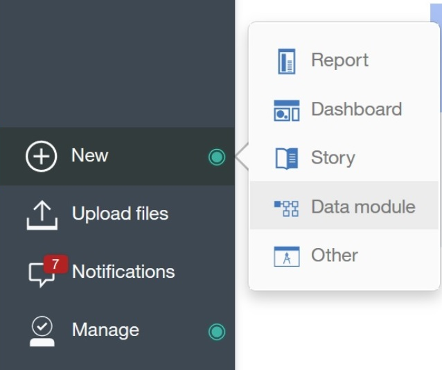

This will take you to the Create data module screen and provide a list of options you can choose from. 

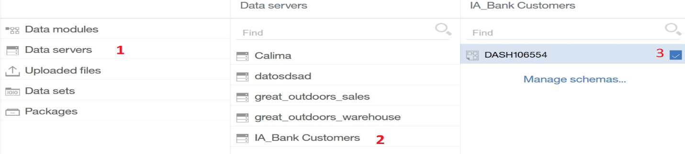

1. Select Data servers (because we are going to connect to the ‘IA_Bank Customers’ data server connection you created earlier.

1. Select IA_Bank Customers from the list. This will display the schema we created earlier. 

1. Select the ‘Schema’ associated with your dashDB instance, ours is **DASH106554** in this instance.

Your schema will now be added to Selected sources list. Again ours is **DASH106554**.

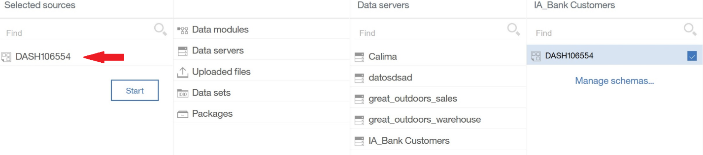

Click on the Start button.

### Data modeling

Once a data source is selected, users can enter their desired search term(s) and click on Go to look for tables with data related to that search term. Cognos Analytics will analyze the data source and present table(s) that have some relation to the term you entered that you can add to your data module. Since we want to look into our Bank customers to analyze satisfaction and churn data,  

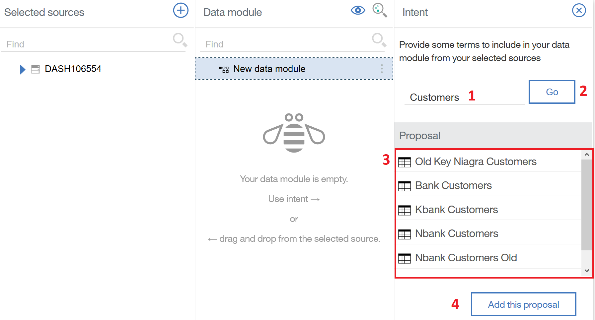

1. In the intent panel, type Customers

1. Click on Go

1. While we show multiple tables here, you should only see a single table, named **Bank Customers**.  Select the Bank Customers table

1. Click on Add this proposal

Your data module should look like this

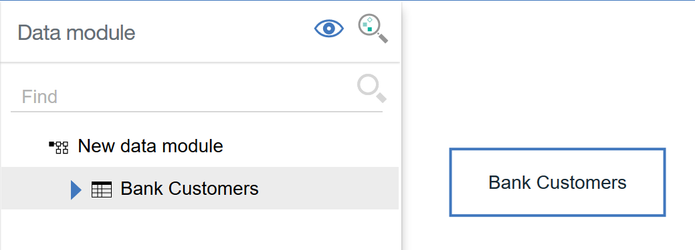

We will save our data module now.

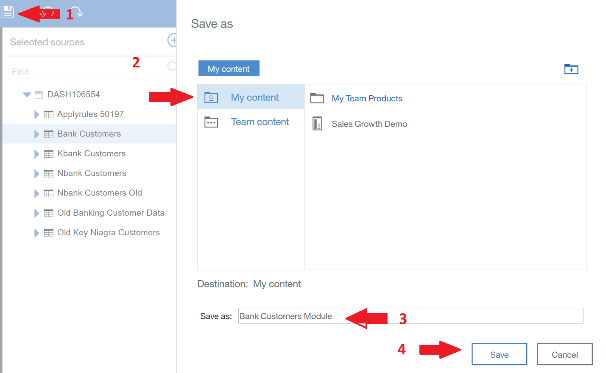
1. Click Save.

1. Select My Content.

1. Type ‘Bank Customers Module’ for the name.

1. Click Save

Expand the Bank Customers table in the Data Module View

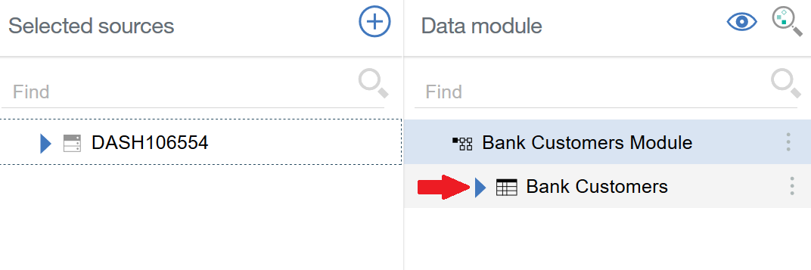

You have told us that your Data Scientists have found some interesting correlations between the number of late payments a customer has had in the past and their propensity to churn. Because this has been identified as an interesting factor for further analysis, we will divide the data into groups based on how many late payments they have had. 

Select the Number of Late Payments column and click on more options (the 3 dots, one above the other)

Select Create custom groups

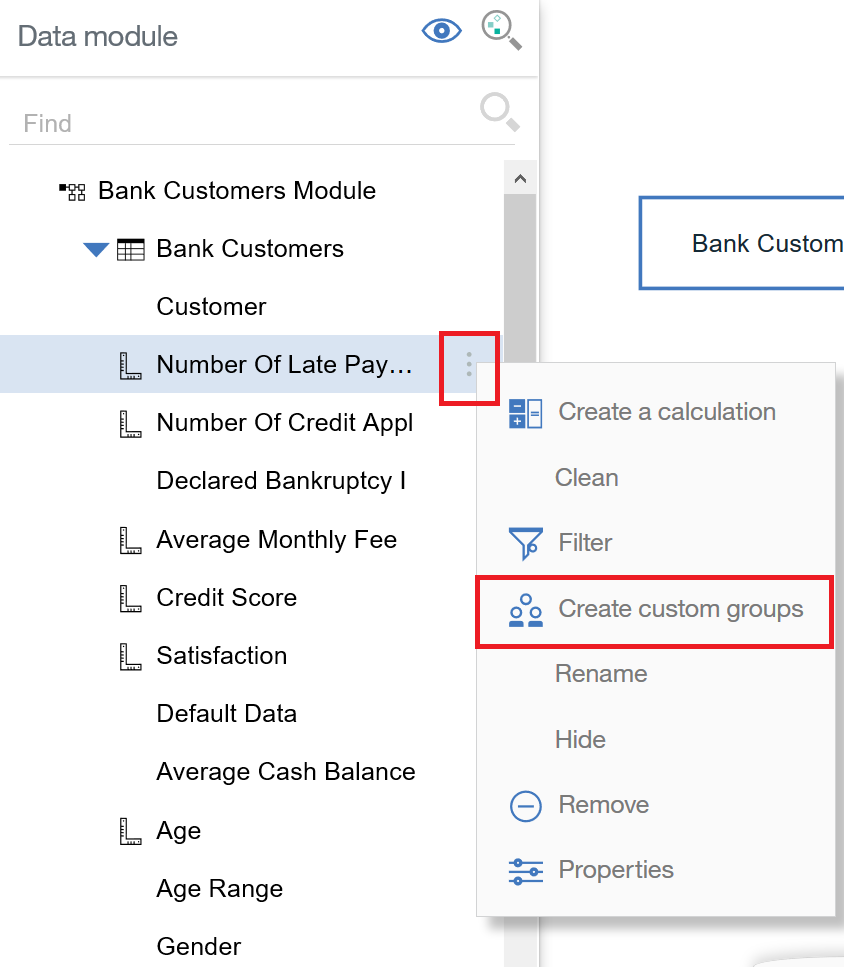

We can see that Cognos Analytics suggests creating an equal distribution of the late payment values into 10 groups distributed evenly.

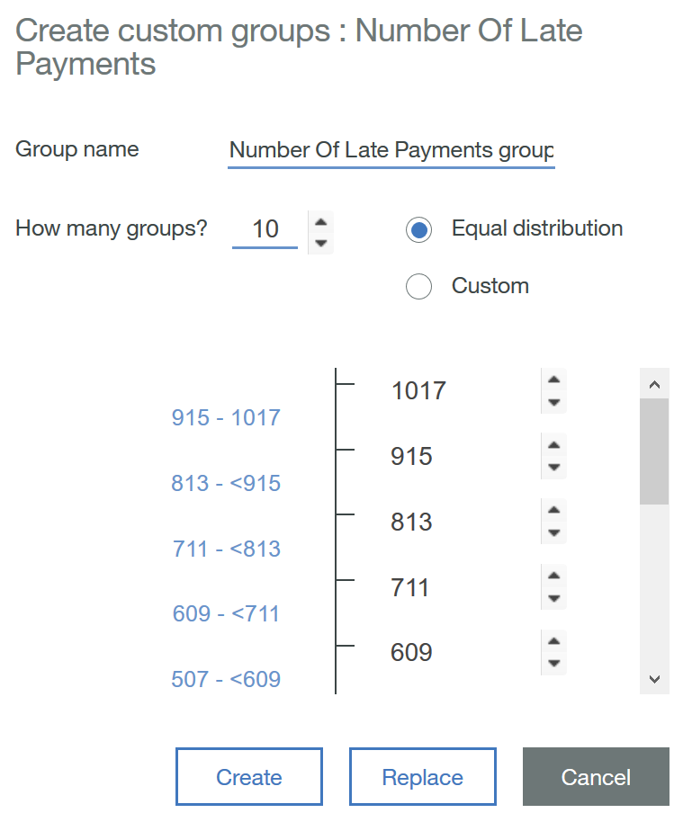

However, we will create 3 groups based on the findings of your Data Scientists.

1. Change the Group name to Group Late Payments

1. Change How many groups? from 10 to 3

1. Select Custom

1. Change the lowest value to 1

1. Change the middle value to 21

1. Change the highest value to 3000

1. Click on Create

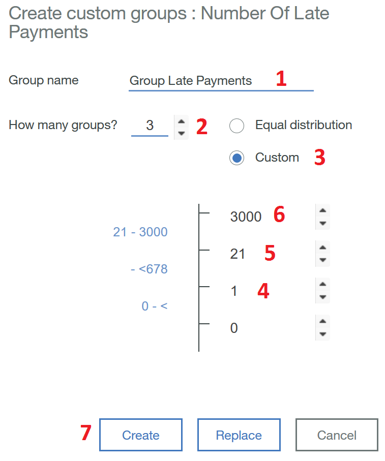

The data scientists have also observed a correlation between the number of credit applications a customer has submitted and their tendency to churn. So we will also create a another Custom group for the number of credit applications. Create a
new custom group based on the Number of Credit Applications.

Again, we will create 3 groups.

Select the Number of Credit Applications column and click on more options

1. Change the Group name to Group Credit Applications (Note, we mis-spelled this, but you can spell it correctly if you wish)

1. Change How many groups? from 10 to 3

1. Select Custom

1. Change the lowest value to 5

1. Change the middle value to 26

1. Change the highest value to 3000

1. Click on Create

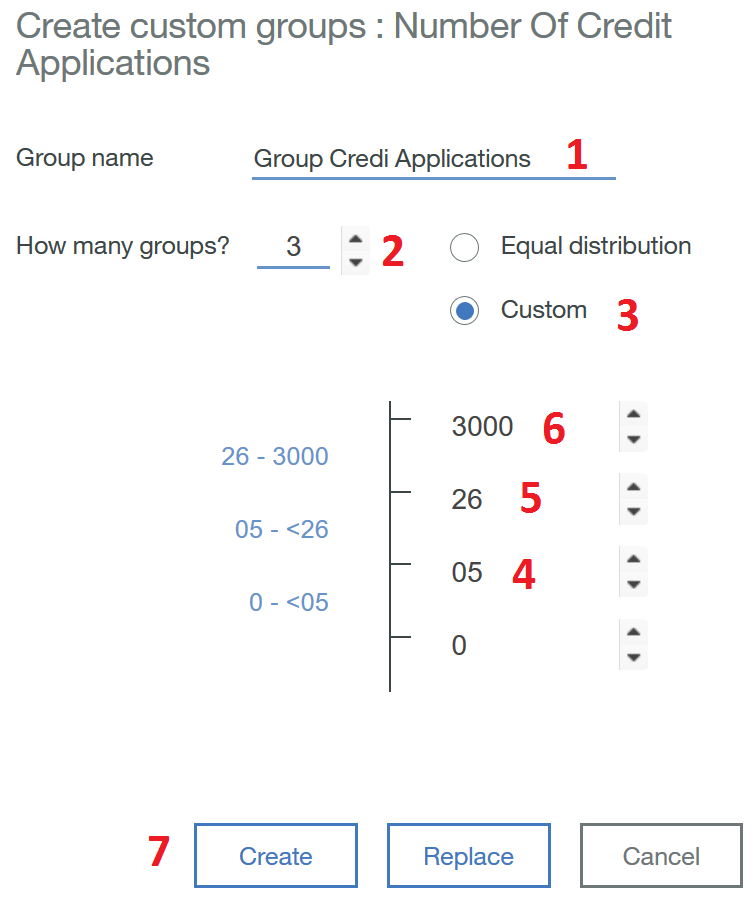

**Save the data module**

### Create Navigation Group

Navigation groups allow drill downs that align with how users want or need to analyze their business. In this case the Bankid column identifies whether the data is from "K Bank" or "N Bank". 

> **IMPORTANT ---- You need to go back and re-open your Data Module.**

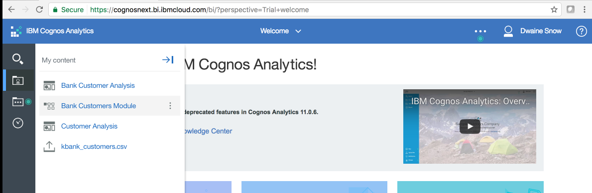

1. Go back to the Welcome screen, select your folder (2nd from the top with the person image in the folder)

1. Select your data module.  

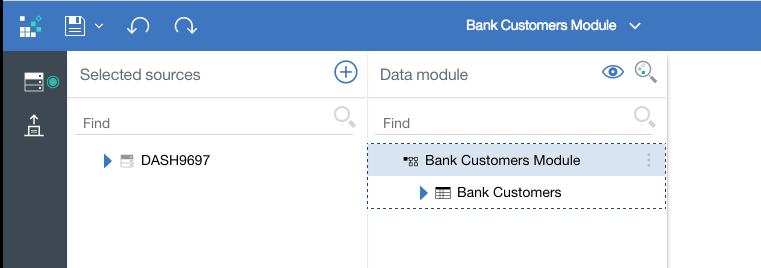

Click on the triangle beside Bank Customers to show the columns in the table.  

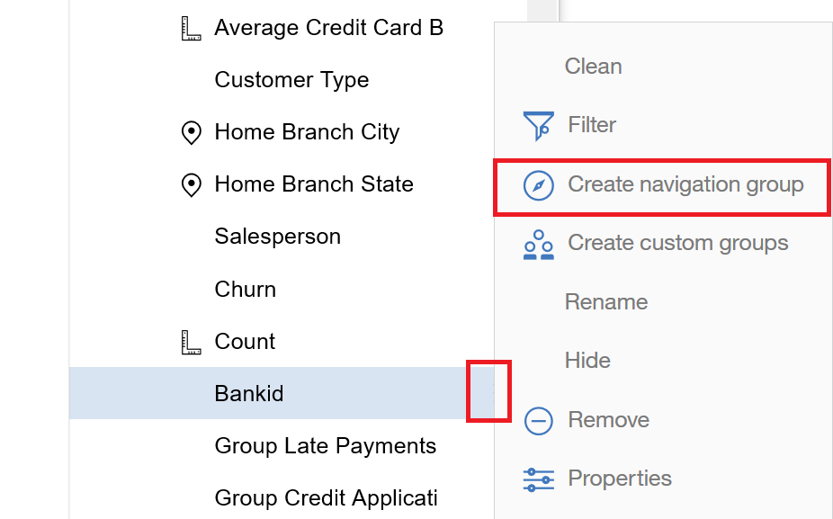

- Scroll to the Bankid column in the Bank Customers table and select it

- Select more options for the Bankid column

- Select Create navigation group. 

The default name will be Bankid since that is the name of the column we selected first.

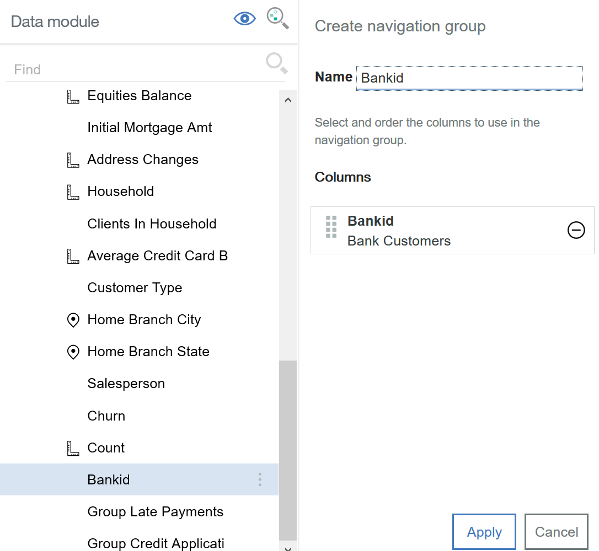

In our Analysis we want to look at information by Originating Bank, churn, customer type, branch location and customer.

1. Rename the Navigation Group to Bank Churn Drill Path

1. Drag the Churn column below Bankid

1. Drag the Customer Type column below Churn

1. Drag the Home Branch State column below Customer Type

1. Drag the Customer column below Home Branch State

1. Click on Apply

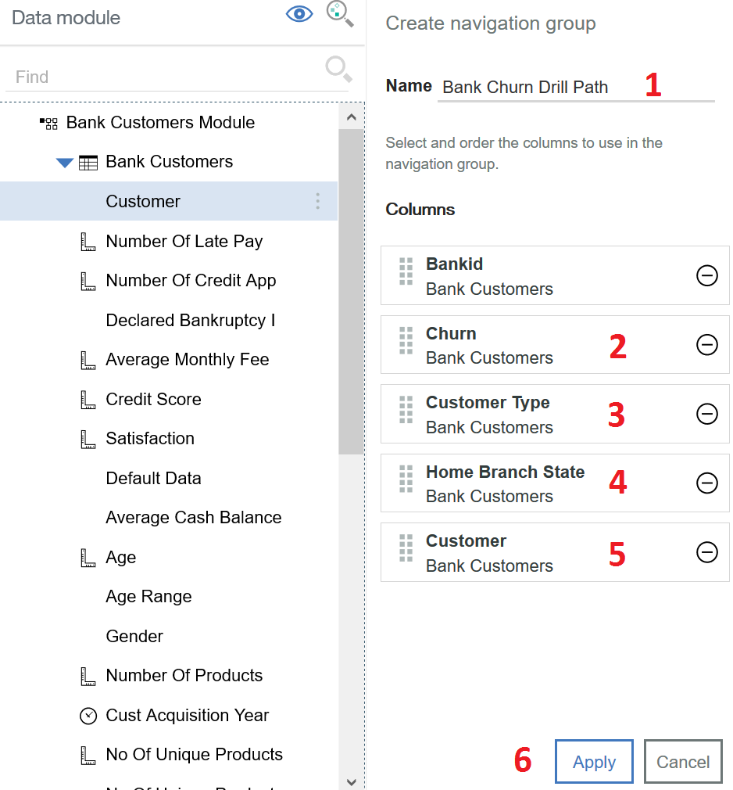

There are many more things we could do in this data module, but for now let's **save** the data moduleand start looking for insight.

## Step 2: Getting Insight

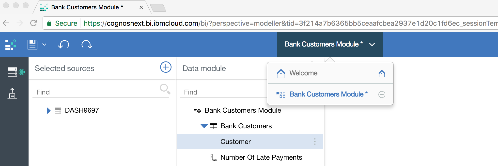

Go back to the Welcome Screen

From the main Cognos Analytics screen, click on the + sign on the left hand side and select Dashboard.

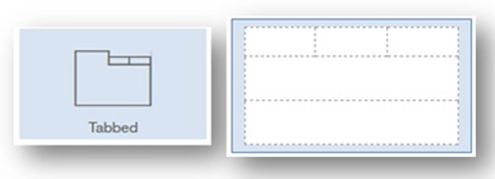

The Template window then appears, allowing you to select the type of dashboard and the template style. 

Select the tabbed dashboard style. This will show you multiple options for the look for your dashboard. 

Select the template with the three small rectangles (panels) across the top, and two full width panels below (on the right above). 

Click on OK.

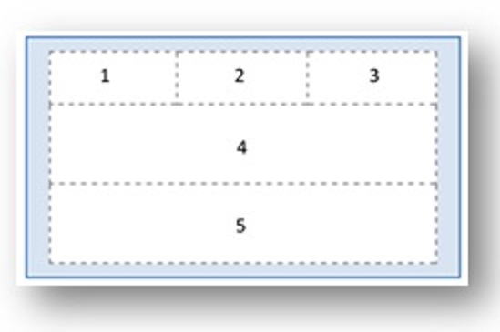

Each panel on the template acts as a placeholder for dashboard objects, known as widgets. Templates are device aware and will auto-size to the screen of the device being used.

As we build the dashboard, we will reference the location placement for widgets we create in the dashboard template using the following panel numbers

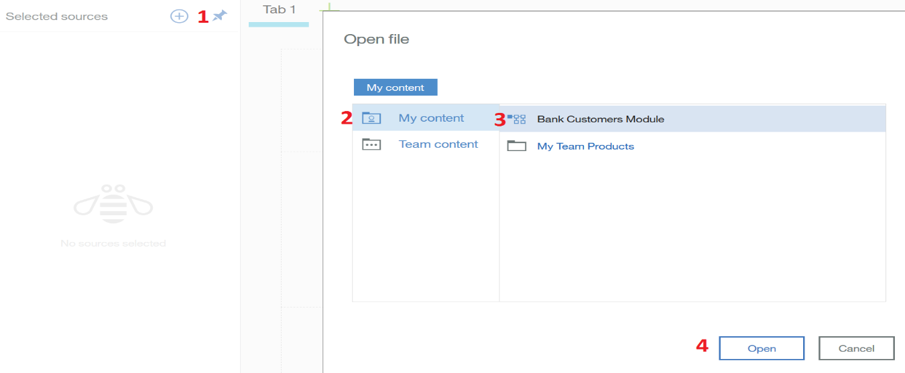

Select the data module we just created, and then 

1. Select the '+' to add sources to the Dashboard

1. Select My content

1. Select the Bank Customers Module

1. Click Open

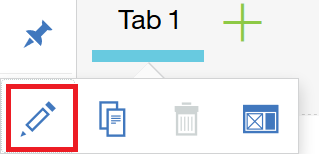

### Designing a Dashboard

Since this is the first dashboard we are creating you can see in the image above that the default name is Tab1. 

- Click on the tab name Tab 1

- Select the Pencil to bring up the toolbar

- Rename the tab to **Customer Satisfaction**

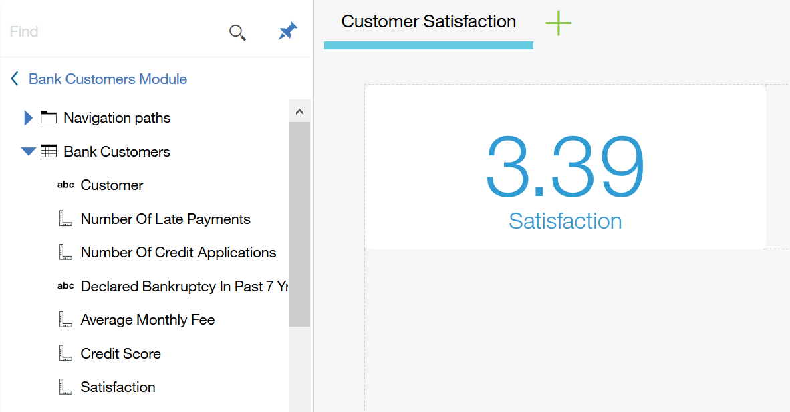

- Click on the triangle beside the Bank Customers table name to expand it and show the columns in the table

- Drag the satisfaction column to panel 1. Remember the panel layout I showed you earlier? If not, go back and look at the field numbers for the areas of this tab's format.

- Here we can see the average satifaction rating for our customers is 3.39 out of 5

> Note - Satisfaction is very easy to locate in this case because it is one of the first few fields in the list. You can also search for columns names using the Find area at the top of the screen.

Next we want to look at satisfaction by customer type, so we need to select the Satisfaction column and then Control-Click (**Command and Click on Mac**) the Customer type column and drag them to Panel 2. 

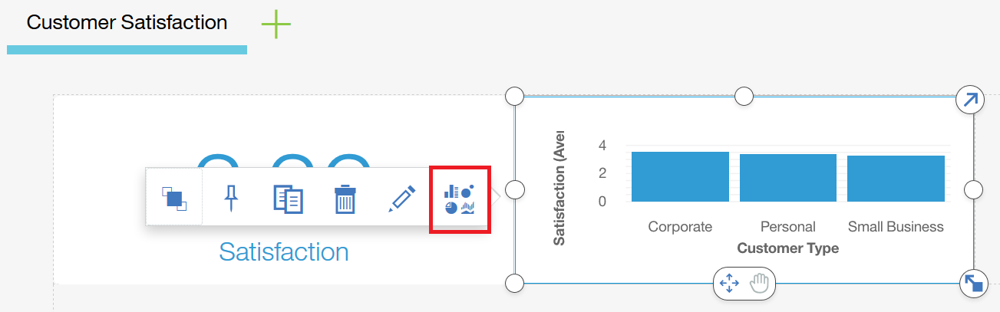

Cognos Analytics gives a visualization to start based on the data types and number of values of the columns selected, but you can change these visualizations by selecting the Change Visualization icon. 

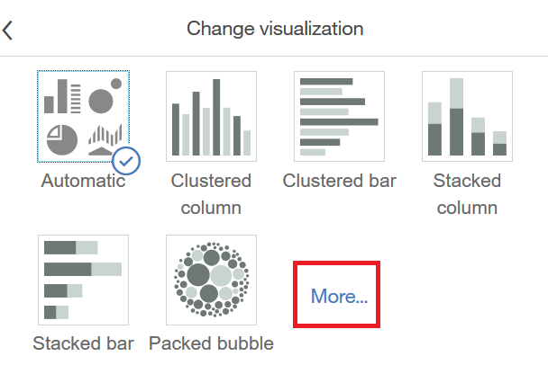

That will show the visualizations that best suit the data types of the columns inside the visualization. You can always select **More** if you do not see a format you like. You can click anywhere else in the dashboard to close this window.

Now save the dashboard.  

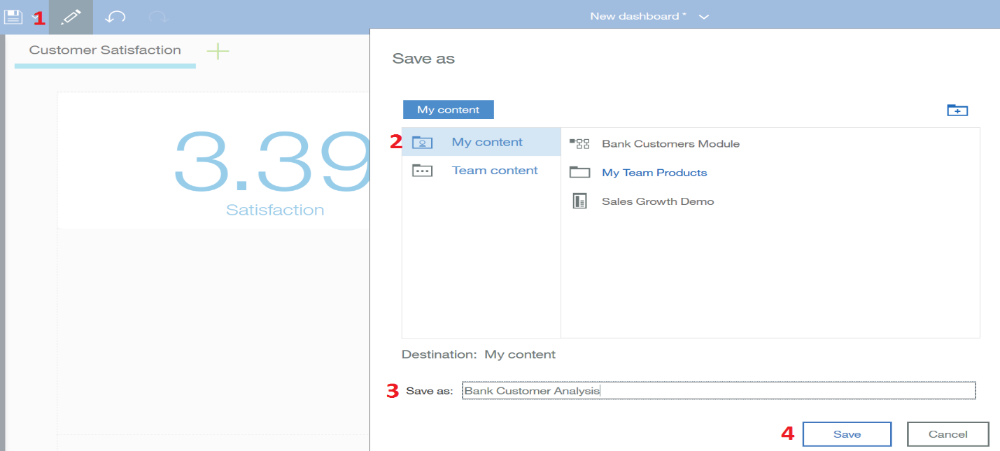

1. Click Save

1. Select My Content

1. Name the Dashboard ‘Bank Customer Analysis

1. Click Save

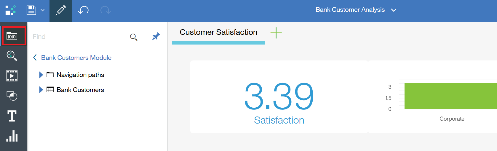

If the data source panel is not open, from the Navigation panel on the left side of the screen, select sources to open the data source panel and select the **Bank Customers Module** we are working with.

Expand both ‘Navigation paths’ and ‘Bank Customers’ to list the items they contain by clicking on the triangle beside those names.

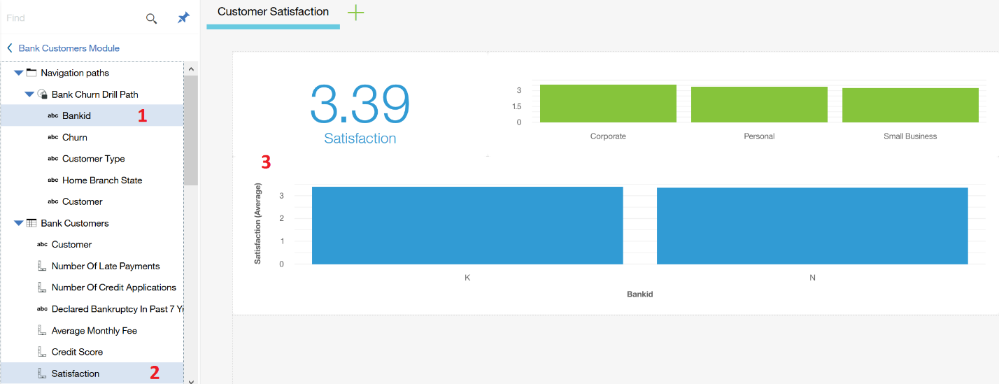

1. Under Navigation paths, expand the Bank Churn Drill Path and select Bankid

1. Ctrl-Click (Command-Click) Satisfaction under the Bank Customers Module

1. Drag these items to Panel 4

**Notice that there is little difference in the overall satisfaction between the two banks.**

1. Under Bank Customers Select Satisfaction

1. Under Bank Customers Age Range

1. Under Bank Customers Gender

1. Drag these items to Panel 5

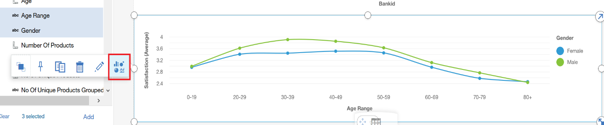

Change the visualization in Panel 5 to a Heat Map

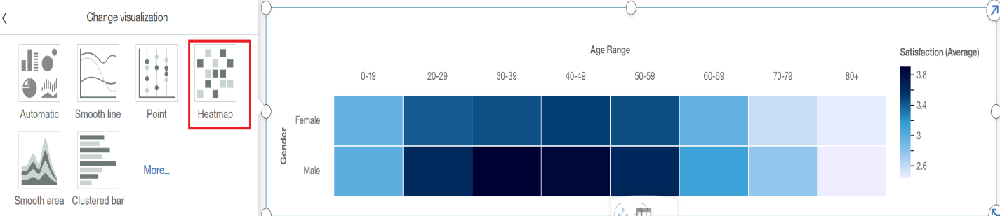

Your Dashboard should like this now

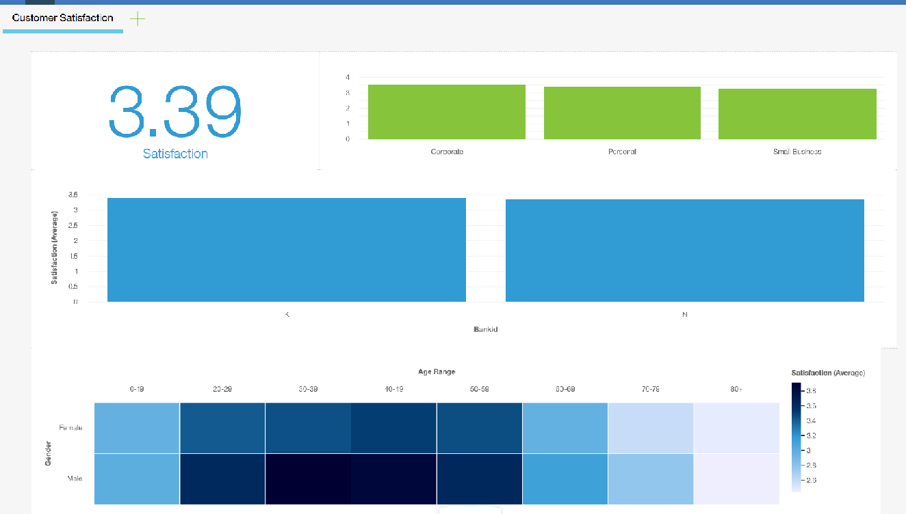

**Notice that on average Males are more satisfied than females, and that on the right, our older customers are the least satisfied.**

Save the Dashboard

Now, let's add another Tab to the Dashboard.  

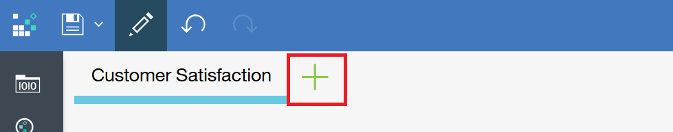

Click on the green + sign

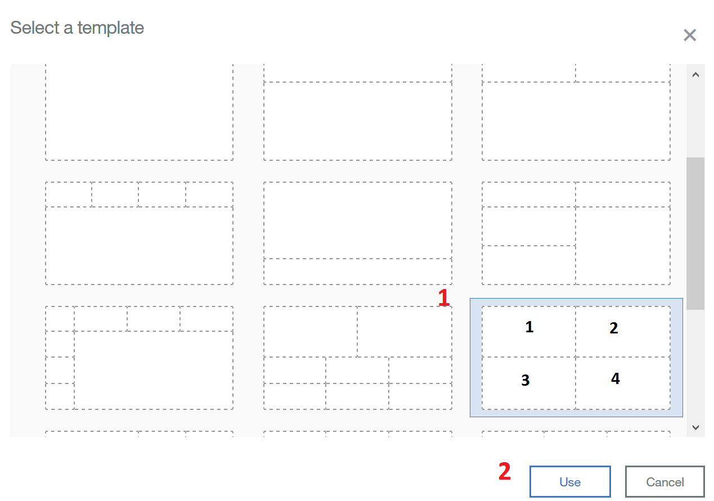

1. For the template we will choose the 2 x 2 Template

1. Select USE

Rename this tab to Churn Analysis

> Note - The four panels are also numbered in this image so we can explain placement later.

As we said earlier, your data scientists have found that churn seems to be related to the number of credit applictions the customer has submitted, and the number of times they have had late payments. Remember we also created groups for late payments and credit applications, now let's create visualizations for these. 

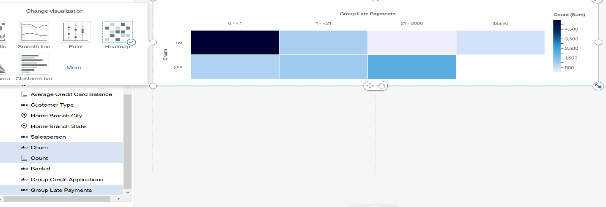

Add a visualization of churn to late payments using the following steps. 

1. Under Bank Customers in the data module on the left select Group Late Payments

1. Under Bank Customers Ctrl-Click (Command-Click) the Count column 

1. Under Bank Customers Ctrl-Click (Command-Click) the Churn column

1. Drag these items to Panel 1

1. Click on a corner or side of the visualization to expand it to use both panel 1 and panel 2

1. Change the Visualization to a Heat map

> Note - 
> Even though we created three groups we see four groups here. What is different?   
>   
> Notice that the group on the far right is (blank). In this case there were some columns that had no value at all for the number of late payments. In this specific case does this mean that customer had no (ZERO) applications, or that someone forgot to fill in this field, or that there is an applicatio problem somewhere? We need to determine the source of the data and whether it is valid or needs to be fixed. We would beed to verify this data with the bank data engineers.

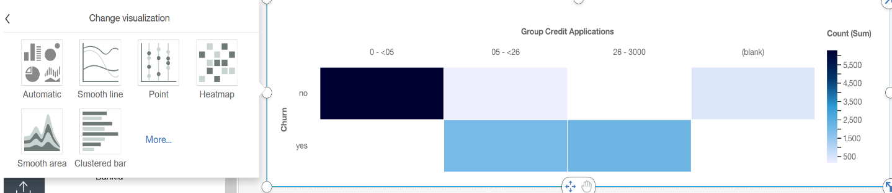

Now add a visualization of churn to credit applications using the following steps. 

1. Under Bank Customers select Group Credit Applications

1. Under Bank Customers Ctrl-Click (Command-Click) the Count column

1. Under Bank Customers Ctrl-Click (Command-Click) the Churn column 

1. Drag these items to Panel 3

1. Click on a corner or side of the visualization to expand it to use both panel 3 and panel 4

1. Change the Visualization to a Heat map

**From these graphics we can see that our most loyal customers are the ones with the least credit applications and late payments.**

> Note - 
> We see the same thing in this graphic with some data being (blank). Again, we could assume that a blank is a zero, but for more accurate analysis we should clean up the data and update the blnk to a 0 (zero).

**The Churn Analysis tab should look like this**

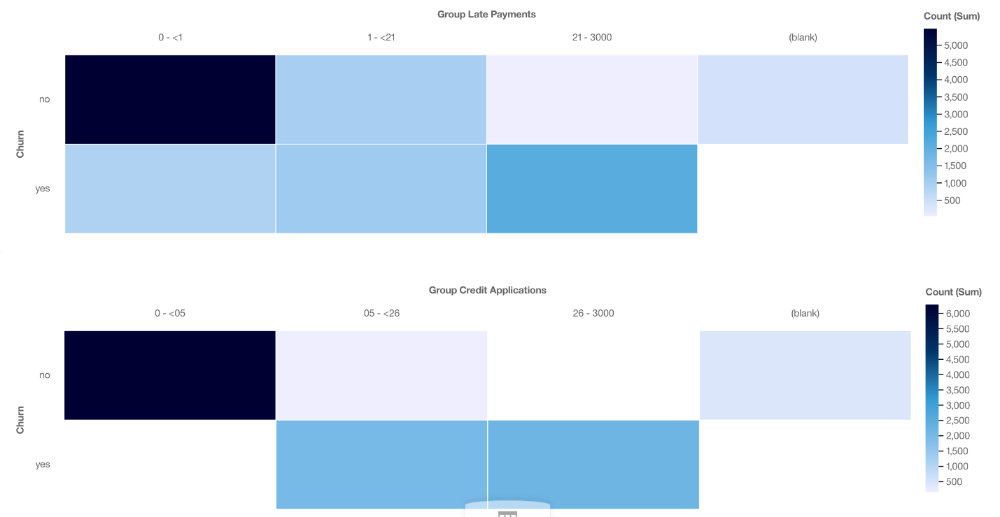

Save the Dashboard
  

Let's go back to the Customer Satisfaction tab, since that was the main reason for the work we have done so far. 

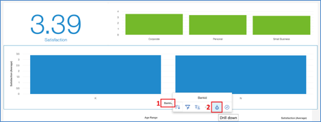

In the middle of the window we two bars, K and N (K Bank and N Bank).

Click the Bankid label under those bars and select drill down

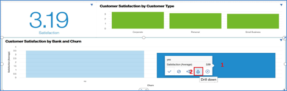

We now see two bars, yes and no (yes means the customer has left the back, no they have not). 

Let’s investigate the customers who have left (yes). 

Wwe can see that the satisfaction scores are lower for the yes bar (the people who have left). Click on the y bar and click on drill down. We notice that all of the visualizations change to be relative to customers who left, and that the satisfaction score changes to a lower number, which makes sense. 

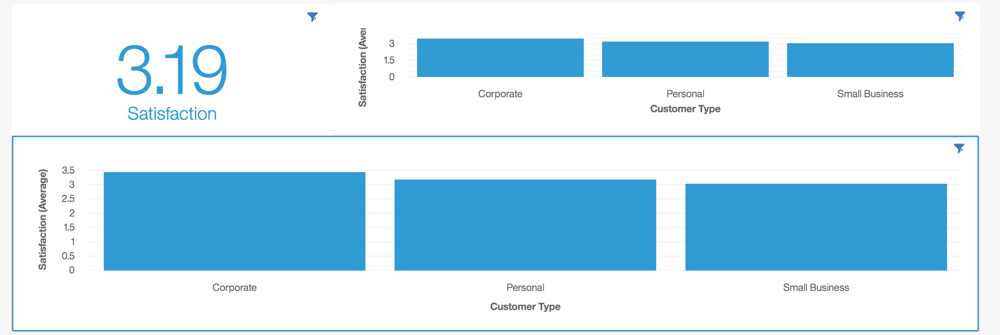

We now see that our Small Business customers have the lowest satisfaction scores (3.04). We can dig deeper into these customers by clicking on the Small Business bar and click Drill down. 

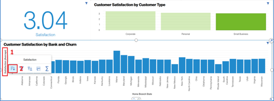

This shows the States of the customers who left the bank. In this case since we are filtered on Small Business, we see the satisfaction level of all Small Business customers who have left, by their state. To find the state with the lowest satisfaction score:

1. Click the Satisfaction (Average) axis title on the left hand side of the chart

1. Select the Sort icon

1. Select Sort desending

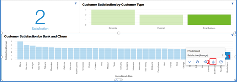

We see that Rhode Island has the lowest satisfaction level. We can select the Rhode Island bar and select drill down to find out which customer(s) from Rhode Island closed their accounts. 

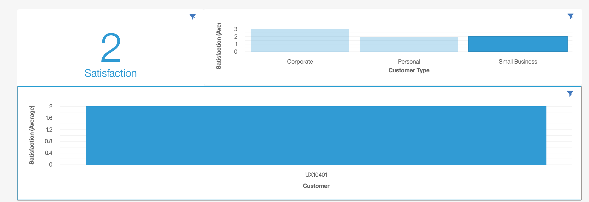

We see that we had one customer (UX10401) leave us from Rhode Island, and their satisfaction level was 2.  

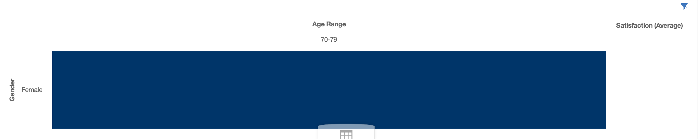

Additionally, if we look at the bar below, we can see that this customer was a 70 - 79 year old female.

> Note -
>
>You can click on any part of the dashboard and the rest of the dashboard will filter based on the value you select.

**We would usually title these graphs, set maximums on graphs, specify different colors, etc. to make the Dashboard more appealing before sharing across the enterprise (or at the board meeting). And you can see in the images that we have done that here. But, for the purposes of this demo we will have you do that.**

# Take a screen capture or screen shot of this dashboard tab to show that you have completed the lab. 
