# Moving data and workloads from on-premises to the Cloud for more agile analytics

## Table of Contents
- **[Introduction](#introduction)**
- **[Narrative](#narrative)**
- **[Solution Overview](#solution-overview)**
- **[Solution Components & Services](#solution-components-and-services)**
- **[Prerequisites](#prerequisites)**

**Now we will start the main part of the lab**

- **[Move the Data to the Cloud](#move-the-data-to-the-cloud)**
    - [Step 1: Create the Cloud Data Analytics lab services](#step-1-create-the-cloud-data-analytics-lab-services)
    - [Step 2: Create the dashDB Credentials](#step-2-create-the-dashdb-credentials)
   

## Introduction

This project provides a reference implementation for moving data from on-premises relational database(s) into a Cloud Managed Database Service (dashDB) so that the data can be analyzed quickly, easily, and without the need to setup any new hardware or request resources from the IT department. In this example, the on premises databases are in two different RDBMS'es to emulate two different organizations. However, you could use a similar pattern and set of step to copy from a single database into the cloud as well. 

In this case, one organization is using IBM's PureData System for Analytics (Netezza) and the other DB2 on Linux for their data warehouses. The data from these systems will be pushed into dashDB in the cloud so that it can be combined and analyzed as a single entity.  

**We will provide two mechanisms for moving the data from on-premises to the cloud, Bluemix Data Connect and Lift CLI, so that you can choose the method based on who you demoing to.** Data Connect is a cleaner, easier solution for one time moves, and best used when demoing to Business Users (LOB managers and executives). Lift CLI is how we would productionalize the initial and delta data load process, and best used when demoing to IT.

### Loading data using IBM Data Connect

### Loading data using IBM Bluemix Lift CLI

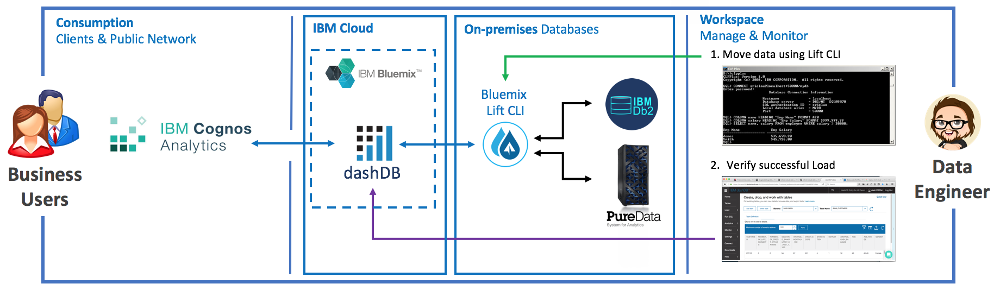

## Narrative 

Consider the following scenario: You are talking to the Chief Marketing Officer (CMO) at "K Bank". 

Hi Ms. Smith, I know that "K Bank" just bought "N Bank", and I just came from a meeting on how you plan to integrate the two companies’ systems, and it is going to take quite a while. I would think that many people, and you in particular, can’t wait for a year or more for the integrated data to start reaching out to your customers.

I know that "K Bank" has been doing churn analytics for some time, but the team at "N Bank" has not. "K Bank" has found that customer loss (churn) is directly related to the customer's satisfaction level. This is kind of obvious, so it would be interesting to see how these churn prediction models could be used to looks at "N Bank" customers and identify who might be at risk of leaving. Since "K Bank" just spent a lot of money to acquire "N Bank", you do not want to lose any customers if you can help it.  

IBM can help you combine the data from both banks now, so that you can get access to this combined data within days, without putting any load on your IT staff who is already overloaded with the consolidation.  We can use IBM's fully managed cloud services to copy data from your current on-premises systems in each bank into a cloud data warehouse and give you a single view of your customers across both banks.
 
Once you have that data at your fingertips, you can explore the data and discover how satisfied your customers are, within each Bank and across both Banks. You can also identify which customers are leaving the bank and which ones you should strive to retain.

We can quickly show you how to create a dashboard to showcase your findings, use it to tell a story of what you discovered and the actions you might want to take base on this analysis.

## Solution Overview

The solution is a set of Business Inteligence (BI) tools that allow Business Users to get quick but important insights from the data. In order to gain this insight the data from both bank systems need to be moved from their data centers into a common repository. Because IT cannot support creating and managing a new system and moving the data, the new, common repository needs to be hosted as a managed cloud service. The BI tools will then be connected to this new repository and the existing analytical reports will be run. 

## Solution Components and Services

There are a few components of this solution. We used a VM to emulate the on premises systems, PureData System for Analytics (Netezza) and DB2. Both of these systems are commonly used by financial firms due to the performance and security they provide - not only for data at rest, but also data as it is being queried.   

We chose dashDB for Analytics (to be renamed **Db2 Warehouse on Cloud** as of ~July 18th) as the combined repository since it is a fully namaged service in the cloud that can be expanded easily, needs no administration, and has built in encryption and security. dashDB is ISO 27001, SOC 2, SOC 3 and HIPAA certified.

Data Connect uses the Secure Gateway to encrypt the data on the wire and Lift uses Aspera to transfer the data using very high levels of compression as well as automatic encryption.   

Cognos Analytics is modern, self-service Business Intelligence Platform that provides a sleek and intuitive user experience. Cognos Analytics provides the ability to empower everyone in the organization to find insight from their data to positively impact their decision making.

## Prerequisites

You will need the following:

 - VMware
      - VMware Player or VMware Workstation for Windows
      - VMware Fusion (Full or 30 day trial) for OSX
 - The Virtual Machine (VM) for the lab
      - Download the [VMware Image](https://ibm.box.com/s/50uj4kfg87qe3rd3icjfvlx94xaygdmr) 
        > **Note** - The image download is 11 GB -- make sure you have a reliable high speed network to download this file! When unzipped the VMware image will consume 20GB of local disk (and up to 20GB temp space), and 3GB RAM. Users with limited RAM (8GB) will want to shut down as many applications as possible prior to launching VMware.
 - A Bluemix account
 - A provisioned Data Connect Starter service in Bluemix
 - A provisioned dashDB for Analytics (**Db2 Warehouse on Cloud** *as of ~July 18*) Entry service in Bluemix
 - dashDB access credentials
 - A Cognos Anlaytics Trial

> **Note**  
If you need help with any of the pre-requisites, go to the [Prereq Step by Step Directions](https://github.com/ibm-cloud-architecture/refarch-cloud-data-analytics/blob/master/PreWork.md)  

## Move the data to the Cloud

## Step 1: Create the Cloud Data Analytics Lab Services

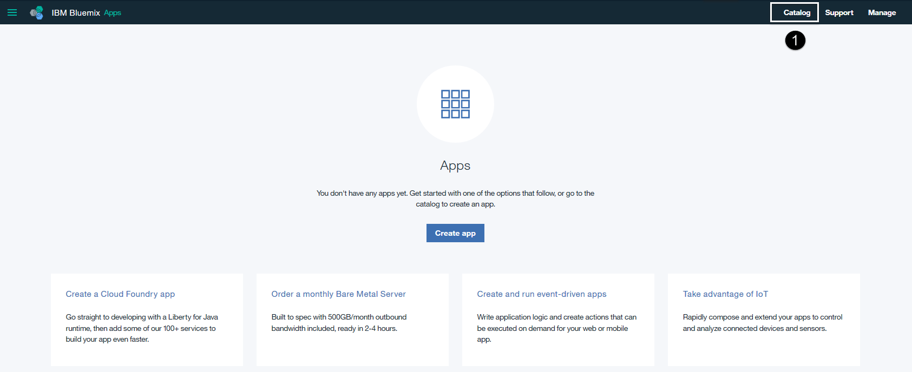

1. **Select** the "Catalog" menu at the top of the Bluemix home page.

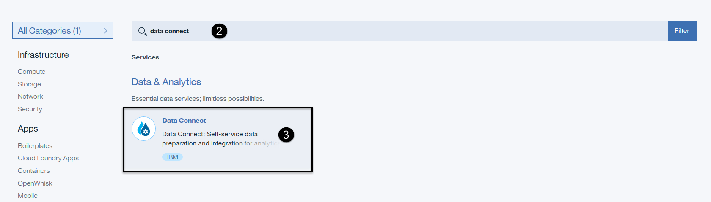

2. **Enter** "data connect" (without quotes) in the catalog search area.  
3. **Click on** the “Data Connect” service.  

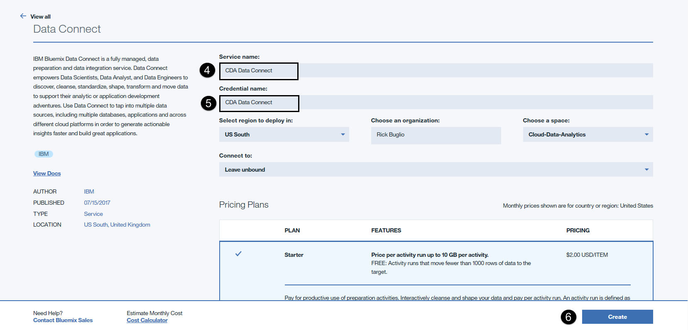

4. **Enter** "CDA Data Connect” (without quotes) for the Service name.  (Use CDA as the acronym for Cloud-Data-Analytics).
5. **Enter** “CDA Data Connect” (without quotes) for the Credential name.  
6. **Select** the the "Create" button. The service will be created and the launch page is displayed.

7. **Select** the **Manage** menu of the CDA Data Connect service on the left.
8. **Select** the **LAUNCH** button to launch the Data Connect service.

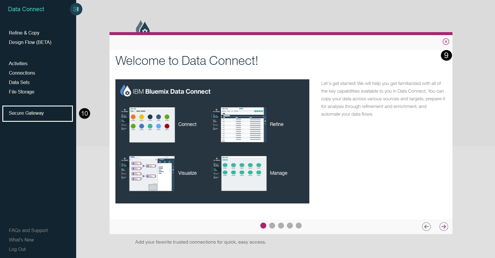

9. **Select** the **X** in the top right corner of the Welcome dialog to close it.
10. **Select** the **Secure Gateway** menu from the Data Connect main menu on the left hand side.

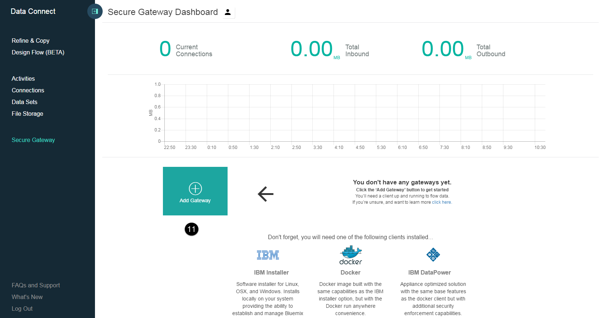

11. **Select** the **Add Gateway** button next to the moving arrow to add a gateway.

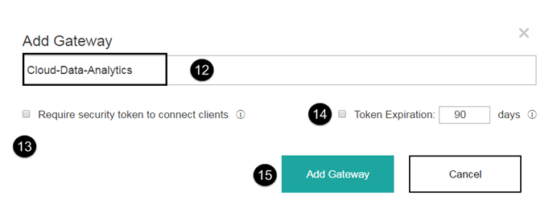

12. **Enter** a gateway name of **Cloud-Data-Analytics**.
13. **Uncheck** the "Require security token to connect clients" check box.
14. **Uncheck** the "Token Expiration" check box.
15. **Select** the **Add Gateway** button.

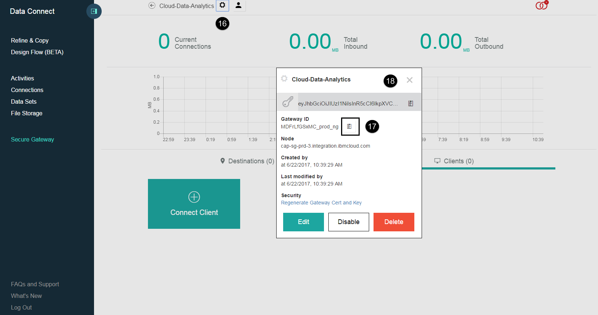

16. **Select** the **Settings** buton at the top of the page to view the Gateway settings.
17. **Select** the **Copy** button next to the Gateway ID to copy the Gateway ID to the clipboard. **Note -** this is a **very important** step because you are going to need this Gateway ID further on in the Prework to supply to the Secure Gateway client configuration file thta is installed on the VM image. Remember this ID or save it off so you can easily get back to it when its needed,
18. **Select** the **X** in the top right corner of the settings dialog to close the dialog.

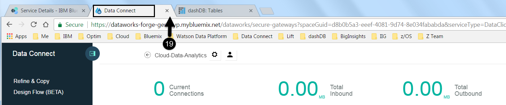

19. **Close** down the Data Connect service by selecting the **X** on the browser tab.

**Go Back** to your Bluemix Account for the next steps. 

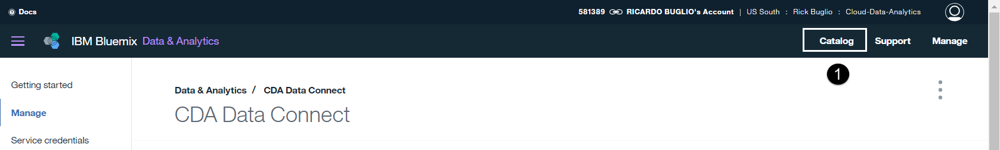

1. **Select** the "Catalog" menu at the top of the Bluemix home page. 

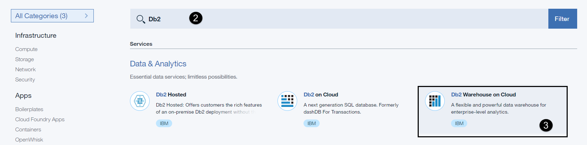

2. **Enter** "dashdb" (without quotes) in the catalog search area.  
3. **Click on** the “dashDB for Analytics” service.  

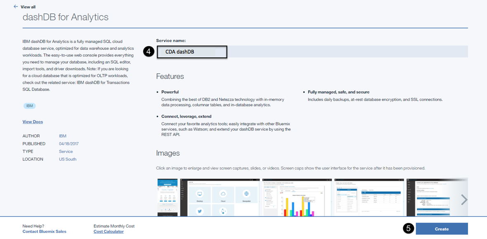

4. **Enter** "CDA dashDB” (without quotes) for the Service name.   
5. **Select** the the "Create" button. The service will be created and the launch page is displayed.

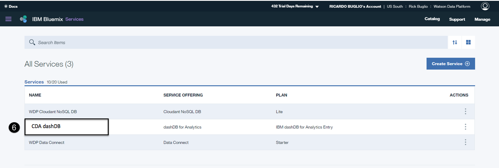

6. **Click On** the "CDA dashDB" service you just created from the list of services.

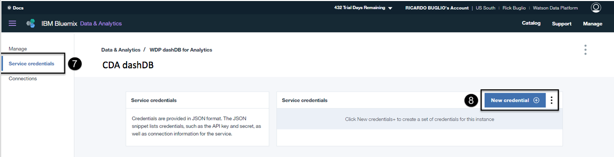

## Step 2: Create the dashDB Credentials

7. **Select** the "Service credentials” section of the "CDA dashDB" service launch page.   
8. **Select** the the "New credential +" button.

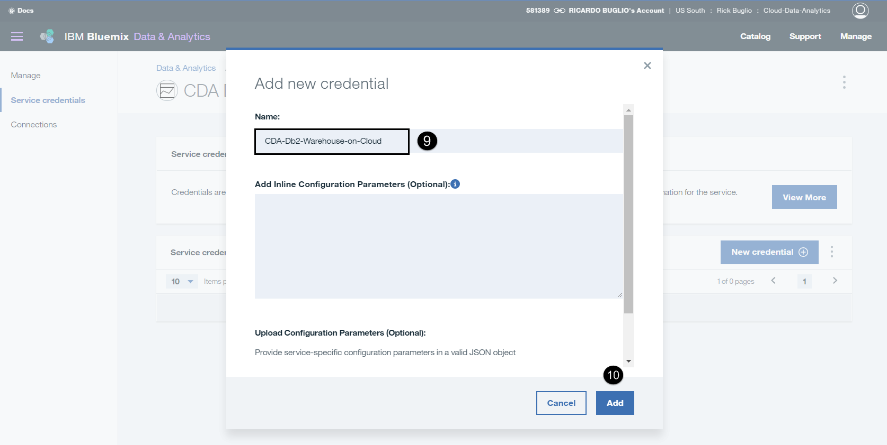

9. **Enter** "CDA dashDB” (without quotes) for the credential name.   
10. **Select** the the "Add" button. The service credential will be created.

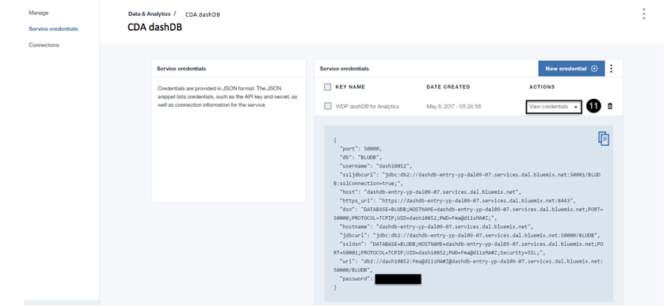

11. **Select** the "View credentials v" down arrow to view the newly created credentials.

> **Note** - These are the "CDA dashDB" service credentials you will need to access the dashDB service in the Data Engineering and Data Science labs. Remember how to get back to this area of the service to access the credentials. I have redacted my password, to protect my identity, yours will be visible.

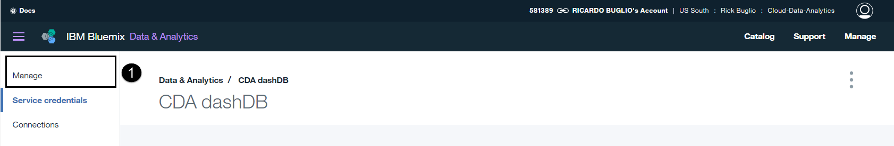

1. **Select** the **Manage** menu of the CDA dashDB service on the left.

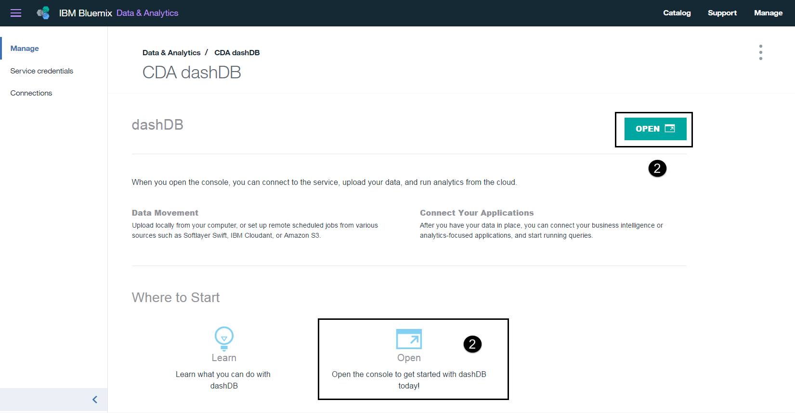

2. **Select** the **OPEN** button to open the dashDB console.

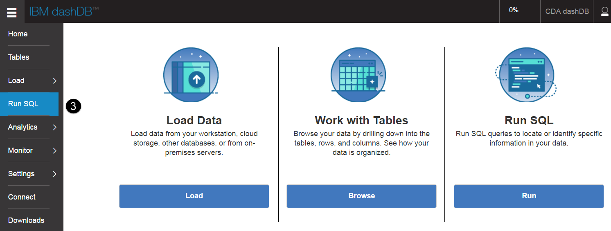

3. **Select** the **Run SQL** menu from the left hand side of the console.

4. **Select** all the sample SQL in the SQL scratch pad area and delete it.

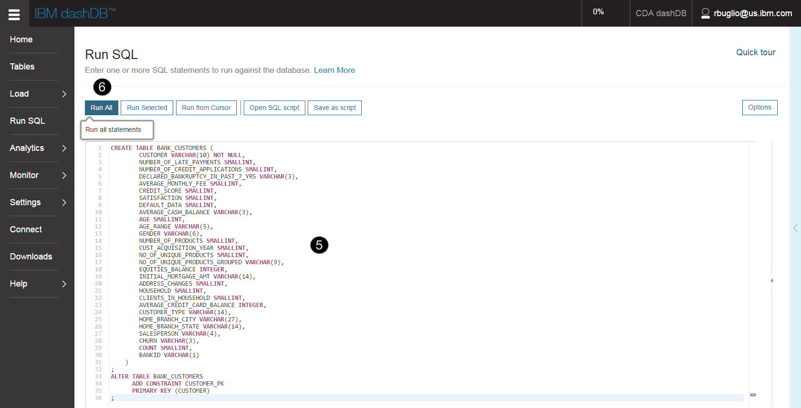

5. **Copy and Pate** the dashDB target table DDL from the [Bank Customers DDL File](https://github.com/ibm-cloud-architecture/refarch-cloud-data-analytics/blob/master/bank_customers.ddl).
6. **Select** the Run All button on the toolbar.

7. **Review** the results. It should complete successfully.
8. **Select** the **Tables** menu from the left hand side of the console.

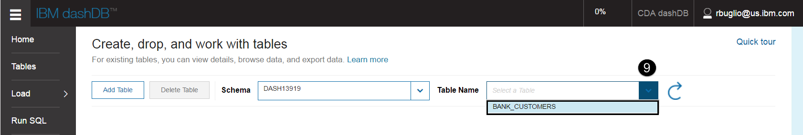

9. **Select** the **BANK_CUSTOMERS** table from the tables drop down list box.

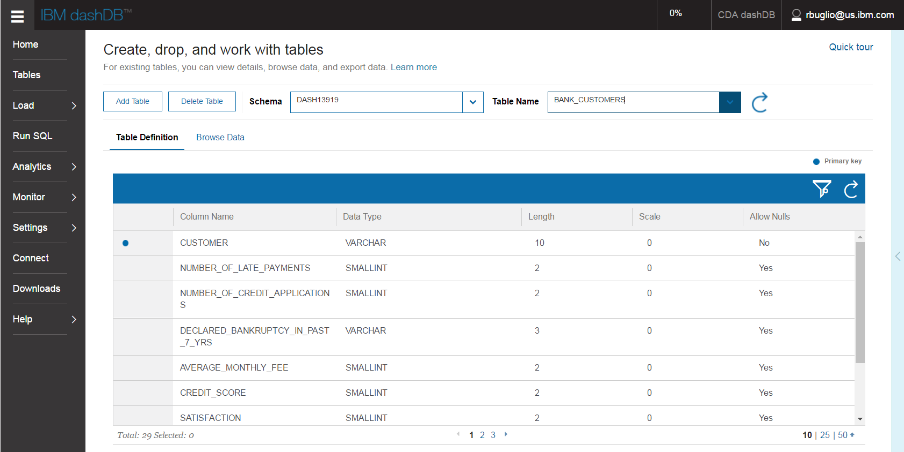

You will see the schema for the new table. The table is empty. You will be moving data from on-premies to this table in the move data to cloud excercies later on in this lab using Data Connect and optionally the Bluxemix Lift CLI.

## Step 3: Start the VM

## Stop Here
