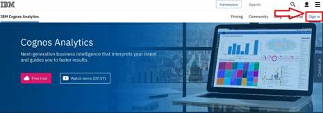
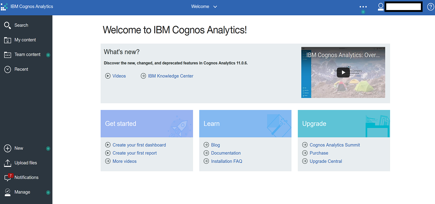
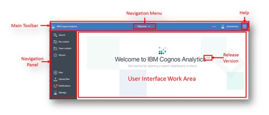
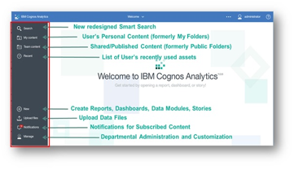
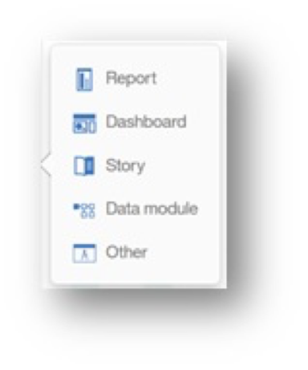

## Visualize Your Data

"K Bank" has found that customer loss (churn) is directly related to the customer's satisfaction level. This is kind of obvious, so it would be interesting to see how these churn prediction models could be used to looks at "N Bank" customers and identify who might be at risk of leaving. Since "K Bank" just spent a lot of money to acquire "N Bank", you do not want to lose any customers if you can help it.

Now that we have the data in one place, we can explore the data and discover how satisfied your customers are, within each Bank and across both Banks. You can also identify which customers are leaving the bank and which ones you should work to retain going forward. You can also create a dashboard to showcase your findings and use it to tell a story of what you discovered and any actions you might want to take base on this analysis for use in your next board meeting.

   - **[PREWORK: Environment Setup](#prework-environment-setup)**
      - [Overview](#overview)  
      - [Step A: Download the lab files](#step-a-download-the-lab-files)  
      - [Step B: Create a Bluemix account](#step-b-create-a-bluemix-account)
      - [Step C: Create the Cloud Data Analytics lab services](#step-c-create-the-cloud-data-analytics-lab-services)
      - [Step D: Create the dashDB Credentials](#step-d-create-the-dashdb-credentials)
      - [Step E: Create a Cognos Analytics account](#step-e-create-a-cognos-analytics-account)
      - [Step F: Create a Watson Analytics account](#step-f-create-a-watson-analytics-account) 
      - [Step G: Create a GitHub account](#step-g-create-a-github-account)

## Getting Acquainted with Cognos   

Cognos Analytics is Modern Self-Service Business Intelligence Platform that provides a sleek and intuitive User Interface.   Whether Users are looking for Personal Data Discovery, or to leverage their full enterprise data platform for analysis, IBM Cognos Analytics provides the capabilities to empower everyone in the organization with the insights needed to positively impact decision making.

Before we build the dashboard to share at the board meeting, let's explore the Cognos Interface.

**Exploring Cognos**

Open your Web Browser and launch the [Cognos Free Trial](https://www.ibm.com/analytics/us/en/technology/products/cognos-analytics/)

All Cognos Analytics Users begin their navigation here.  
Note : Administrators may also set the homepage view globally as seen here in the free trial version.

The Cognos interface allows you to view content and activites pertinent to the page you are on

**User Home Page** The majority of the UI is dedicated to the User Interface Work Area.  This is the interactive window where the User will interact with all their data.  For the home page, the User may select a saved dashboard or report to render on this home page. Administrators may also set the homepage view globally, or by User Group. 

**Navigation panel**  On the left side of the UI is the main Navigation panel.  This navigation panel is present on the UI at all times and updates dynamically as the User works with the various capabilities within Cognos Analytics.  The upper part of the panel provides Users with direct access to search for their content, and links to content to which they have access.  The bottom portion of the panel provides Users with one-click access to capabilities to create and manage new activities such as creating new content, uploading personal data files, accessing notifications and managing the environment (dependent on User permissions).

**Main Tool Bar**

Search.  The New Smart Search in Cognos Analytics provides a modernized search engine that uses a smart, intent-driven search algorithm to assist the User.  Click on Search to open the search panel.  Type “Sales” in the search dialog box.  As you type, an auto-fill feature will launch and render search suggestions for related terms.  We will work more with this feature in an upcoming exercise.  Click outside the Search panel to close it.

My Content.  The My Content folder provides the User with direct access to the content they have saved.  This is content owned by the User and may only be viewed by the User.  You will be saving your work from today’s workshop in this folder.  Click on My Content to open the navigation panel to see if there is any User content in your environment. Click outside the My Content panel to close it.

Team Content.  The Team Content folder contains all the published enterprise and shared content the user has permissions to view.  Click on Team Content to open the navigation panel. Notice there is a list of folders.  We will go deeper into these later in the exercises.  Click outside the Team Content panel to close it.

Recent.  IBM research shows that Users typically use the same set of content on a regular basis.  The Recent button shows the User the most recently used list of content, up to 20 objects (reports, dashboards, data modules, etc.).   Objects appear in order based on most recently used.   Once an object is viewed, it will move to the top of the list.  Click on Recent to see what, if any, are the most recently used objects in your environment.  Hover your mouse over the icon to the left of each object to identify the type of object.  Click outside the Recent panel to close it.

New.  The New button is used by Users to create new content.  It is intent-driven, meaning that it allows Users to select what type of content they wish to create, and the Cognos Analytics UI will open the associated capabilities in the Work Area.  From here, Users may create new Reports, Dashboards, Stories, Data Modules or access Other Companion Applications (legacy studios from previous versions of Cognos).

**Let's start to build a Dashboard!**
