Introduction
============

Cognos Analytics is Modern Self-Service Business Intelligence Platform
that provides a sleek and intuitive User Interface. Whether Users are
looking for Personal Data Discovery, or to leverage their full
enterprise data platform for analysis, IBM Cognos Analytics provides the
capabilities to empower everyone in the organization with the insights
needed to positively impact decision making.

This workshop designed to give you an opportunity to discover the ease
of use of IBM Cognos Analytics V11, IBM’s Modern Business Intelligence
solution that enhances the efficiency and capabilities of business
users, report authors, and administrators alike.

During the workshop you will be shown some of the newest capabilities
included in IBM Cognos Analytics, and you will be able to try out some
of this functionality for yourself. The new interface was designed in
collaboration with existing analytics users and reflects both their
experience and expectations for the future. Consumers now have access to
interactive reports, dashboard creation is as easy as
dragging-and-dropping and power users can perform lightweight data
modelling online.

After this workshop you will have a sense of the way in which IBM Cognos
Analytics empowers business users to perform data discovery and to
create dashboards.

In this workshop, you will experience the following capabilities in IBM
Cognos Analytics:

> Cognos Analytics Navigation
>
> Create a New data server Connection
>
> Create a Data Module
>
> Create a Dashboard
>
> Find Insights in the Information

You are a Chief Marketing Officer looking a recent satisfaction survey
with customer attributes and churn results presented to you from the IT
department.

In the last Board meeting, there was a long discussion around customer
satisfaction and how these low satisfaction scores and contributing to
customer churn. Your job is to discover and share any insights from the
data provided to you before the next board meeting next month.

Explore the data and discover how satisfied your customers are with your
bank, and what customers are leaving the bank and which ones should we
try and retain going forward.

Develop a dashboard to showcase your findings and use it to tell a story
of what you discovered and any actions you might take from this
analysis.

Lets Get Started
================

Click on FireFox and launch [Cognos Free
Trial](https://www.ibm.com/analytics/us/en/technology/products/cognos-analytics/)
and SIGN IN to bring up the login page.

The NEW User Experience brings you directly into the completely
redesigned Cognos Analytics User Interface (UI). All Cognos Analytics
Users begin their navigation here.

Note : Administrators may also set the homepage view globally as seen
here in the free trial version.

The IBM Cognos Analytics User Interface is a modern and sleek User
Interface (UI) that provides a graduated User Experience based on the
needs of the individual user. This modern purpose- built User Interface
provides a highly intuitive User experience which greatly promotes User
adoption. Only IBM provides Analytics tools that provide managed
self-service done in a cognitive way. Let’s take a few minutes to
familiarize ourselves with the User Interface so we can take IBM Cognos
Analytics for a test drive!!

Navigating the Cognos User Interface
------------------------------------

The goal of the new UI and navigation panel and menu was to provide
Users with a streamlined way to view content and activities pertinent to
them

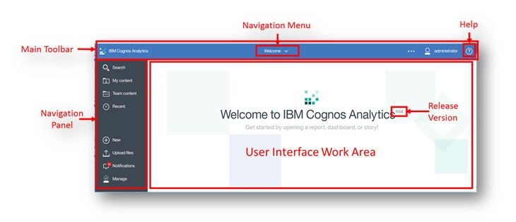

**User Home Page**. The majority of the UI is dedicated to the **User
Interface Work Area**. This is the interactive window where the User
will interact with all their data. For the home page, the User may
select a saved dashboard or report to render on this home page.
Administrators may also set the homepage view globally, or by User
Group.

**Navigation panel.** On the left side of the UI is the main
**Navigation panel**. This navigation panel is present on the UI at all
times and updates dynamically as the User works with the various
capabilities within Cognos Analytics. The upper part of the panel
provides Users with direct access to search for their content, and links
to content to which they have access. The bottom portion of the panel
provides Users with one-click access to capabilities to create and
manage new activities such as creating new content, uploading personal
data files, accessing notifications and managing the environment
(dependent on User permissions).

Main Tool Bar

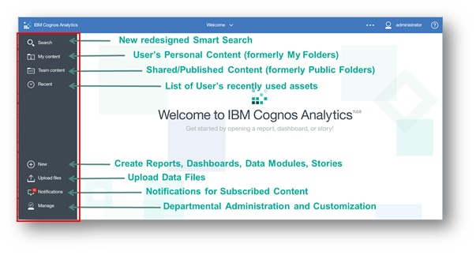

> **Search**. The **New Smart Search** in Cognos Analytics provides a
> modernized search engine that uses a smart, intent-driven search
> algorithm to assist the User. **Click on Search** to open the search
> panel. **Type “Sales”** in the search dialog box. As you type, an
> auto-fill feature will launch and render search suggestions for
> related terms. We will work more with this feature in an upcoming
> exercise. **Click** outside the Search panel to close it.
>
> **My Content**. The **My Content** folder provides the User with
> direct access to the content they have saved. This is content owned by
> the User and may only be viewed by the User. You will be saving your
> work from today’s workshop in this folder. **Click on My Content** to
> open the navigation panel to see if there is any User content in your
> environment. **Click** outside the My Content panel to close it.
>
> **Team Content**. The **Team Content** folder contains all the
> published enterprise and shared content the user has permissions to
> view. **Click on Team Content** to open the navigation panel. Notice
> there is a list of folders. We will go deeper into these later in the
> exercises. **Click** outside the Team Content panel to close it.
>
> **Recent**. IBM research shows that Users typically use the same set
> of content on a regular basis. The **Recent** button shows the User
> the most recently used list of content, up to 20 objects (reports,
> dashboards, data modules, etc.). Objects appear in order based on most
> recently used. Once an object is viewed, it will move to the top of
> the list**. Click on Recent** to see what, if any, are the most
> recently used objects in your environment. **Hover** your mouse over
> the icon to the left of each object to identify the type of object.
> **Click** outside the Recent panel to close it.
>
> **New**. The **New** button is used by Users to create new content. It
> is intent-driven, meaning that it allows Users to select what type of
> content they wish to create, and the Cognos Analytics UI will open the
> associated capabilities in the Work Area. From here, Users may create
> new Reports, Dashboards, Stories, Data Modules or access Other
> Companion Applications (legacy studios from previous versions of
> Cognos).

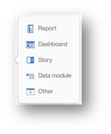

> **Upload files**. Users may upload external data files to the Cognos
> Analytics environment for analysis, independently or in conjunction
> with enterprise data in Cognos Analytics.
>
> **Notifications**. Users may subscribe to Cognos Analytics content and
> receive notifications when that content has been updated and is ready
> for review. An indicator is provided to provide Users with the number
> of new notifications. **Note :** The default configuration has 7
> default notifications to start, please ignore.
>
> **Manage**. Users who have been granted departmental administration
> permissions can manage content and create or modify Users, schedules,
> data sources and customize the environment.

The **Main Toolbar** runs across the top of the UI and with navigation,
help and personalizing Cognos Analytics Content

> **Navigation Menu.** The navigation menu at the top center of the UI
> provides a dropdown button that allows Users to easily move between
> the different objects they have worked with during their current
> session, without opening additional browser windows. (None will
> currently show as we have not opened any objects so far, but sample
> below shows example).

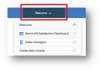

> **More** (3 horizontal ellipses). The **More** button provides the
> User with options to customize their User Experience. The options
> presented dynamically update based the type of object open in the work
> area. **Click** outside the More menu to close it.

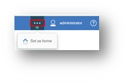

> **Personal Menu**. The Personal Menu allows Users to change personal
> preferences for their environment and to manage their subscriptions.
> **Click** on the Personal Menu to see the capabilities available.
> **Click** outside the Personal Menu to close it
>
> 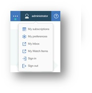
> 
>
> **Coach Marks**. **Coach Marks** are available as indicated by a green
> button 
> 
> pop-up of User Interface hints and are provided to enhance the user
> experience by providing information to the user on how to use
> features.
>
> Your workshop image may not have Coach Marks turned on. To turn on
> Coach Marks, click on the **Personal Menu button**
> 
> 
> toolbar. **Select My preferences** and click the box next to “**Show
> Hints**”. **Click** outside the pane to close it
>
> 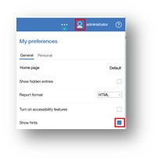
> 
>
> **Click the Coach Mark** buttons you see on the screen to open windows
> with hints. **Click** the “**X**” button to close the hints. Users may
> also turn off the coach marks by clicking the “Turn off hints” or in
> My preferences and changing the “Show Hints” setting
>
> 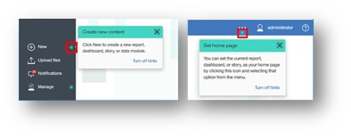
> 
>
> **Help.** The Help button
> 
> 
> regarding Cognos Analytics
>
> **About** provides the User with information on the version they are
> working in.
>
> **Help** provides a link to the IBM Knowledge Center which has
> technical documentation available.
>
> **Community** directs Users to the dedicated Cognos Analytics
> community directly from the new UI. The community provides forums
> where Users may engage with their peers and technical experts as well
> find resources, videos, and news. **Click on Community** to launch the
> community page. **Bookmark this page for future use.**
>
> **Note :** Your browser may restrict access until pop-ups are enabled.
>
> 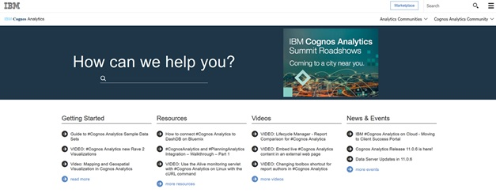
> 

Return to the Cognos Analytics session to continue with the workshop.

Create a New data server Connection
===================================

**Select Manage** from the Navigation Panel. Hint : On the Bottom Left
of the User Interface.

**Select Data Server Connection** to create a new data server.

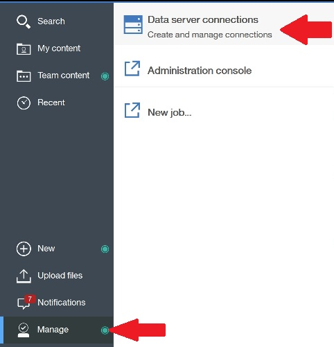

**Create a new data connection** by selecting the ‘+’ and **Select
dashDB** as the type

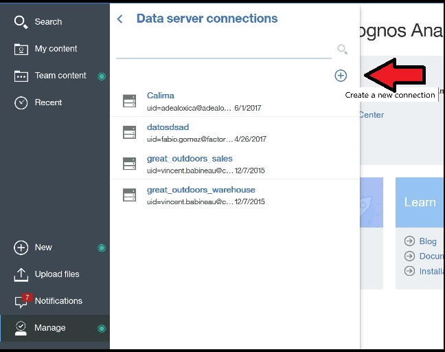

You will be presented with this screen.

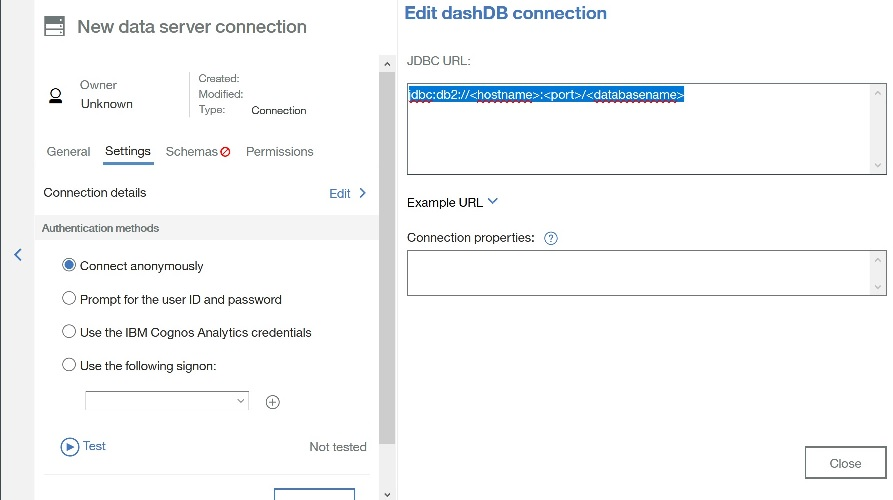

The **1^st^ action** is to rename the new connection name ‘**New data
server connection**’ on the left side of the window to ‘**IA\_Bank
Customers’**

The **2nd action** is to add your server name, port and database to the
default jdbc string
‘jdbc:db2://&lt;hostname&gt;:&lt;port&gt;/&lt;databasename&gt;’ (
example : jdbc:db2://bluemix\#\#.bluforcloud.com:50000/BLUDB )

The **3^rd^ action** is to create a signon associated to the data
connection just created. **Select** the ‘**Use the following signon**’
check box then **Select the ‘+’** icon.

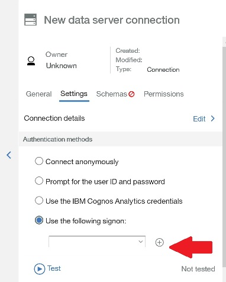

You will be presented with this screen to provide the user name an
password to associate to the signon.

**Note** : If you have not completed the 1^st^ action, you will see
‘**New data server connection’**, please rename the server connection to
‘**IA\_Bank Customers**’ before you take any save action

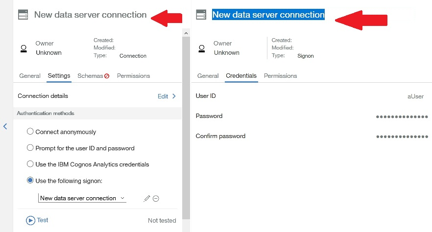

Provide the credentials for the signon to your dashDB data source. Until
your passwords match message appears.

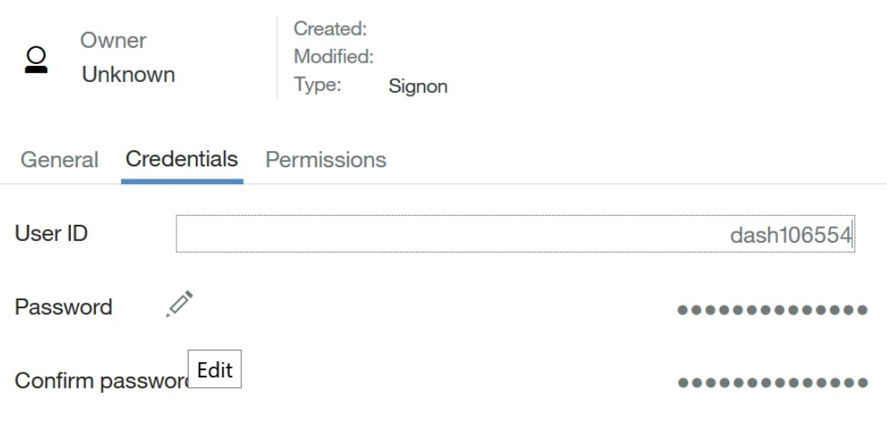

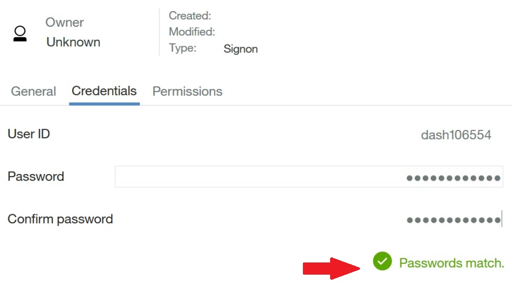

Once the Passwords match, we will test the signon just created.

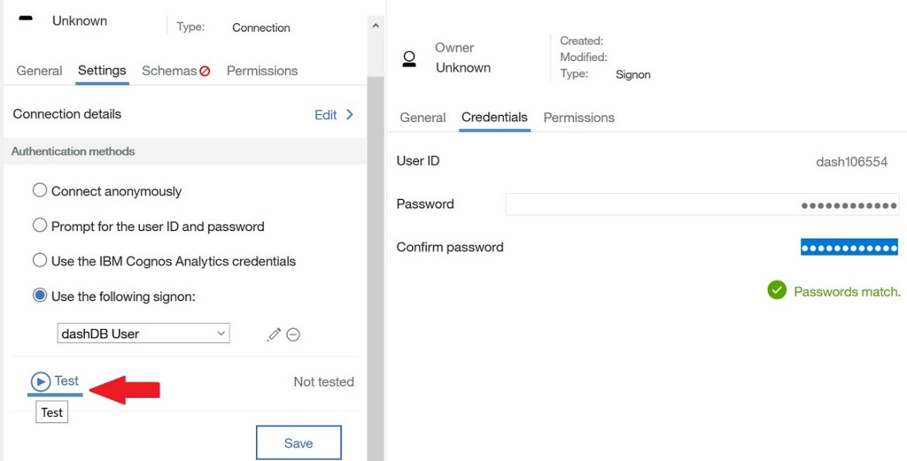

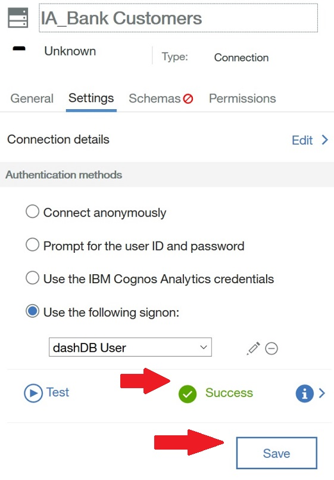

Once we have **SUCCESS** then **Select the SAVE Button.**

Now we need to load the schema we will use in this exercise. **Select
the Schema** tab for the IA\_Bank Customers data server connection.
Select the Schema associated to your userid and select ‘**Load
Metadata’** until it’s successfully loaded with a Message and a green
button next to the schema

Create a Data Module
====================

With Cognos Analytics, Users are not restricted to only using existing
enterprise data sources. The NEW modeling capabilities in Cognos
Analytics allows the business user to blend in personal data sources
without requiring assistance from IT. This does not replace IT, it
simply augments the user experience to allow the User to work with
personal data sets and analyze that data in conjunction with the
enterprise data. Users can import external data from files, on premise
data sources and cloud data sources into Cognos Analytics. Multiple data
sources may be blended, cleansed and joined together to create a custom
and reusable data module for use in dashboards and reports and may be
shared with other users in the organization.

Create a new Data Module. **Select New** from Navigation Bar and
**Select Data Module**

You are now give the options to select the data assets you wish to use
for your data module, **Select Data servers** because we are going to
connect to the ‘IA\_Bank Customers’ data server connection you created
earlier. **Select ‘IA Bank Customers’** which will display the schema we
loaded during the load metadata action taken earlier. Select the
‘SCHEMA’ associated with your dashDB instance, here I am using
‘DASH106554’

Your Schema will now be added to selected sources. Mine is DASH106554.
**Select Start **

Intent driven data modeling
---------------------------

This will launch you into the intent-driven portion of the modeling
functionality.

As a user, you will be able to indicate your “intent” in creating a data
module. Once a data source is selected, Users can enter their desired
search terms. Cognos Analytics analyzes the data source and will make
recommendations on which table(s) to begin with to create the User’s
custom data module. Cognos analytics will then identify a starting point
for a data module by suggesting related content to be used.

In the intent panel, **type “Customers”** and **click GO**. Cognos
Analytics will analyze all the tables in the selected data source, and
renders proposals for the data tables that contain related content. In
this scenario, we are suggesting all **tables with Customers** in the
table name. Since the user is interested in Customer information to
analyze Satisfaction and Churn information.

**Select ‘Add this Proposal’** to add these tables

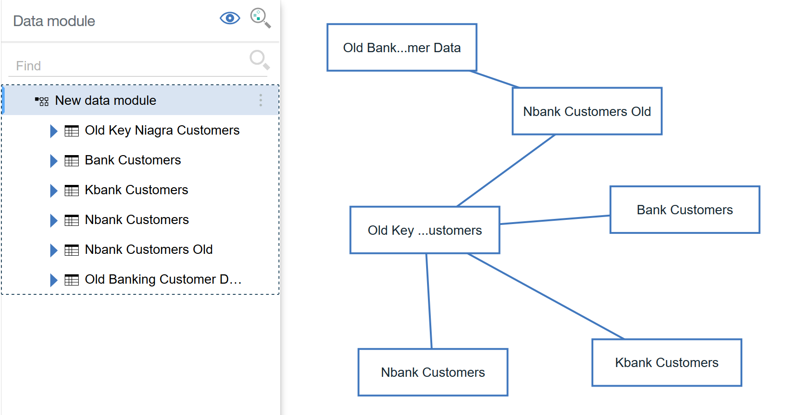

**TECH TIP : YOU MAY CLICK ON EACH TABLE AND MOVE IT AROUND THE SCREEN
TO MODIFY THE DISPLAY TO YOUR PREFERENCE. TO MOVE THE ENTIRE DIAGRAM AT
ONCE, YOU MAY CLICK IN THE WHITESPACE AND MOVE WHILE HOLDING DOWN THE
LEFT MOUSE BUTTON. YOU MAY ALSO ZOOM IN/OUT ON THE DIAGRAM USING THE
SCROLL ON YOUR MOUSE. **

Relationships between tables have been determined by scanning data and
column information from the data. These relationships are indicated by
the lines shown connecting the tables. The relationship indicates how
the files are joined to one another based on a common data item. **Click
on the relationship lines** to see the detail of the join type. **Click
anywhere to close**

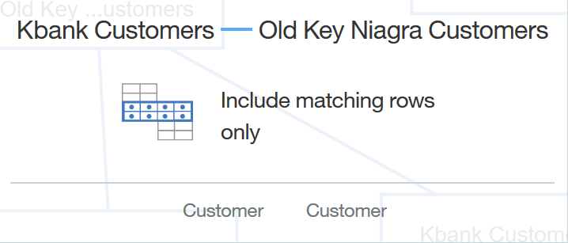

**Adding and Removing Tables from a Data Module**

If the proposed data module has a table the User decides is not needed,
it may be easily removed by right clicking on the table in the diagram
and selecting remove. **Right click on the 'Nbank Customers Old'** table
in the diagram and **select Remove**.

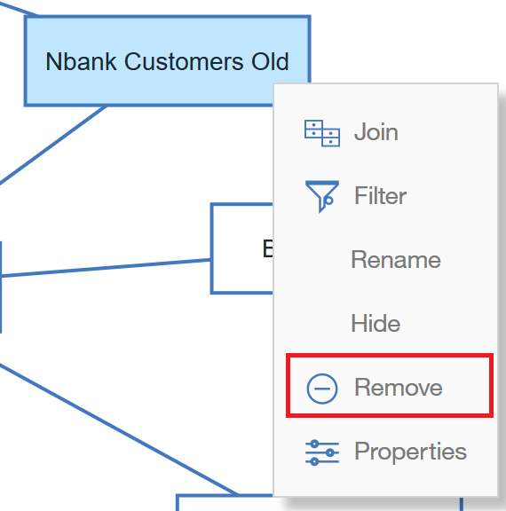

Tables may also be deleted from the data module table list. Click on
'Old Key Niagra Customers' Brand in the data module panel.

**Right Click on 'Old Key Niagra Customers'** table in the list to open
the Options. **Select Remove**.

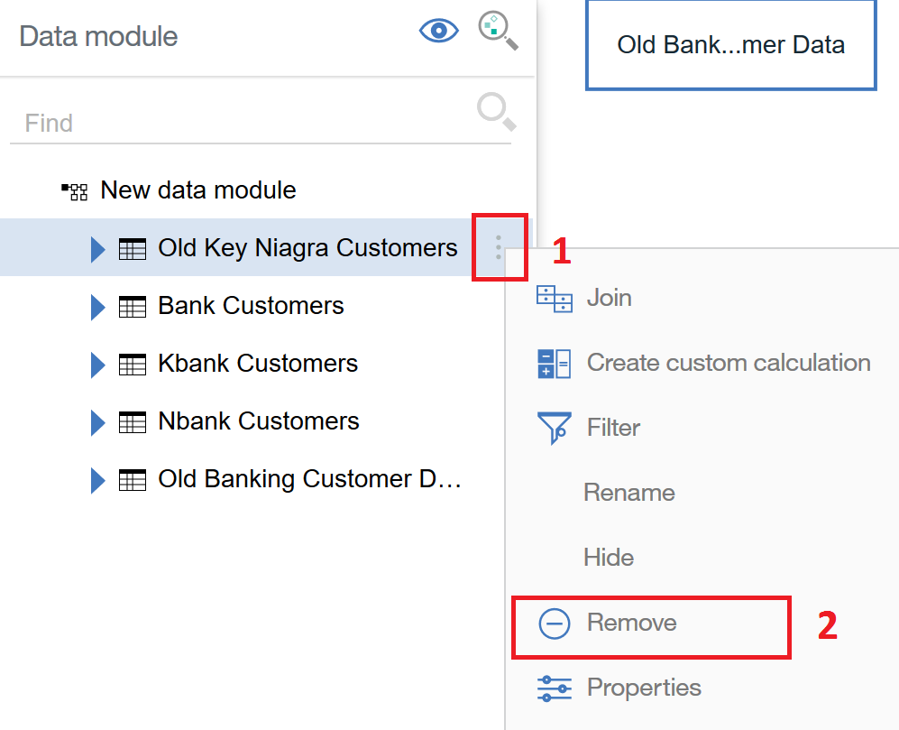

For our analysis, the only table we need is ‘Bank Customers’, **Remove**
the following tables from the model

**Kbank Customers**

**Nbank Customers**

**Old Banking Customer Data**

Your model should look like this now

We will save our data module now.

> Click Save.
>
> Select My Content.
>
> Type ‘Bank Customers Module’ for the name.
>
> Click Save

Expand the Bank Customers table in the Data Module View

Create Custom Groups
--------------------

You can see the columns in the table now and from the icons quickly
identify the numeric and non-numeric fields. **Select ‘Number of Late
Payments** **more option** and you can see for each column the actions
we can perform to improve the usability for users using this data
module. As you can see we can Create Calculations, Clean, Filter,
Rename, Hide, Remove or modify the properties for the item selected.
Here we are going to create a custom group. Select **Create custom
groups.**

Our Data Scientists, using SPSS and Watson Analytics have found some
interesting probabilities related to customer churn based on the number
of late payments a customer has. We will create distribution groups to
reflect these finding so we can share this information with others. To
start we can see that the product has created an equal distribution of
the late payment values into 10 groups distributed evenly.

We will create 3 groups based on their findings.

> Rename the Grouping to ‘Group Late Payments’
>
> Change the \# of groups from 10 to 3
>
> Select Custom
>
> Change the lowest value to 1
>
> Change the 2^nd^ value to 21
>
> Change the last value to 3000
>
> Select Create

The data scientists have also observed some consistencies with the \# of
Credit Applications a customer makes to their tendency to Churn. We will
create another Custom group for Number of Credit Applications. Create a
new custom grouping for Number of Credit Applications.

We will create 3 groups based on their findings.

> Rename the Grouping to ‘Group Late Payments’
>
> Change the \# of groups from 10 to 3
>
> Select Custom
>
> Change the lowest value to 05
>
> Change the 2^nd^ value to 26
>
> Change the last value to 3000
>
> Select Create

Save the data module

Create Navigation Group
-----------------------

A navigation group is a collection of non-measure columns that business
users associate for data exploration. Navigation groups can now be
defined as part of a data module to help users easily explore and drill
down to see their underlying data. These can be logical navigation paths
that follow a defined hierarchy, or they can be defined to allow users
to navigate and drill down in any order that makes sense for their
analysis.

We will start by **selecting the more option** for the field ‘Bankid’.
Bankid is at the bottom of the field list for the Bank Customers table,
just above the new Group calculation we just created. Another option to
locate the field is to type’Bank’ in the **Find** area of the data
module window. Select ‘Create navigation Group’

In traditional BI and OLAP technologies, a drill down action required a
pre-defined hierarchical data structure so that you could drill down
from Year to Month, but was not defined to allow a User to drill from
Year to Product. Navigation groups are much more flexible and can
accommodate drill down that aligns with how users need to analyze their
business.

In our Analysis we wish look at information by Bank, Churn, Customer
Type, Location and Customer.

> **Rename the Navigation Group to Bank Churn Drill Path**
>
> **Drag Churn below Bankid**
>
> **Drag Customer Type below Churn**
>
> **Drag Home Brnch State below Customer Type**
>
> **Drag Customer below Home Branch State**
>
> **Click Apply**

**Save the Data Module**

There are many more things to do in this data module, but for timing we
will save it and start finding insights.

Create Dashboard for Insights
=============================

We will now create a dashboard to analize the information created in our
data module.

Create a new dashboard from the Navigation pane

Working with Templates
----------------------

The Template window appears allowing the user to select the type of
dashboard and the template style. Select the tabbed dashboard style.
This will allow you to have multiple pages for your dashboards. Select
the template with the three (3) small panels across the top, and two (2)
panels below. Click OK

Each panel on the template acts as a placeholder for dashboard objects,
known as widgets. Templates are device aware and will auto-size to the
screen of the device being used.

Cognos Analytics provides many “out of the box” templates to choose
from. This library of templates is based on dashboard design best
practices. The templates are simply guidelines that allow quick and
visually appealing layout of widgets onto the dashboard. However, users
may still customize layouts to suit their preferences and may also
choose to start from a freeform (blank) template.

As we build the dashboard, we will reference the location placement for
widgets in the dashboard template using the following panel numbers

As we start our dashboard design we will be asked to select the data
sources to use. We will select the data module we just created.
Dashboards support the use of many data sources, in this example we will
only use 1

> Select the '+' to add sources to the Dashboard
>
> Select My Content
>
> Select Bank Customers Module
>
> Click Open

Working with Dashboard Design
-----------------------------

Rename Tab1. To rename the dashboard tab, click on the tab name “Tab 1”
to bring up the On-Demand Toolbar. Select the Pencil and rename the tab
to 'Customer Satisfaction'

Expand Bank Customers and drag Staisfaction to Panel 1. Here we can see
the average Satifaction rating by our customers is 3.39.

Satisfaction is very easy to locate here because its one of the first 10
fields in the list, again like everything else in Cognos Analytics there
is a Find area where you can find fields very quickly.

Next we will select Satisfaction and Ctrl Click Customer type and drag
it to Panel 2. Cognos Analytics gives me a visualization to start based
on the items selected. I can change these visualizations by selecting
the Change Visualization icon.

By Deault we will show the visualizations that best suit the items and
there types inside the visualization. You can always select ‘**More**’.
Click anywhere else in the dashboard to remove this window.

Select the bar chart just created, we will now look at actions available
to you from the menu bar.

> The View widget icon allows users to decide which widgets will be
> connected to which other widgets in the dashboard. By default all
> widgets in the dashboard are automatically connected without any
> coding.
>
> The pin will pin the widget for further use in other dashboards or to
> be used for story telling.
>
> The properties item is what we will look at now. The properties allows
> you to customize and change the properties of the widget
>
> The user icon we talked about earlier as well as the help.

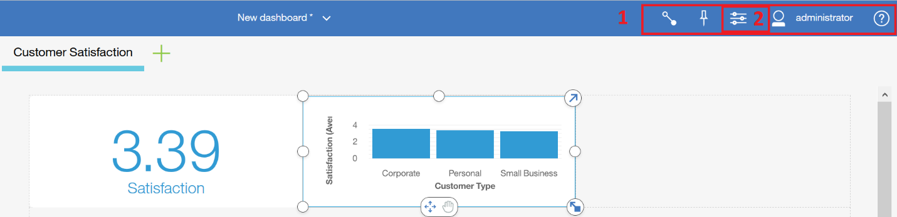

Select the Properties Icon for the bar chart. Under the General Area, we
can change the color pallette, column color, maintain axis scale, and
Hide axis titles. Also, if dealing with changing data, set the refresh
rate for this widget to pickup the refreshed data in near real time
without having to take a user action. If refresh data set is on, we
first verify the data is changed before resubmitting the query of the
widget.

Here I have set the Column Color to Green and I have enabled ‘Hide axis
titles’

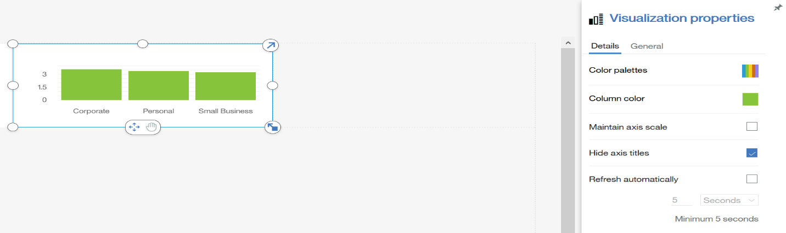

Under the General Tab you see options to set the ‘Fill color’, ‘Border
color’ and you can set the Opacity of the widget of object selected in
the dashboard. If we had a image selected here, we might change the
Opacity to a lower number to use it as a background image for the Tab
and/or individual widget.

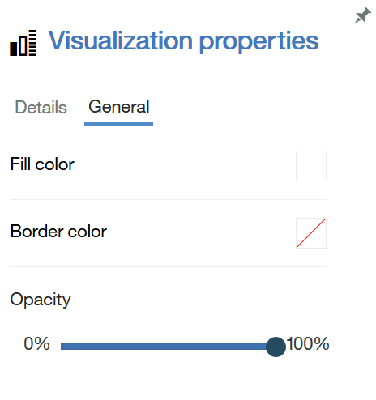

To remove the Properties, click the Properties icon on the menu bar
again.

Note : The properties will change depending on the type of visualization
or object selected. For instance if a text object is selected, you would
see properties associated with a text item. The same is true if a
picture or video object is selected.

Resize the Customer Type Satisfaction bar chart to span Panel 2 and 3 by
dragging the resize button on the right to the end of the template to
look like this.

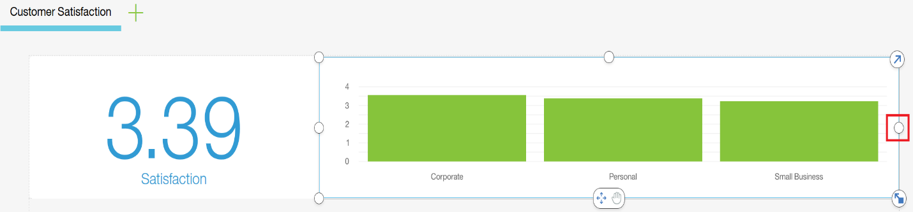

Let’s save the Dashoard

> Click Save
>
> Select My Content
>
> Name the Dashboard ‘Bank Customer Analysis
>
> Click Save

If the data source panel is not open, from the Navigation panel, select
Sources to open the data source panel. The Data Source panel displays
the Banking Customers Source we are working with.

Expand ‘Navigation paths’ and ‘Bank Customers’ to list the items.

> From Navigation Paths under Bank Churn Drill Path select Bankid
>
> Ctrl-Click Satisfaction under Bank Customers
>
> Drag these items to Panel 4

For Panel 5

> Under Bank Customers Select Satisfaction
>
> Under Bank Customers Age Range
>
> Under Bank Customers Gender
>
> Drag these items to Panel 5

Change the Visualization in Panel 5 to a Heat Map

Your Dashboard should like this now.

Save the Dashboard

Create a New Tab in the Dashboard

For the template we will choose the 2 x 2 Template and select USE

The 4 Panels are also numbered in this image

Rename the tab ‘Churn Analysis’

Make Panel 1 and 2 look like this using these steps

> Under Bank Customers Select Group Late Payments
>
> Under Bank Customers Ctrl-Click Count
>
> Under Bank Customers Ctrl-Click Churn
>
> Drag items to Panel 1
>
> Expand Visualization to use Panel 1 and 2
>
> Change the Visualization to a Heat Map

Make Panel 3 and 4 look like this using these steps

> Under Bank Customers Select Group Credit Applications
>
> Under Bank Customers Ctrl-Click Count
>
> Under Bank Customers Ctrl-Click Churn
>
> Drag items to Panel 3
>
> Expand Visualization to use Panel 3 and 4
>
> Change the Visualization to a Heat Map

The Churn Analysis Tab Should now look like this

Save the Dashboard

Using Properties for each object, make this Dashboard visually appealing
by moving legends and adding titles and removing titles.

Find Insights in the Information
================================

Explore the information in the Dashboard and Share 3 Insights from the
Information you created

Insight 1
\_\_\_\_\_\_\_\_\_\_\_\_\_\_\_\_\_\_\_\_\_\_\_\_\_\_\_\_\_\_\_\_\_\_\_\_\_\_\_\_\_\_\_\_\_\_\_\_\_\_\_\_\_\_\_\_\_\_\_\_\_\_\_\_\_\_\_

Insight 2
\_\_\_\_\_\_\_\_\_\_\_\_\_\_\_\_\_\_\_\_\_\_\_\_\_\_\_\_\_\_\_\_\_\_\_\_\_\_\_\_\_\_\_\_\_\_\_\_\_\_\_\_\_\_\_\_\_\_\_\_\_\_\_\_\_\_\_

Insight 3
\_\_\_\_\_\_\_\_\_\_\_\_\_\_\_\_\_\_\_\_\_\_\_\_\_\_\_\_\_\_\_\_\_\_\_\_\_\_\_\_\_\_\_\_\_\_\_\_\_\_\_\_\_\_\_\_\_\_\_\_\_\_\_\_\_\_\_
